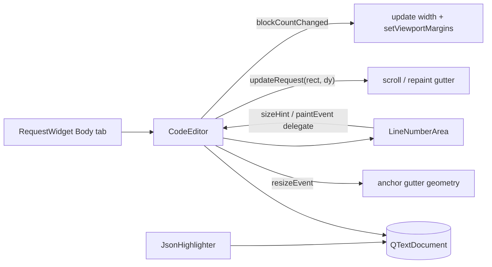

# PYPOST-510: Body edit area should have line numbers

## Research

- The Body tab uses `CodeEditor` (`pypost/ui/widgets/code_editor.py`), which extends
  `VariableAwarePlainTextEdit` → `QPlainTextEdit`. It already disables line wrapping, handles
  auto-indent, bracket dedent, and JSON paste formatting; `JsonHighlighter` is attached to its
  document in `RequestWidget` (`pypost/ui/widgets/request_editor.py`).
- Qt has a canonical solution for line numbers on `QPlainTextEdit`: the official "Code Editor"
  example ([Qt docs](https://doc.qt.io/qt-6/qtwidgets-widgets-codeeditor-example.html)). A child
  `QWidget` (the gutter) is placed over the editor's left viewport margin reserved via
  `setViewportMargins()`; numbers are painted per visible block using `firstVisibleBlock()`,
  `blockBoundingGeometry()`, and `contentOffset()`.
- Synchronization relies on three editor signals: `blockCountChanged` (recompute gutter width),
  `updateRequest` (scroll/repaint the gutter in lockstep with the viewport), and `resizeEvent`
  (re-anchor gutter geometry). This pattern is O(visible lines) per paint, so performance stays
  flat for documents with thousands of lines.
- The same pattern works unchanged in PySide6 (verified against PySide6/PyQt6 ports of the
  example). It composes cleanly with `QSyntaxHighlighter`, placeholder text, and mouse-event
  mixins because the gutter is a sibling widget over the margin, not part of the text layout —
  `VariableHoverMixin.mouseMoveEvent` coordinates are viewport-relative and unaffected.
- The Script tab uses a plain `QPlainTextEdit` and the response view is read-only; both are out
  of scope per requirements, but the gutter component must not hard-code `CodeEditor` specifics
  so it can be reused later (tech debt `doc/dev/tech-debt/PYPOST-10.md`).

## Implementation Plan

1. Add `pypost/ui/widgets/line_number_area.py`:
   - `LineNumberArea(QWidget)`: gutter child widget; delegates `sizeHint()` and `paintEvent()`
     to its host editor.
2. Extend `CodeEditor` in `pypost/ui/widgets/code_editor.py`:
   - Create the gutter in `__init__`, connect `blockCountChanged` and `updateRequest` signals.
   - `line_number_area_width() -> int`: digit-count-based width from font metrics plus padding.
   - `update_line_number_area_width()`: apply width via `setViewportMargins()`.
   - `update_line_number_area(rect, dy)`: scroll or repaint the gutter on viewport updates.
   - Override `resizeEvent()` to keep the gutter geometry anchored to the content rect.
   - `line_number_area_paint_event(event)`: paint visible block numbers right-aligned, using
     palette-derived colors so the gutter is distinct but theme-consistent.
3. No changes needed in `RequestWidget`: it already instantiates `CodeEditor` for the Body tab,
   so the gutter appears there automatically; the Script tab keeps plain `QPlainTextEdit`.
4. Tests in `tests/test_code_editor.py` (new test classes):
   - Empty document shows width for one digit; numbering starts at 1.
   - Width grows when crossing digit boundaries (9 → 10, 99 → 100 lines) and shrinks back.
   - Viewport left margin equals the gutter width after content changes.
   - Gutter is read-only: clicks on it do not modify the document.
   - Existing behaviors (auto-indent, paste formatting) still pass unchanged.

## Architecture

### Modules

| Module | Responsibility |
| --- | --- |
| `line_number_area.py` | Thin gutter widget: occupies left margin, delegates painting to host |
| `CodeEditor` | Owns gutter lifecycle, width computation, scroll sync, number painting |
| `RequestWidget` | Unchanged consumer; Body tab gets the gutter via `CodeEditor` |
| `tests/test_code_editor.py` | Verifies width adaptation, numbering, and non-interference |

### Interfaces

- `LineNumberArea(editor: QPlainTextEdit)` — child widget bound to a host editor.
- `CodeEditor.line_number_area_width() -> int` — gutter width for the current block count.
- `CodeEditor.line_number_area_paint_event(event: QPaintEvent) -> None` — paints visible
  block numbers (host-side because painting needs protected `QPlainTextEdit` methods).
- Internal slots: `update_line_number_area_width(block_count: int)`,
  `update_line_number_area(rect: QRect, dy: int)`.

### Patterns

- **Qt Code Editor pattern (delegated painting)**: the gutter is a dumb child widget; the host
  editor paints it because painting requires protected editor APIs (`firstVisibleBlock`). This
  is the upstream-recommended structure and the least surprising for Qt developers.
- **Observer (signals/slots)**: gutter stays in sync through `blockCountChanged` and
  `updateRequest`, with no polling and no timer.
- **Composition over inheritance**: line numbering is added inside `CodeEditor` without
  changing the `VariableAwarePlainTextEdit` base, keeping hover/variable behavior untouched.

## Q&A

- Q: Why paint numbers in `CodeEditor` instead of inside `LineNumberArea`?
  A: Painting requires protected `QPlainTextEdit` methods (`firstVisibleBlock`,
  `blockBoundingGeometry`, `contentOffset`); the Qt example delegates for exactly this reason.
- Q: Why not a separate read-only `QPlainTextEdit` or `QListView` as the gutter?
  A: Scroll-sync and per-pixel alignment become fragile and slower; the viewport-margin
  approach is the supported Qt mechanism and aligns by construction.
- Q: Does the gutter affect `VariableHoverMixin` tooltips or the placeholder text?
  A: No. The gutter sits over the viewport margin; viewport-relative coordinates used by hover
  handling and placeholder rendering are unchanged.
- Q: Does this block planned sprint features (validation error lines, collapsible data)?
  A: No. Block numbers map 1:1 to logical lines (no wrapping), so future features can target a
  line by block number; the gutter can later draw markers in the same paint pass.
- Q: Hardware/theme styling?
  A: Colors derive from the widget palette (`QPalette` window/placeholder roles) rather than
  hard-coded values, keeping the gutter legible on all supported desktop platforms.
