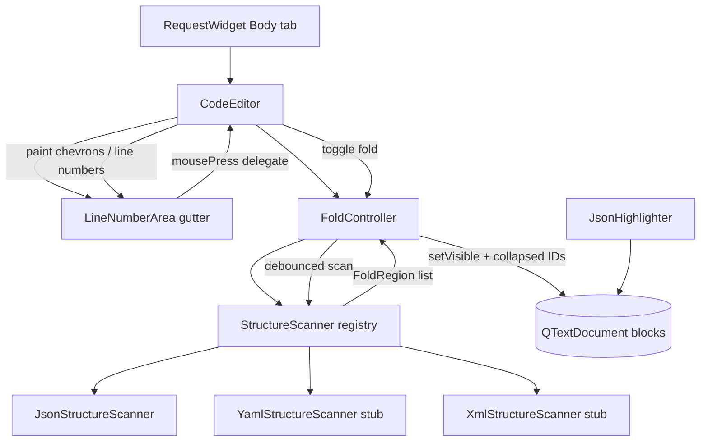

# PYPOST-511: Data in text area should be collapsible for supported formats JSON/YAML/XML

## Research

### Current editor stack

- The Body tab uses `CodeEditor` (`pypost/ui/widgets/code_editor.py`), extending
  `VariableAwarePlainTextEdit` → `QPlainTextEdit`. PYPOST-510 added a left gutter via
  `LineNumberArea` and viewport margins; numbers are painted in
  `line_number_area_paint_event()` using `firstVisibleBlock()`, `block.isVisible()`, and
  `blockNumber() + 1`.
- `RequestWidget` (`pypost/ui/widgets/request_editor.py`) instantiates `CodeEditor` and attaches
  `JsonHighlighter` to its document. Body text is read via `toPlainText()` for save/send.
- Format selector (PYPOST-513) is not implemented; JSON is implicit today. Collapse must ship for
  JSON first and expose a format hook for YAML/XML when the selector lands.

### Qt/PySide6 folding mechanisms

| Approach | Works in `QPlainTextEdit` | Preserves `toPlainText()` | Notes |
| --- | --- | --- | --- |
| `QTextBlock.setVisible(False)` | Yes | Yes | Supported by `QPlainTextDocumentLayout`; hidden blocks are omitted from layout but remain in the document. Official choice for line-level folding. |
| Filter text before display (`setPlainText` subset) | Yes | No | Destructive; violates content-preservation requirement. |
| `QTextBlockFormat` zero-height blocks | Partial | Yes | Fragile in `QPlainTextEdit`; layout glitches reported. |
| `QTextEdit` + `setVisible` | Unreliable | Yes | `QTextEdit` layout often ignores block visibility; not our widget type. |
| Replace editor with tree widget | N/A | N/A | Out of scope; body must stay a plain-text surface. |

**Primary mechanism:** `QTextBlock.setVisible()` on descendant blocks of a collapsed region.
`toPlainText()` and `QTextDocument` iterators still include hidden blocks, so save/send stay
correct. Collapse is a view concern and is not recorded on the undo stack — appropriate for
session-only fold state.

**Refresh after toggling:** call `viewport().update()` (and gutter repaint via existing
`updateRequest` wiring) after batch visibility changes. For large documents, batch
`setVisible()` over contiguous block ranges rather than per-block layout invalidation.

### Block metadata and gutter markers

- `QTextBlockUserData` / `setUserData()` attaches per-block metadata owned by the document
  ([Qt docs](https://doc.qt.io/qt-6/qtextblock.html#setUserData)). Useful for marking fold-start
  lines (`is_fold_header`, `region_id`) during a structure scan. Not suitable for persisting
  collapse state across undo or block deletion — user data is not in undo history and is destroyed
  when the block is removed.
- **Collapse state** lives in a separate in-memory model keyed by stable region identifiers (see
  Architecture), not in `QTextBlockUserData` alone.
- **Gutter markers:** PYPOST-510 explicitly deferred fold affordances to this task. The existing
  gutter paint loop already skips invisible blocks and aligns to `blockBoundingGeometry()` — the
  same loop can draw chevrons (▶/▼) for fold-header blocks. Clicks are handled on `LineNumberArea`
  via a new delegate method on `CodeEditor` (mirroring the paint delegation pattern).
- `setExtraSelections()` can optionally highlight collapsed header lines; not required for MVP but
  available without subclassing `QPlainTextDocumentLayout`
  ([Qt Quarterly — extra selections pattern](https://doc.qt.io/archives/qq/QtQuarterly31.pdf)).

### Structure detection (format-aware)

Collapse regions must come from parseable structure, not arbitrary selections.

| Format | Region boundary strategy | Invalid/partial document |
| --- | --- | --- |
| JSON | Stack scan over lines: `{`, `[` open; `}`, `]` close (respect strings/comments via lexer or `json.decoder` scan). Pair opening line block with closing line block. | No regions if document is not valid JSON **or** if scanner detects unbalanced/misleading spans; prefer all-or-nothing for MVP JSON. |
| YAML | Indent + block indicators (`-`, `:`, `|`, `>`); map indent levels to start/end line pairs. | No regions when YAML parse fails (future; `PyYAML` or incremental scanner). |
| XML | Tag stack over lines; pair opening/closing tags at same depth. | No regions when not well-formed (future). |

**JSON MVP:** implement a dedicated `JsonStructureScanner` (line/block-based brace matching with
string-aware scanning, or parse via `json.JSONDecoder().raw_decode` walking with line offsets).
Full JSON parse validates before enabling folds; partial invalidity → no fold controls (per
requirements).

**Extensibility:** `StructureScanner` protocol with `scan(text, document) -> list[FoldRegion]`.
Registry keyed by `BodyFormat` enum (`JSON`, `YAML`, `XML`, `PLAIN`). `PLAIN` returns empty.
YAML/XML scanners are stubbed or implemented behind the same interface when formats are active.

### Line numbers with hidden blocks

Current gutter paints `block_number + 1` only when `block.isVisible()`. Hidden blocks get no
number; visible blocks keep their **logical** document line number (not a renumbered sequence).
This preserves orientation for future validation error lines (PYPOST-512) and matches the
requirement that users can still locate themselves in the document.

### Editing, undo, and fold state

- Text edits trigger `QTextDocument.contentsChanged`. A debounced re-scan (e.g. `QTimer` 200 ms)
  recomputes regions and re-applies visibility for collapsed region IDs still present.
- **Region identity:** each `FoldRegion` carries a `region_id` stable across re-scans when the
  structural node is unchanged — e.g. JSON Pointer path (`/users/0/profile`) or
  `(depth, opening_line_text, start_offset)` fallback when parse tree unavailable.
- If a collapsed region's boundaries change or the region disappears (edit broke structure),
  drop it from collapsed set and expand affected blocks.
- **Session-only:** collapse state is not persisted to `RequestData`; loading a request shows all
  blocks expanded (`setVisible(True)` reset).

### Performance

- Structure scan is O(n) in line count; acceptable for thousands of lines with debouncing.
- Avoid `markContentsDirty(0, doc.size())` on every toggle; rely on `setVisible` + viewport
  update.
- Do not re-scan on every keystroke synchronously; debounce coalesces bursts during typing.

## Implementation Plan

1. **Add fold domain types** — `pypost/ui/widgets/fold/` (or flat modules if preferred):
   - `FoldRegion` dataclass: `region_id`, `start_block`, `end_block`, `header_block` (line with
     opening token), `kind` (object/array/element).
   - `StructureScanner` protocol: `scan(document) -> list[FoldRegion]`.
   - `JsonStructureScanner` — first concrete implementation.
   - `YamlStructureScanner`, `XmlStructureScanner` — stubs raising `NotImplementedError` or
     returning `[]` until PYPOST-513 enables those formats.
2. **Add `FoldController`** — owns collapsed `region_id` set, runs debounced scan, applies
   `setVisible` to descendant blocks, exposes `toggle(region_id)`, `expand_all()`, `is_collapsed()`.
3. **Extend `CodeEditor`**:
   - `body_format: BodyFormat` property (default `JSON`); `set_body_format()` for PYPOST-513.
   - Wire `FoldController` to `document().contentsChanged` and fold toggles.
   - Extend `line_number_area_width()` for chevron column (~12–16 px + existing number width).
   - Extend `line_number_area_paint_event()` to draw chevrons on fold-header visible blocks.
   - Add `line_number_area_mouse_press(event)` — map y → block, detect chevron hit rect, toggle.
   - Ensure `resizeEvent` / gutter geometry account for wider gutter.
4. **Extend `LineNumberArea`** — forward `mousePressEvent` to editor delegate (fold clicks only;
   still no keyboard focus).
5. **`RequestWidget`** — no change required for JSON MVP. When PYPOST-513 adds format selector,
   connect `body_format` on `body_edit` to the selected format.
6. **Tests** (`tests/test_code_editor_folding.py` or extend `tests/test_code_editor.py`):
   - Valid JSON: collapse region hides descendant blocks; `toPlainText()` unchanged.
   - Expand restores block visibility and content.
   - Nested multi-level collapse/expand.
   - Invalid JSON: no chevrons; all blocks visible.
   - Line numbers on visible blocks show logical numbers (gaps where lines hidden).
   - Regression: existing line-number, indent, paste tests pass.

## Architecture



### Modules

| Module | Responsibility |
| --- | --- |
| `fold/fold_region.py` | `FoldRegion`, `BodyFormat` enum, shared types |
| `fold/structure_scanner.py` | `StructureScanner` protocol and scanner registry |
| `fold/json_structure_scanner.py` | JSON nestable-region detection (MVP) |
| `fold/yaml_structure_scanner.py` | YAML scanner stub/interface for PYPOST-513 |
| `fold/xml_structure_scanner.py` | XML scanner stub/interface for PYPOST-513 |
| `fold/fold_controller.py` | Debounced scan, collapse state, apply `setVisible` |
| `code_editor.py` | Integrate `FoldController`; wider gutter; chevron paint and click handling |
| `line_number_area.py` | Forward mouse events to host for fold toggles |
| `request_editor.py` | Unchanged for MVP; later passes `body_format` from selector |
| `tests/test_code_editor_folding.py` | Collapse/expand, content preservation, line numbers |

### Module interaction

1. User opens Body tab with valid JSON → `FoldController` scans → marks fold-header blocks (via
   scan result) → gutter draws chevrons on header lines.
2. User clicks chevron → `CodeEditor` → `FoldController.toggle(region_id)` → descendant blocks
   `setVisible(False)` → viewport + gutter repaint.
3. User saves/sends → `toPlainText()` returns full text including hidden blocks.
4. User edits text → debounced re-scan → regions recomputed → collapsed IDs re-applied where still
   valid; invalid JSON clears folds.
5. PYPOST-513 sets `CodeEditor.body_format` → registry selects YAML/XML scanner.

### Interfaces / APIs

```python
class BodyFormat(Enum):
    JSON = "json"
    YAML = "yaml"
    XML = "xml"
    PLAIN = "plain"


@dataclass(frozen=True)
class FoldRegion:
    region_id: str          # stable key, e.g. JSON pointer path
    header_block: int       # block number of line with opening token
    start_block: int        # same as header for JSON line-based regions
    end_block: int          # closing line block number
    kind: str               # "object" | "array" | "element"


class StructureScanner(Protocol):
    def scan(self, document: QTextDocument) -> list[FoldRegion]: ...


class FoldController:
    def __init__(self, editor: QPlainTextEdit, format: BodyFormat = BodyFormat.JSON): ...
    def set_body_format(self, format: BodyFormat) -> None: ...
    def regions(self) -> list[FoldRegion]: ...
    def is_collapsed(self, region_id: str) -> bool: ...
    def toggle(self, region_id: str) -> None: ...
    def expand_all(self) -> None: ...
    def apply_visibility(self) -> None: ...
    def fold_header_at_block(self, block_number: int) -> FoldRegion | None: ...


# CodeEditor additions
def set_body_format(self, format: BodyFormat) -> None: ...
def line_number_area_mouse_press(self, event: QMouseEvent) -> None: ...
def fold_controller(self) -> FoldController: ...
```

Gutter width: `chevron_width + padding + digit_width * num_digits` (extend
`line_number_area_width()`).

Chevron hit test: for visible block at click y, if block is a fold header, chevron rect is
leftmost `chevron_width` pixels of gutter.

### Architectural patterns

| Pattern | Use | Justification |
| --- | --- | --- |
| **Strategy** | `StructureScanner` per format | JSON now; YAML/XML plug in without changing controller or gutter |
| **Controller** | `FoldController` | Separates view-state (collapsed set) from widget painting and input |
| **Delegated gutter** (existing) | Paint and mouse on `CodeEditor`, thin widget on margin | Same as PYPOST-510; host needs protected block geometry APIs |
| **Observer** | `contentsChanged` → debounced scan; `updateRequest` → gutter sync | No polling; aligns with line-number architecture |
| **View/model separation** | Collapse state not in document text or undo | Meets reliability requirement; session-only fold state |

### Key design decisions

1. **`QTextBlock.setVisible()` over text removal** — only Qt mechanism that hides lines while
   keeping full `toPlainText()` for save/send.
2. **Logical line numbers, not renumbered** — visible blocks show original `blockNumber + 1`;
   hidden blocks omitted from gutter. Supports PYPOST-512 error lines and user orientation.
3. **Structure scan gate** — fold controls appear only when the active format scanner succeeds;
   invalid JSON behaves as today (no chevrons).
4. **Stable `region_id` for collapse persistence across edits** — JSON Pointer–style paths
   (fallback: start offset + depth) so debounced re-scan can re-apply collapsed sections after
   typing elsewhere in the document.
5. **Gutter chevrons, not inline text mutation** — collapsed sections are indicated by ▶/▼ in the
   margin; body characters are never replaced with `...` or minified placeholders.
6. **Widen existing gutter** — extend PYPOST-510 gutter rather than a second margin widget; keeps
   scroll sync and geometry in one place.
7. **`BodyFormat` hook defaulting to JSON** — `RequestWidget` unchanged for MVP; PYPOST-513 wires
   `set_body_format()` later. YAML/XML scanners registered but inert until format is active.
8. **Session-only collapse state** — not stored in `RequestData`; `load_data()` / `setPlainText`
   calls `expand_all()` to reset view state.
9. **Invalidated folds expand safely** — if an edit breaks a region's boundaries, remove from
   collapsed set and show all blocks rather than leaving inconsistent visibility.

### Compatibility checklist

| Existing behavior | Impact |
| --- | --- |
| Line numbers (PYPOST-510) | Gutter widened; paint skips hidden blocks; logical numbers preserved |
| JSON syntax highlighting | Unaffected; highlighter runs on all blocks including hidden |
| Auto-indent / bracket enter | Unaffected; may trigger re-scan after edit |
| JSON paste formatting | Unaffected; re-scan after paste; folds reset or remapped |
| Variable hover tooltips | Viewport coordinates unchanged |
| Placeholder text | Unaffected |
| Future format selector (513) | `set_body_format()` switches scanner |
| Future validation errors (512) | Logical line numbers align with error line references |

## Q&A

- Q: Why `setVisible()` instead of removing lines from the widget text?
  A: Requirements mandate full body text for save/send and forbid altering characters. Hidden blocks
  stay in the document but are omitted from layout
  ([QTextBlock.setVisible](https://doc.qt.io/qt-6/qtextblock.html#setVisible),
  [QPlainTextEdit notes](https://runebook.dev/en/docs/qt/qtextblock/setVisible)).
- Q: Why not store collapse state in `QTextBlockUserData`?
  A: User data is destroyed with blocks, excluded from undo, and tied to block identity. Collapse
  state needs a controller-level set keyed by stable region IDs
  ([setUserData ownership](https://doc.qt.io/qt-6/qtextblock.html#setUserData)).
- Q: Where do fold controls appear?
  A: Chevrons in the left gutter on lines that open a nestable region (opening `{`, `[`, YAML
  block, XML start tag). Click toggles collapse.
- Q: What line numbers are shown when lines are hidden?
  A: Logical document line numbers for visible blocks only (e.g. 1, 2, 5, 6 with 3–4 hidden) —
  not a renumbered 1, 2, 3, 4 sequence.
- Q: How does this work before PYPOST-513 format selector?
  A: `BodyFormat.JSON` is implicit; only `JsonStructureScanner` runs. YAML/XML modules exist as
  stubs for later wiring.
- Q: Is collapse state saved with the request?
  A: No — session-only; reload expands all (per requirements out-of-scope for persistence).
- Q: What happens on invalid JSON?
  A: Scanner returns no regions; all blocks visible; no chevrons — same as plain text today.
- Q: Does collapse affect undo/redo of text edits?
  A: No. Visibility changes are outside the undo stack. Text undo/redo triggers re-scan via
  `contentsChanged`.
