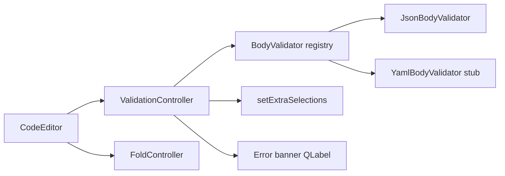

# PYPOST-512: Text area should show errors in data according to the format

## Research

### Current editor stack

- Body tab uses `CodeEditor` with `BodyFormat` enum (default `JSON`), `FoldController` for
  collapsible sections, and `LineNumberArea` showing logical line numbers (PYPOST-510/511).
- `RequestWidget` attaches `JsonHighlighter`; body text read via `toPlainText()`.
- Format selector (PYPOST-513) not implemented; JSON is implicit.

### Qt error display options

| Approach | Preserves `toPlainText()` | Notes |
| --- | --- | --- |
| `QPlainTextEdit.setExtraSelections()` | Yes | Highlight error line/column; does not modify document. Official pattern for transient markers. |
| Modify document text (error annotations) | No | Violates content-preservation requirement. |
| Separate error list widget | Yes | Possible but splits attention; inline highlight preferred for MVP. |
| `QSyntaxHighlighter` error state | Yes | Highlighter is lexical; parse errors need full-document validation. |

**Primary mechanism:** debounced format validator → `ValidationError(line, column, message)` →
`setExtraSelections()` for line background + column wave underline; compact error banner label
overlaid at editor bottom for the message text.

### Validation by format

| Format | Strategy | Invalid document |
| --- | --- | --- |
| JSON | `json.loads()`; map `JSONDecodeError.lineno/colno/msg` | Single first error |
| YAML | Stub returns no errors until `PyYAML` or scanner lands | No inline errors (MVP) |
| XML | Stub returns no errors until well-formed parse lands | No inline errors (MVP) |
| PLAIN | No validator | No errors |

JSON `JSONDecodeError` provides 1-based `lineno` and `colno`, aligned with gutter line numbers.

## Implementation Plan

1. Add `validate/` package parallel to `fold/`: shared `ValidationError`, `BodyValidator` protocol,
   registry keyed by `BodyFormat`, `JsonBodyValidator`, YAML/XML stubs.
2. Add `ValidationController`: debounced validation (200 ms), stores errors, applies extra
   selections and error banner.
3. Wire `CodeEditor`: own `ValidationController`; `set_body_format()` switches validator; empty
   body clears errors.
4. Tests: JSON valid/invalid, line/column mapping, extra selections and banner text.
5. Dev doc `doc/dev/body_editor_validation.md`.

## Architecture

### Key design decisions

1. **Registry mirrors `StructureScanner`** — same `BodyFormat` enum; PYPOST-513 switches both
   fold scanner and validator via `set_body_format()`.
2. **Debounced validation (200 ms)** — matches `FoldController` debounce; avoids validating on
   every keystroke.
3. **Logical line numbers** — error `line` is 1-based document line, matching gutter numbers
   (including when some lines are folded hidden).
4. **First error only for JSON** — `json.loads()` reports one `JSONDecodeError`; sufficient for MVP.
5. **Non-destructive display** — extra selections and banner only; no document mutation.
6. **PLAIN skips validation** — unstructured bodies show no format errors.

### Module layout

| File | Responsibility |
| --- | --- |
| `validate/validation_error.py` | `ValidationError` dataclass |
| `validate/body_validator.py` | Protocol, registry, `get_validator()` |
| `validate/json_body_validator.py` | JSON parse validation |
| `validate/yaml_body_validator.py` | Stub |
| `validate/xml_body_validator.py` | Stub |
| `validate/validation_controller.py` | Debounce, apply UI markers |
| `code_editor.py` | Own controller; `set_body_format` hook |

## Q&A

- Q: Why not validate inside `JsonStructureScanner`?
  A: Separation of concerns — folding and validation share format enum but differ in output and UI;
  independent debounce cycles allow one to fail without blocking the other.
- Q: Do folded hidden lines affect error line numbers?
  A: No — errors reference document block numbers; gutter shows the same logical line when visible.
- Q: What if JSON is valid but user wants YAML semantics?
  A: Until PYPOST-513, default is JSON; YAML validator stub returns no errors.
