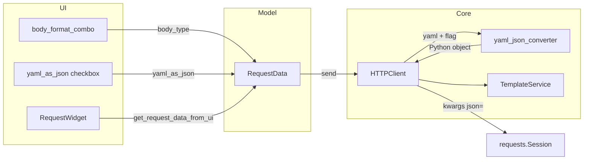

# PYPOST-514: Architecture — "YAML as JSON" send-time conversion

## Research

### Current behavior

- `RequestWidget` Body tab (`request_editor.py`) has a format combo (JSON / YAML / XML)
  wired to `RequestData.body_type` (PYPOST-513).
- `HTTPClient._prepare_request_kwargs` (`http_client.py`) serializes the body after template
  rendering:
  - `body_type == "json"` → `json.loads` → `kwargs["json"]` (falls back to `data` on parse error).
  - any other `body_type` → `kwargs["data"]` with raw text (YAML sent as plain text today).
- `RequestData` (`models.py`) stores `body: str` and `body_type: str`; no conversion flag yet.
- History records the resolved **editor** body via `SensitiveDataMaskingPolicy`, not the wire form.
- `CurlGenerator` copies the rendered raw body; it does not apply send-time conversion.
- PyYAML is **not** yet in `requirements.txt`; no YAML parse utility exists in `pypost/core/`.

### Library choice

| Option | Pros | Cons |
| --- | --- | --- |
| **PyYAML** (`yaml.safe_load`) | De-facto standard, small API, matches future PYPOST-518 validator needs | YAML 1.1 semantics (e.g. `yes`/`no` booleans) |
| **ruamel.yaml** | YAML 1.2, round-trip fidelity | Heavier dependency; overkill for one-way send conversion |

**Decision:** PyYAML with `yaml.safe_load` only (never `yaml.load`). User-authored request
bodies are untrusted input; `safe_load` restricts construction to basic Python types. Parsed
values are passed to `requests` via `kwargs["json"]`, which serializes with the stdlib
`json` encoder — same path as native JSON bodies.

References: [PyYAML safe_load docs](https://pyyaml.org/wiki/PyYAMLDocumentation),
[YAML→JSON Python patterns](https://stackoverflow.com/questions/50846431/converting-a-yaml-file-to-json-object-in-python).

## Implementation Plan

1. **Model** — add `yaml_as_json: bool = False` to `RequestData`.
2. **Core converter** — new module `pypost/core/yaml_json_converter.py` with a pure function
   that parses YAML text and returns a JSON-serializable Python object; map parse failures to
   a typed exception.
3. **HTTP send path** — extend `_prepare_request_kwargs` to convert when
   `body_type == "yaml"` and `yaml_as_json` is true; raise `ExecutionError` on failure.
4. **Error UX** — add `ErrorCategory.BODY`, a `_ERROR_MESSAGES` entry in `tabs_presenter.py`,
   and non-retryable handling in `request_service.py`.
5. **UI** — add `QCheckBox("YAML as JSON")` on the Body tab format row; wire load/save like
   `mcp_check` / `expose_as_mcp`; enable checkbox only when format is YAML.
6. **Dependency** — add `PyYAML` to `requirements.txt`.
7. **Tests** — persistence in `test_request_editor_body_format.py` (or dedicated file),
   send behavior and error path in `test_http_client.py`, converter unit tests,
   and BODY non-retry in `test_retry.py` (or dedicated file).

## Architecture

### Module diagram



### Body tab layout

Extend the PYPOST-513 format row:

```text
┌─ Body tab ───────────────────────────────────────┐
│ Format: [ YAML ▼ ]   [ ] YAML as JSON             │
│ ┌────────────────────────────────────────────────┐ │
│ │ CodeEditor (body_edit) — stays YAML in UI      │ │
│ └────────────────────────────────────────────────┘ │
└────────────────────────────────────────────────────┘
```

- Checkbox sits in `format_row` after the combo (with stretch before/after as needed).
- `body_edit` reference and external API unchanged.

### Send-time decision flow

```text
render body via TemplateService
        │
        ▼
body empty? ──yes──► no body kwargs (unchanged)
        │ no
        ▼
body_type == "yaml" AND yaml_as_json?
        │
   no ──┴── yes
   │         │
   │         ▼
   │    yaml_json_converter.convert(body)
   │         │
   │    fail ──► ExecutionError(BODY) — request NOT sent
   │         │
   │    ok ──► kwargs["json"] = parsed object
   │
   ▼
existing json / raw-data branches (unchanged)
```

### Module responsibilities

| Module | Change |
| --- | --- |
| `models.py` | `RequestData.yaml_as_json: bool = False` |
| `yaml_json_converter.py` | **New.** `convert_yaml_body_to_object(text: str) -> Any`; raises `YamlBodyConversionError` |
| `http_client.py` | Branch in `_prepare_request_kwargs`; raise `ExecutionError(BODY)` on conversion failure |
| `request_service.py` | In `_execute_http_with_retry`, treat `ErrorCategory.BODY` as **non-retryable** — re-raise immediately without entering the back-off/retry loop (same intent as pre-send `TEMPLATE` validation, which never reaches the retry loop) |
| `errors.py` | `ErrorCategory.BODY` |
| `tabs_presenter.py` | `_ERROR_MESSAGES[ErrorCategory.BODY]` user-facing template |
| `request_editor.py` | Checkbox UI, load/save `yaml_as_json`; `setEnabled` when format is YAML |
| `requirements.txt` | `PyYAML` |
| `tests/test_yaml_json_converter.py` | **New.** Valid/invalid YAML, multi-document rejection, JSON-serialization failure |
| `tests/test_http_client.py` | Send with flag on/off, invalid YAML blocks send |
| `tests/test_request_editor_body_format.py` | Checkbox persistence and enabled-state by format |
| `tests/test_retry.py` | BODY errors do not trigger retry when a retry policy is configured |

**Out of scope (unchanged):** `CurlGenerator`, history body text, editor content on send,
paste-time JSON→YAML (PYPOST-515), YAML validation/folding (PYPOST-518/519).

### Interfaces

#### RequestData (model)

```python
yaml_as_json: bool = False
```

Serializes with existing Pydantic `model_dump` / collection storage — no migration.

#### yaml_json_converter (core)

```python
class YamlBodyConversionError(Exception):
    """YAML body could not be parsed for JSON send."""

def convert_yaml_body_to_object(text: str) -> Any:
    """Parse YAML text into a JSON-serializable Python object.

    Raises:
        YamlBodyConversionError: On empty/invalid YAML or non-serializable result.
    """
```

- Strip whitespace; treat blank body as “no body” (caller skips conversion).
- Parse with `yaml.safe_load_all(text)`; **reject unless exactly one document**
  (`len(list(safe_load_all(...))) == 1`). Multi-document YAML streams (e.g. `---` separators)
  raise `YamlBodyConversionError` — typical API payloads are single documents.
- Wrap `yaml.YAMLError` as `YamlBodyConversionError`.
- After a successful parse, validate JSON serializability with `json.dumps(parsed)` inside the
  converter. Non-serializable values (e.g. `datetime`, custom objects that slip through) must
  raise `YamlBodyConversionError` before the object reaches `kwargs["json"]`. Do not rely on
  `requests` to surface `TypeError` at send time.

#### HTTPClient._prepare_request_kwargs

```python
if request_data.body_type == "yaml" and request_data.yaml_as_json and body:
    try:
        kwargs["json"] = convert_yaml_body_to_object(body)
    except YamlBodyConversionError as exc:
        raise ExecutionError(
            category=ErrorCategory.BODY,
            message="Could not convert YAML body to JSON.",
            detail=str(exc),
        ) from exc
elif request_data.body_type == "json" and body:
    ...  # existing
elif request_data.body_type != "json":
    kwargs["data"] = body
```

When conversion applies, `requests` sets `Content-Type: application/json` automatically
(same as native JSON bodies).

#### RequestService._execute_http_with_retry

Today `_execute_http_with_retry` catches every `ExecutionError` from `http_client.send_request`
and retries until `max_retries` is exhausted (see `request_service.py` lines 166–181). BODY errors
are pre-send validation failures (like `TEMPLATE` in `execute()`): retrying cannot fix invalid
YAML. **BODY must not enter the retry loop.**

```python
except ExecutionError as exc:
    if exc.category == ErrorCategory.BODY:
        raise  # non-retryable — invalid body; request never left the client
    last_error = exc
    if attempt == max_retries:
        ...
```

No retry metrics (`track_retry_attempt`), no `retry_callback`, no back-off delay for BODY.

#### tabs_presenter._ERROR_MESSAGES

```python
ErrorCategory.BODY: (
    "Could not convert YAML body to JSON: {detail}. Check YAML syntax and structure."
),
```

Uses the same `{url}` / `{detail}` `.format()` path as other categories (`detail` carries the
converter message; `message` on `ExecutionError` remains the short internal summary).

#### RequestWidget (UI)

Mirror `mcp_check` wiring:

- `load_data`: `self.yaml_as_json_check.setChecked(self.request_data.yaml_as_json)`
- `update_request_data` / `get_request_data_from_ui`: read/write `yaml_as_json`
- **Required UX:** on format change (and initial load), call
  `yaml_as_json_check.setEnabled(body_format == BodyFormat.YAML)`. When disabled, the checkbox
  is greyed out but **checked state always persisted** in `RequestData` (no send effect when
  `body_type != "yaml"` per requirements).

### Patterns and justification

1. **Send-time conversion in core, not UI** — keeps `RequestWidget` free of HTTP/serialization
   logic; `HTTPClient` already owns `body_type` branching (same as PYPOST-513 rationale for
   keeping `BodyFormat` mapping in UI only).
2. **Pure converter module** — testable without mocking `requests`; single responsibility.
3. **Reuse `kwargs["json"]` path** — no duplicate Content-Type or encoding logic.
4. **Fail closed** — invalid YAML raises before `session.request`; no silent fallback to raw
   YAML when conversion was requested.
5. **Editor body untouched** — `RequestData.body` remains YAML; conversion is ephemeral at
   prepare-kwargs time only.

## Decisions

1. **Field name `yaml_as_json`** — boolean on `RequestData`, parallel to `expose_as_mcp`.
2. **PyYAML + safe_load_all** — security and simplicity over ruamel.yaml; single-document
   enforcement via document count.
3. **New `ErrorCategory.BODY`** — distinct user message from template/network errors.
4. **Checkbox enabled only for YAML format** — required UX (`setEnabled`); persisted flag
   ignored on send when `body_type != "yaml"`.
5. **BODY errors are non-retryable** — `_execute_http_with_retry` re-raises `ErrorCategory.BODY`
   immediately; invalid YAML is not a transient network fault.
6. **History and cURL show editor YAML** — requirements scope send path only; avoids
   surprising users who expect history to match what they typed.
7. **No metrics for checkbox toggle** — low-value UI control (consistent with PYPOST-513
   format selector decision).
8. **JSON serializability validated in converter** — `json.dumps` after `safe_load_all` catches
   non-JSON types before `kwargs["json"]`; avoids depending on `requests` encoder errors.

## Q&A

- Q: Why not change `body_type` to `"json"` at send time?
  A: That would conflate editor format with wire format and complicate persistence/restore.
  A dedicated flag keeps YAML editing UX while opt-in JSON delivery.
- Q: Why convert in `HTTPClient` rather than `RequestService`?
  A: `_prepare_request_kwargs` already centralizes body serialization by `body_type`; conversion
  is another serialization rule, not orchestration logic.
- Q: What if JSON serialization fails after successful YAML parse (e.g. non-JSON types)?
  A: The converter runs `json.dumps(parsed)` after parse. Failure raises
  `YamlBodyConversionError` → `ExecutionError(BODY)` before any HTTP attempt. Do not defer
  this to the `requests` `json=` encoder.
- Q: Do BODY errors retry when a retry policy is configured?
  A: No. `_execute_http_with_retry` re-raises `ErrorCategory.BODY` on first catch — same
  non-retryable intent as `TEMPLATE` pre-send validation. Tests must assert zero retry attempts
  when conversion fails under a non-zero `max_retries` policy.
- Q: Does Copy cURL reflect JSON conversion?
  A: No — out of scope. cURL continues to use rendered editor text. Document for possible
  follow-up if users need parity.
- Q: Relation to PYPOST-515?
  A: PYPOST-515 is paste-time JSON→YAML display when checkbox is on. This task is send-time
  YAML→JSON only; shared `yaml_as_json` flag on `RequestData` links both features.
