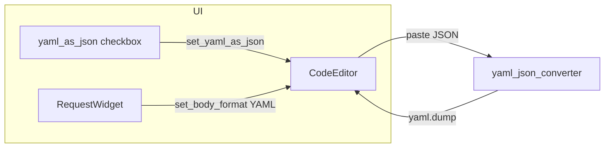

# PYPOST-515: Architecture — paste-time JSON→YAML

## Overview

Extend the existing `CodeEditor.insertFromMimeData` hook. When pasted text is valid JSON and the
editor is configured for YAML body with `yaml_as_json` enabled, insert YAML instead of formatted
JSON.

## Data flow



## Components

| Layer | Change |
|-------|--------|
| `yaml_json_converter.py` | Add `convert_json_object_to_yaml(obj)` — `yaml.dump`, block style |
| `code_editor.py` | `_yaml_as_json` flag, `set_yaml_as_json`, branch in `insertFromMimeData` |
| `request_editor.py` | Sync checkbox and format to `body_edit` on load, format change, checkbox toggle |

## Paste decision

```text
paste has text?
  no → super().insertFromMimeData
  yes → json.loads(text) succeeds?
    no → super().insertFromMimeData
    yes → body_format == YAML AND yaml_as_json?
      yes → insert convert_json_object_to_yaml(parsed)
      no  → insert json.dumps(parsed, indent=indent_size)  [existing]
```

## Out of scope

- Send-time conversion (PYPOST-514)
- cURL / history parity (PYPOST-522)
- YAML validation on paste
