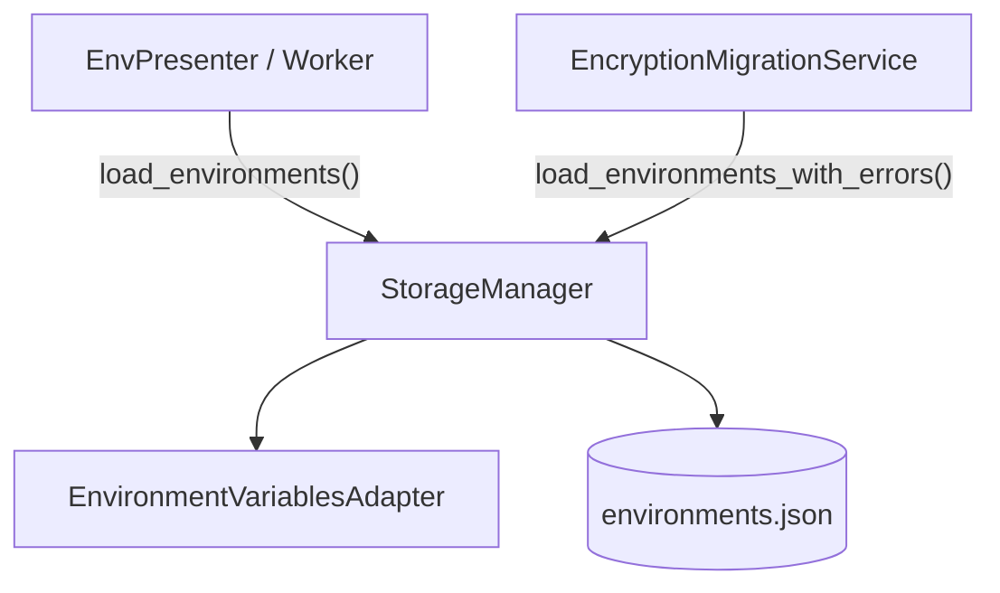
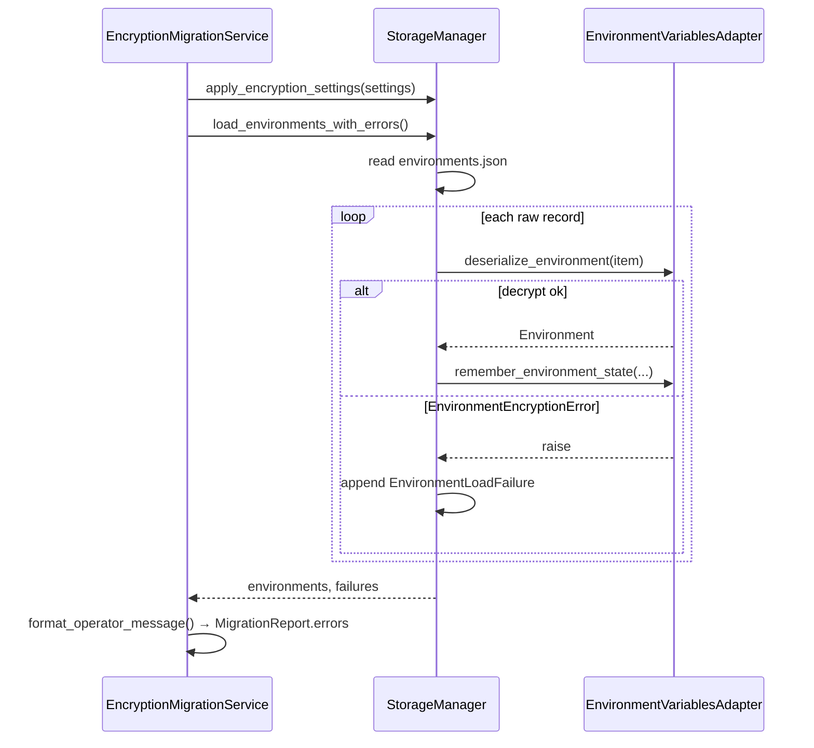

# PYPOST-525: Per-environment failure reporting for encryption migration

## Research

### Current behavior

1. **`StorageManager.load_environments()`** (`pypost/core/storage.py`) reads
   `environments.json`, deserializes every record in a single loop, and on **any** exception
   (file I/O, JSON parse, or per-item decrypt/deserialize) logs
   `load_environments_failed` and returns `[]`. Successful items never surface if a later item
   fails; the UI path favors all-or-nothing resilience.

2. **`EncryptionMigrationService._deserialize_all()`** (`pypost/core/encryption_migration.py`)
   bypasses that path: it reads raw JSON via `_read_raw_environments()`, then calls the private
   `self._storage._env_adapter.deserialize_environment(item)` per record, catching
   `EnvironmentEncryptionError` and collecting `f"{env_name}: {exc}"` strings. This is TD-1 from
   [PYPOST-487](../PYPOST-487/60-tech-debt.md).

3. **Operator-visible error format today** — migration tests assert messages like
   `"Dev: … could not be decrypted"` (`tests/test_encryption_migration.py`,
   `test_verify_decrypt_access_detects_corrupt_ciphertext`). `MigrationReport.errors` remains
   `tuple[str, ...]`; this task must preserve that string shape for operators.

4. **Desktop contract** — `EnvPresenter`, `EnvironmentStorageWorker`, and async gateway call
   `load_environments()` only. Requirements forbid changing that observable behavior.

5. **Adapter boundary** — `EnvironmentVariablesAdapter.deserialize_environment()` performs
   decrypt, metrics, and `Environment` construction. Per-item failures originate as
   `EnvironmentEncryptionError`; malformed records may also raise Pydantic `ValidationError`.

6. **Python conventions** — project uses `@dataclass(frozen=True)` for small result types
   (`EnvironmentInventory`, `MigrationReport`, `EncryptionKey`). Type hints on public APIs;
   Google-style docstrings on new methods.

## Implementation Plan

### Phase 1 — Public storage result type and method

1. Add `EnvironmentLoadFailure` frozen dataclass in `pypost/core/storage.py` (or
   `pypost/core/environment_load_types.py` if the file grows; prefer co-location with
   `StorageManager` for minimal scope).
2. Add `StorageManager.load_environments_with_errors() -> tuple[list[Environment], tuple[EnvironmentLoadFailure, ...]]`.
3. Implement per-item loop: deserialize via existing `_env_adapter`, call
   `remember_environment_state` on success, append `EnvironmentLoadFailure` on failure, continue
   remaining items.
4. Leave `load_environments()` signature and all-or-nothing semantics unchanged.

### Phase 2 — Migration decoupling

1. Rewrite `_deserialize_all()` to call `load_environments_with_errors()` after
   `apply_encryption_settings` (already applied by callers).
2. Map `EnvironmentLoadFailure` → operator strings with `format_operator_message()` so
   `MigrationReport.errors` and log lines stay identical.
3. Remove all `self._storage._env_adapter` references from `encryption_migration.py`.
4. Keep `_read_raw_environments()` / `_scan_raw_environments()` for inventory-only scans
   (no decrypt); out of scope for TD-2 duplicate read path.

### Phase 3 — Tests

| Area | File | Focus |
| --- | --- | --- |
| New storage API | `tests/test_storage_environments.py` | Partial success, failure tuple fields, file missing |
| UI regression | `tests/test_storage_environments.py` | `load_environments()` still `[]` on any failure |
| Migration integration | `tests/test_encryption_migration.py` | Existing verify/re-encrypt tests pass unchanged |
| Coupling guard | `tests/test_encryption_migration.py` | Assert migration uses public method (mock/spy) |

## Architecture

### Module diagram



### Responsibilities

| Module | Responsibility | Change |
| --- | --- | --- |
| `StorageManager` | Persist/load environments; desktop vs migration load contracts | **Add** `load_environments_with_errors`; **unchanged** `load_environments` |
| `EnvironmentLoadFailure` | Structured per-item load failure | **New** type |
| `EnvironmentVariablesAdapter` | Decrypt/deserialize one raw record | No public API change |
| `EncryptionMigrationService` | Verify, re-encrypt, encrypt-plaintext | **Use** public storage method; **remove** `_env_adapter` access |
| `EnvPresenter` / gateway / worker | Desktop environment list | No change |

### Interaction — migration verify with one bad environment



### Selected patterns

1. **Parallel public contracts** — desktop resilience (`load_environments`) and migration
   batch reporting (`load_environments_with_errors`) coexist without forcing UI trade-offs.
2. **Adapter composition** — storage owns file I/O and iteration; adapter owns crypto/policy
   (unchanged from PYPOST-482).
3. **Frozen value objects** — `EnvironmentLoadFailure` matches existing migration report types.
4. **Fail-continue batch** — migration-oriented path never aborts the loop on first bad record.

### Main interfaces / APIs

#### `EnvironmentLoadFailure`

```python
@dataclass(frozen=True)
class EnvironmentLoadFailure:
  """One stored environment record that failed decrypt or deserialize."""

  name: str
  environment_id: str | None
  reason: str

  def format_operator_message(self) -> str:
    """Human-readable line for CLI and MigrationReport.errors."""
    return f"{self.name}: {self.reason}"
```

| Field | Source | Notes |
| --- | --- | --- |
| `name` | `raw_env.get("name", "unknown")` | Matches current migration identity |
| `environment_id` | `raw_env.get("id")` if present | Stable id for logs/diagnostics; optional |
| `reason` | `str(exc)` from caught exception | Must not include key material (adapter already sanitizes) |

#### `StorageManager.load_environments_with_errors`

```python
def load_environments_with_errors(
    self,
) -> tuple[list[Environment], tuple[EnvironmentLoadFailure, ...]]:
  """Load all stored environments, collecting per-record failures.

  Unlike load_environments(), continues after individual decrypt or
  deserialize failures and returns both successful environments and
  structured failure details.

  Caller must invoke apply_encryption_settings() before this method when
  encryption policy matters (same as load_environments).

  Returns:
    A pair (environments, failures). environments preserves on-disk order
    for successfully loaded records only. failures lists every record that
    could not be deserialized.

  File-level behavior (missing file, invalid JSON, non-list root):
    Returns ([], ()) and logs an error — same effective outcome as an empty
    store. Per-environment reporting applies only to valid list entries.
  """
```

**Exception handling per item**

| Exception | Action |
| --- | --- |
| `EnvironmentEncryptionError` | Append failure; continue (parity with current `_deserialize_all`) |
| `ValidationError` (Pydantic) | Append failure with reason; continue |
| Other unexpected `Exception` | Log at error; append failure with generic reason; continue |

Rationale: migration must not crash mid-batch; operators need every bad environment listed.

**Logging**

- Success path: `load_environments_with_errors_completed count=%d error_count=%d file=%s`
- File-level failure: `load_environments_with_errors_failed file=%s error=%s` (distinct event
  name from desktop `load_environments_failed` for observability in Step 5).

**`load_environments()` (unchanged contract)**

- Keeps existing try/except around the full read+loop.
- Any failure → `[]` + `load_environments_failed` log.
- May internally call shared private helper in Step 3; behavior must not change.

#### Migration service changes

```python
def _deserialize_all(
    self,
    settings: AppSettings | None,
) -> tuple[list[Environment], tuple[str, ...]]:
    self._storage.apply_encryption_settings(settings)
    environments, failures = self._storage.load_environments_with_errors()
    errors = tuple(f.format_operator_message() for f in failures)
    return environments, errors
```

- **Removed**: `self._storage._env_adapter.deserialize_environment(...)`.
- **Removed**: duplicate raw read inside `_deserialize_all` (storage reads the file).
- **Unchanged**: `verify_decrypt_access`, `bulk_re_encrypt`, `encrypt_plaintext_hidden`
  operator outcomes; `MigrationReport.errors` remains `tuple[str, ...]`.

### Error tuple format

| Layer | Type | Example |
| --- | --- | --- |
| Storage (structured) | `tuple[EnvironmentLoadFailure, ...]` | `EnvironmentLoadFailure(name="Dev", environment_id="e1", reason="Failed to decrypt environment variable 'SECRET': …")` |
| Migration / CLI (operator) | `tuple[str, ...]` | `"Dev: Failed to decrypt environment variable 'SECRET': …"` |

Conversion is one-way formatting at the migration boundary via `format_operator_message()`.
Storage does not emit pre-formatted strings so identity fields stay available for future CLI
`--json` work (out of scope).

### Test plan

#### `tests/test_storage_environments.py` (new)

1. **`test_load_environments_with_errors_all_success`** — round-trip save/load; failures empty;
   result equals `load_environments()` output.
2. **`test_load_environments_with_errors_partial_decrypt_failure`** — two environments; corrupt
   ciphertext on one; returns one `Environment` and one `EnvironmentLoadFailure` with correct
   `name` / `reason`; second env still loaded.
3. **`test_load_environments_with_errors_missing_key`** — encrypted env without key material;
   failure reason mentions decrypt; successes empty if only one env.
4. **`test_load_environments_with_errors_missing_file`** — `([], ())`.
5. **`test_load_environments_unchanged_on_partial_failure`** (regression) — same fixture as (2);
   `load_environments()` still returns `[]`.

#### `tests/test_encryption_migration.py`

1. Existing tests (`test_verify_decrypt_access_detects_corrupt_ciphertext`,
   `test_verify_decrypt_access_success`, bulk re-encrypt / encrypt-plaintext) must pass without
   assertion changes.
2. **`test_deserialize_all_uses_public_storage_api`** — patch
   `StorageManager.load_environments_with_errors`; assert called; assert `_env_adapter` not
   accessed (e.g. patch `deserialize_environment` on adapter and expect no call from migration
   when storage is mocked).

#### Manual / CLI smoke (Step 3)

- `scripts/encryption_migrate.py verify` on mixed good/bad `environments.json` — same stderr/exit
  as before.

## Q&A

| Question | Answer |
| --- | --- |
| Why a new method instead of changing `load_environments()`? | Requirements: desktop users keep all-or-nothing resilience; migration needs batch per-item errors. Separate public contracts avoid UI regression. |
| Why structured failures instead of `tuple[str, ...]` from storage? | Requirements ask for environment identity **and** reason; structured fields support logging and future JSON output without parsing `"name: reason"` strings. |
| Should file-level JSON errors appear in the failure tuple? | No — scoped to per-record decrypt/deserialize; file errors log and return `([], ())`, consistent with empty store handling. |
| Does inventory scanning move into storage? | No — `_scan_raw_environments` stays in migration for decrypt-free envelope stats (TD-2 remains out of scope). |
| Export `EnvironmentLoadFailure` from package `__init__`? | Only if other modules need it; migration can import from `pypost.core.storage`. |
