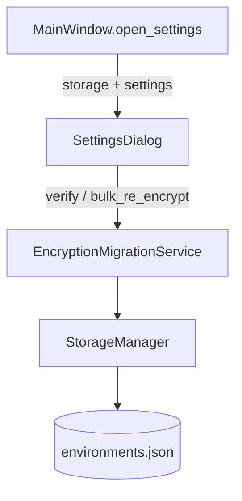

# PYPOST-527: Settings UI verify and re-encrypt actions

## Research

- **PYPOST-487** implemented `EncryptionMigrationService`, CLI, and deferred optional Settings UI
  (TD-3).
- **PYPOST-525** removed private storage coupling; migration uses `load_environments_with_errors()`.
- **SettingsDialog** already exposes encryption mode, key source, and fallback (PYPOST-481/483).
- **MainWindow.open_settings** constructs `SettingsDialog` and persists settings on accept;
  has `self.storage` for encryption policy application after save.
- **Qt patterns**: `QMessageBox.question` for destructive confirm (`env_dialog.py`);
  `QMessageBox.information` / `warning` for outcomes.

## Implementation Plan

1. Extend `SettingsDialog.__init__` with optional `storage: StorageManager | None`.
2. When storage is provided, construct `EncryptionMigrationService(storage)`.
3. Add **Encryption migration** section with two `QPushButton` widgets below encryption help.
4. `_encryption_settings_from_form()` — `AppSettings.model_copy` with encryption fields from form.
5. `_on_verify_encryption()` — `verify_decrypt_access`; show result dialog.
6. `_on_re_encrypt_environments()` — `QMessageBox.question`; on Yes, `bulk_re_encrypt(backup=True)`.
7. `_format_migration_report()` — human-readable summary (mirrors CLI inventory lines).
8. `MainWindow.open_settings` — pass `storage=self.storage`.
9. Tests in `tests/test_settings_encryption_migration_ui.py`.
10. Update `doc/dev/encryption_key_migration.md` operator surfaces diagram.

## Architecture

| Component | Change | Responsibility |
| --- | --- | --- |
| `SettingsDialog` | Modified | Migration section UI; form settings; result dialogs |
| `MainWindow` | Modified | Pass `storage` into Settings |
| `EncryptionMigrationService` | Unchanged | Verify and bulk re-encrypt |
| `StorageManager` | Unchanged | Load/save environments |

### Settings form vs saved config

Verify and re-encrypt use `_encryption_settings_from_form()` so operators can test a new key
source or enabled flag before clicking Save. Non-encryption fields remain from `current_settings`.

### Safety

- Re-encrypt: `QMessageBox.question` default **No**; logs cancel/confirm events.
- Service: `backup=True`, atomic save, fail-closed on decrypt errors (unchanged).

## Q&A

| Question | Answer |
| --- | --- |
| Run migration on UI thread? | Yes — same as CLI synchronous path; acceptable for typical desktop datasets; progress UI is out of scope. |
| Share report formatter with CLI? | UI uses a local `_format_migration_report`; CLI keeps its own formatter to avoid coupling scripts to Qt. |
