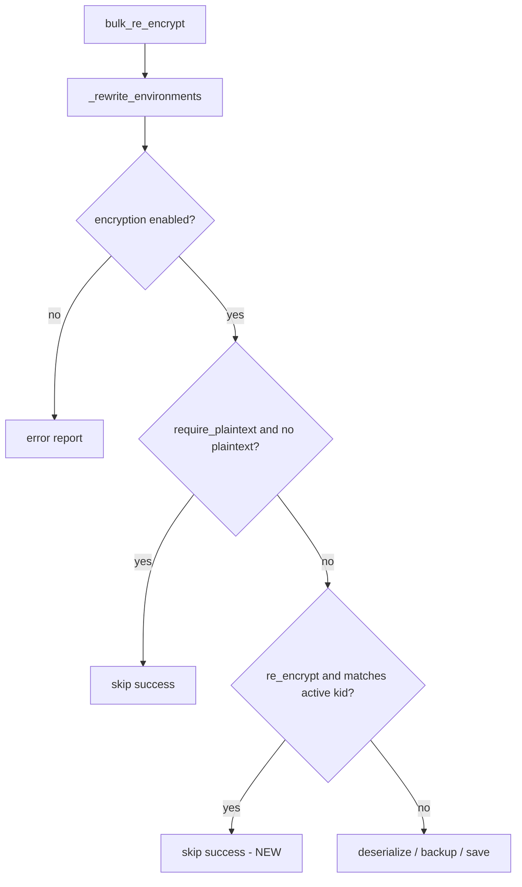

# PYPOST-528: Skip no-op bulk_re_encrypt

## Research

- **PYPOST-487** — `EncryptionMigrationService._rewrite_environments` shared by `bulk_re_encrypt`
  and `encrypt_plaintext_hidden`.
- **encrypt_plaintext_hidden** already short-circuits when `plaintext_hidden_count == 0`.
- **Inventory** — `kid_histogram` counts envelopes per `kid`; `encrypted_envelope_count` is total
  envelopes; envelopes with empty `kid` increment count but not histogram (out of scope).
- **Active key** — `build_key_provider(settings).get_current_key().key_id`.

## Implementation Plan

1. Add static helper `_inventory_matches_active_kid(inventory, active_kid) -> bool`.
2. In `_rewrite_environments`, after encryption-enabled and `require_plaintext` early exits, when
   `not require_plaintext` (re-encrypt path):
   - Resolve active `kid`.
   - If helper returns true, log skip and return success `MigrationReport` without deserialize,
     backup, or save.
3. Add tests:
   - Skip when single env already on active key (mtime unchanged, no backup).
   - No skip when plaintext hidden present (file rewritten).
4. Update `doc/dev/encryption_key_migration.md` API note.

## Match conditions

| Condition | Skip? |
| --- | --- |
| `plaintext_hidden_count > 0` | No — rewrite encrypts plaintext |
| `encrypted_envelope_count == 0` and `hidden_value_count == 0` | Yes — empty dataset |
| Histogram has single entry `{active_kid: N}` where `N == encrypted_envelope_count` | Yes |
| Multiple kids or count mismatch | No |
| Empty `kid` envelopes (histogram gap) | No |

## Architecture

No new public API surface. `EncryptionMigrationService` boundary unchanged for callers.
