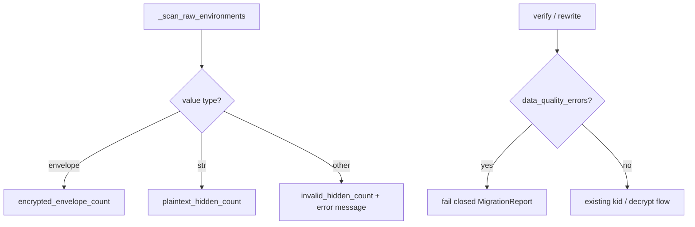

# PYPOST-529: Flag invalid hidden values in inventory

## Research

- **`_scan_raw_environments`** — iterates `hidden_keys`; envelope = `dict` with `enc is True`;
  plaintext = `str`; everything else is currently unclassified.
- **`EnvironmentInventory`** — aggregate stats; `missing_kids` added post-scan via
  `_check_missing_kids`.
- **Error propagation** — `MigrationReport.errors` used by verify and rewrite paths; CLI prints
  `error:` lines to stderr.

## Implementation Plan

1. Extend `EnvironmentInventory` with `invalid_hidden_count: int` and
   `data_quality_errors: tuple[str, ...]`.
2. In `_scan_raw_environments`, increment `invalid_hidden_count` and append messages for invalid
   shapes. Use environment `name` (fallback `id`, then `"unknown"`).
3. Update `_log_inventory` with `invalid_hidden_count` and `data_quality_error_count`.
4. In `verify_decrypt_access` and `_rewrite_environments`, fail early when
   `data_quality_errors` is non-empty (before missing-kid / decrypt checks where applicable).
5. Update `scripts/encryption_migrate.py` `report` subcommand to set `errors` and `success` from
   inventory data-quality errors.
6. Extend `_format_inventory` in CLI to print invalid count.
7. Tests: numeric hidden value; dict without `enc: true`.

## Classification

| Hidden value shape | Classification |
| --- | --- |
| `dict` with `enc is True` | Encrypted envelope |
| `str` | Plaintext hidden |
| `None` (missing variable) | Skipped (not counted) |
| Any other type or dict without `enc: true` | Invalid — data-quality error |

## Architecture

No new public service methods. Inventory dataclass and scan logic only.
