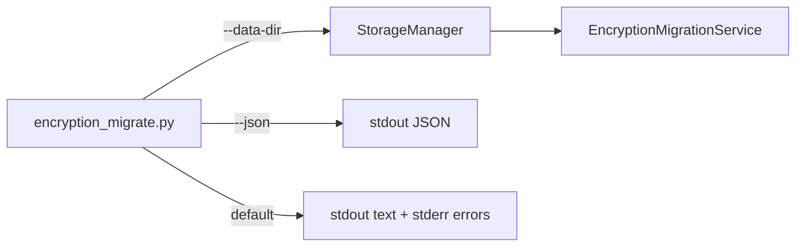

# PYPOST-530: CLI --json and --data-dir

## Research

- **PYPOST-487** — `scripts/encryption_migrate.py` emits human-readable lines via `_format_inventory`.
- **MigrationReport** — dataclass with `inventory`, `errors`, `success`, `dry_run`, `backup_path`.
- **StorageManager** — resolves `data_dir` via `platformdirs.user_data_dir`; no override existed.

## Implementation Plan

1. Add optional `data_dir` parameter to `StorageManager.__init__`.
2. Add global CLI flags `--json` and `--data-dir` on the root parser (apply to all subcommands).
3. Serialize `MigrationReport` to a JSON-serializable dict; print with `json.dumps` when `--json`.
4. Validate `--data-dir` exists before constructing storage; exit 1 with stderr message if not.
5. Extend CLI tests; document flags in `doc/dev/encryption_key_migration.md`.

## JSON payload

| Field | Type | Notes |
| --- | --- | --- |
| `command` | string | Subcommand name |
| `success` | bool | Mirrors exit code |
| `dry_run` | bool | From report |
| `backup_path` | string \| null | Absolute path when set |
| `errors` | string[] | Operator messages |
| `inventory` | object | Counts, `kid_histogram`, `missing_kids` |

Human mode keeps errors on stderr; JSON mode includes them in the document only.

## Architecture

