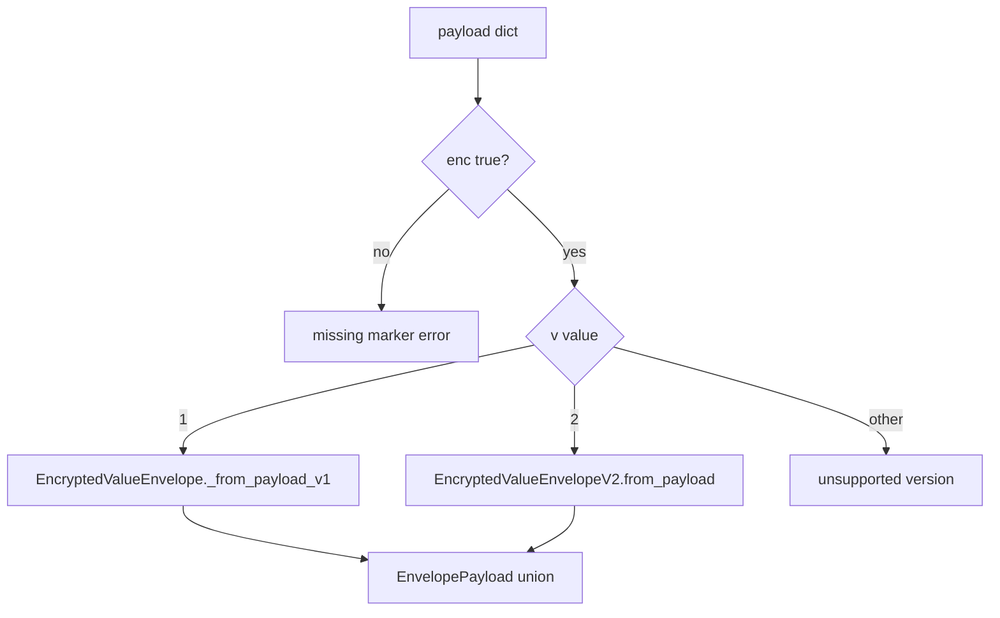

# PYPOST-533: Envelope v2 schema and version dispatch

## Research

- **PYPOST-484** — introduced `EncryptedValueEnvelope.from_payload()` with hard-coded v1 checks.
- **PYPOST-484 tech debt** — flagged need for explicit version dispatch before extending fields.
- v1 on-disk shape is `enc`, `v`, `alg`, `kid`, `ct` with `v=1` and `alg=fernet`.
- Fernet bundles nonce + ciphertext + HMAC in `ct`; AEAD algorithms need separate `iv` and `tag`.

## v2 Schema Design

| Field | Type | Required | Notes |
| --- | --- | --- | --- |
| `enc` | bool | yes | Must be `true` |
| `v` | int | yes | Must be `2` |
| `alg` | string | yes | `fernet` or `aes-gcm` (extensible list) |
| `kid` | string | yes | Key identifier (coerced to str) |
| `ct` | string | yes | Ciphertext (coerced to str) |
| `iv` | string | aes-gcm only | Base64 nonce |
| `tag` | string | aes-gcm only | Base64 authentication tag |
| `meta` | object | no | String-to-string metadata map (e.g. rotation hints) |

### Algorithm rules

- **`fernet`**: `iv` and `tag` must be absent; `ct` holds the Fernet token (same semantics as v1).
- **`aes-gcm`**: `iv` and `tag` are required; `ct` holds base64 ciphertext bytes.

### Version dispatch

`EnvelopePayload = EncryptedValueEnvelope | EncryptedValueEnvelopeV2`

Entry point remains `EncryptedValueEnvelope.from_payload()` for backward-compatible imports.

### Codec behavior (this task)

| Path | Behavior |
| --- | --- |
| `encrypt()` | Unchanged — emits v1 `EncryptedValueEnvelope` |
| `decrypt()` v1 | Unchanged — Fernet decrypt via `kid` + `ct` |
| `decrypt()` v2 | Raises `EnvironmentEncryptionError` — algorithm handlers deferred |

## Implementation Plan

1. Add `EncryptedValueEnvelopeV2` dataclass with `from_payload` / `to_json`.
2. Extract v1 parsing to `_from_payload_v1`; add version router on `from_payload`.
3. Update `decrypt()` to branch on envelope type.
4. Add unit tests for v2 parse rules and v1 regression.
5. Document v2 schema and dispatch in `doc/dev/environment_encryption_at_rest.md`.

## Modules

| Module | Change |
| --- | --- |
| `pypost/core/environment_secrets_codec.py` | v2 model, dispatch, decrypt guard |
| `tests/test_environment_secrets_codec.py` | v2 and dispatch tests |
| `doc/dev/environment_encryption_at_rest.md` | Payload format v2 section |

## Future Extension

- Add `_decrypt_v2(envelope)` with per-algorithm handlers when AES-GCM is implemented.
- Optional migration tool to re-encrypt v1 → v2 after codec support lands.
