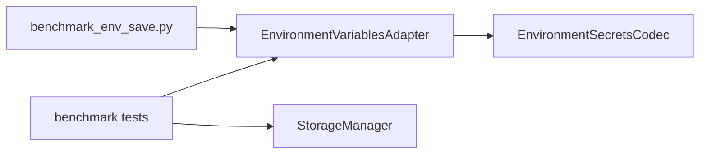

# PYPOST-534: Environment save benchmark harness

## Research

1. **Regression surface.** PYPOST-485 selective re-encrypt lives in
   `EnvironmentVariablesAdapter.serialize_environment()` via `_persisted_variables` /
   `_persisted_plaintext` and `EnvironmentSerializeStats` (`encrypted_count`, `reused_count`).
2. **Existing tests.** `tests/test_environment_variables_adapter.py` covers reuse with two
   hidden keys; no scale test at 100+ keys.
3. **Observability.** `environment_value_encryptions_total` increments only on new Fernet
   encrypt, not envelope reuse — suitable for CI assertions without timing.
4. **Timing.** Local `time.perf_counter` ratio (reuse vs cleared cache) is stable enough with a
   generous threshold; full `pytest-benchmark` dependency is unnecessary.
5. **Prior art.** PYPOST-455 documented micro-benchmarks and added guard tests without a new
   metric; same pattern applies here.

## Implementation Plan

### Phase 1 — CI guard tests

File: `tests/test_environment_save_selective_reencrypt_benchmark.py`

| Test | Guard |
| --- | --- |
| Second save, no changes | `reused_count == 120`, `encrypted_count == 0` |
| Second save, one key changed | `reused_count == 119`, `encrypted_count == 1` |
| Metrics after second save | `environment_value_encryptions_total` unchanged |
| Timing ratio | Full re-encrypt (cache cleared) ≥ 2× slower than reuse |
| StorageManager E2E | Second `save_environments` preserves unchanged envelopes |

Constant `HIDDEN_KEY_COUNT = 120`.

### Phase 2 — Local profiling script

File: `scripts/benchmark_env_save.py`

- CLI: `--keys` (default 120), `--iterations` (default 3).
- Prints first-save, reuse second-save, and full-reencrypt timings plus stats.
- Not invoked from CI; documented in dev docs.

### Phase 3 — Documentation

- Add **Selective re-encrypt benchmark (PYPOST-534)** section to
  `doc/dev/environment_encryption_at_rest.md`.
- Record revisit criteria in `60-tech-debt.md`.

## Module interaction

No production code changes required unless tests reveal a gap.
