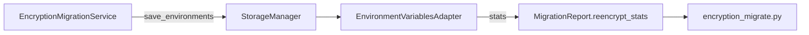

# PYPOST-535: Migration CLI reuse stats

## Research

- **PYPOST-485** — `EnvironmentVariablesAdapter.serialize_environment` tracks
  `encrypted_count` / `reused_count` in logs only.
- **PYPOST-487** — `MigrationReport` + CLI `_format_inventory` / `_report_to_dict`.
- **Gap** — `_rewrite_environments` calls `apply_encryption_settings` immediately before
  `save_environments`, clearing persisted snapshots so reuse never occurs and stats stay zero.
- **Kid rotation** — Reuse must not keep envelopes whose `kid` differs from the active key.

## Implementation Plan

1. Add `EnvironmentSerializeStats` and `ReencryptStats` frozen dataclasses.
2. Extend `_can_reuse_encrypted_envelope` with active `kid` equality check.
3. Return stats from `serialize_environment`; aggregate in `save_environments`.
4. Add optional `reencrypt_stats` to `MigrationReport`; populate on rewrite paths.
5. Remove redundant `apply_encryption_settings` before migration save (settings applied during
   `_deserialize_all`).
6. On `already_on_active_kid` skip, set stats to all reused / zero encrypted.
7. Extend CLI formatters and JSON payload; add tests and docs.

## JSON payload extension

| Field | Type | Notes |
| --- | --- | --- |
| `reencrypt_stats` | object \| null | Present on rewrite commands when applicable |
| `reencrypt_stats.encrypted_count` | int | New Fernet encrypt operations |
| `reencrypt_stats.reused_count` | int | Unchanged envelopes kept on disk |

## Architecture

