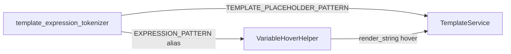

# PYPOST-536: Unify hover expression pattern

## Decision

**Reuse** `template_expression_tokenizer.TEMPLATE_PLACEHOLDER_PATTERN` for hover. No
intentional semantic difference between hover token boundaries and validation tokenization.

## Research

- PYPOST-460 established `\{\{\s*(.*?)\s*\}\}` as the canonical inner capture.
- Hover previously used `[^{}]+?`, which could diverge for edge cases with braces in inner
  text; nested function calls already matched both patterns.
- Hover needs `re.Match.group(0)` (full token); tokenizer exposes the same compiled regex.

## Implementation Plan

1. Rename private `_PLACEHOLDER_INNER_PATTERN` to public `TEMPLATE_PLACEHOLDER_PATTERN`.
2. Set `VariableHoverHelper.EXPRESSION_PATTERN = TEMPLATE_PLACEHOLDER_PATTERN`.
3. Add unit test asserting hover `finditer` tokens align with tokenizer output.
4. Update `doc/dev/template_expression_functions.md` hover section.

## Architecture

### Responsibilities

| Component | Responsibility |
| --- | --- |
| `TEMPLATE_PLACEHOLDER_PATTERN` | Single compiled regex for all `{{ ... }}` scans |
| `tokenize_template_expressions` | Inner-text list for validation/counting |
| `VariableHoverHelper` | Full-token iteration + resolution for tooltips |

### Parity contract

- Pattern: `\{\{\s*(.*?)\s*\}\}`
- Hover `find_expression_at_index` / `resolve_text` iterate the shared pattern.
- `VARIABLE_PATTERN` unchanged (plain identifiers only).
