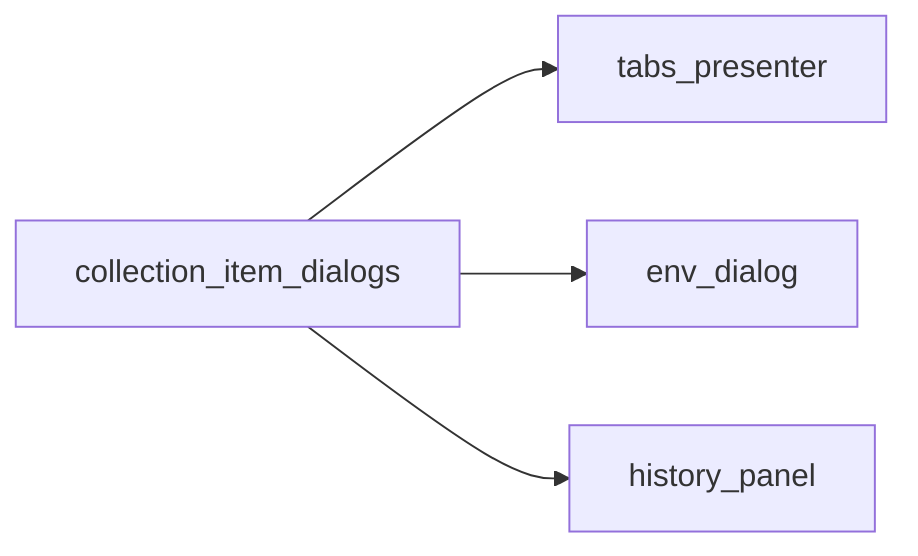

# PYPOST-539: Architecture

## Approach

Extend `pypost/ui/collection_item_dialogs.py` with helpers for the three target areas. Callers
import helpers at the use site; tests patch the same import path as collection flows.

## New helpers

| Helper | Caller | Purpose |
|--------|--------|---------|
| `show_request_failed_error` | tabs_presenter | Plain-string request failure |
| `show_request_error` | tabs_presenter | Structured ExecutionError message |
| `prompt_dirty_sibling_tab_reload` | tabs_presenter | Dirty sibling saved elsewhere |
| `prompt_clean_sibling_tab_reload` | tabs_presenter | Clean sibling saved elsewhere |
| `confirm_delete_environment` | env_dialog | Delete environment Yes/No |
| `show_copy_environment_empty_name_error` | env_dialog | Copy with empty name |
| `show_copy_environment_duplicate_name_error` | env_dialog | Copy with duplicate name |
| `confirm_clear_history` | history_panel | Clear all history Yes/No |

## Test strategy

- Unit tests for each new helper in `tests/test_collection_item_dialogs.py`.
- Integration tests patch helpers at caller import sites (`tabs_presenter`, `env_dialog`).
