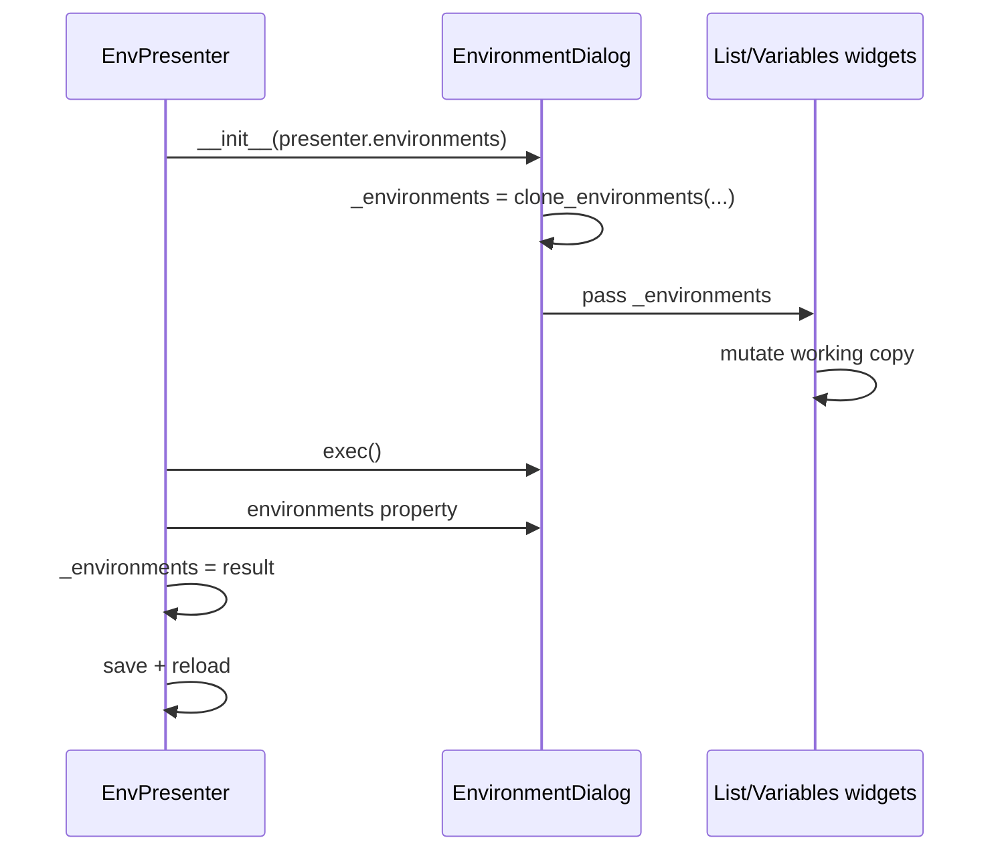

# PYPOST-54: Architecture

## Current problem

`EnvironmentDialog` and `EnvironmentListWidget` held a reference to `EnvPresenter._environments`
and mutated it in place. The presenter saved after `exec()` relying on those side effects.

## Design

## Changes

| Module | Change |
| --- | --- |
| `pypost/core/environment_ops.py` | `clone_environments()` via `Environment.model_copy(deep=True)` (ids preserved) |
| `pypost/ui/dialogs/env_dialog.py` | Working copy + `environments` property |
| `pypost/ui/presenters/env_presenter.py` | Apply `dialog.environments()` after close |
| `tests/test_env_dialog.py` | Assert on `dlg.environments`; input unchanged tests |
| `tests/test_environment_ops.py` | Unit tests for `clone_environments` |

## Rationale

- Deep copy isolates variable/MCP edits during the session, not only list structure changes.
- Presenter assignment on close preserves existing “close dialog = persist” UX without new buttons.
- Widgets keep internal mutation pattern; isolation boundary is at dialog construction.
