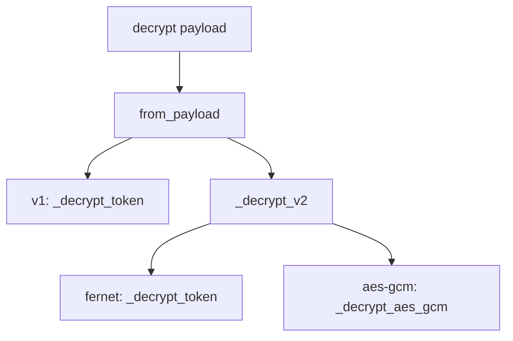

# PYPOST-541: v2 envelope decrypt handlers

## Research

- **PYPOST-533** — added `EncryptedValueEnvelopeV2`, version dispatch, and decrypt guard for v2.
- v2 fernet uses the same Fernet token in `ct` as v1; only envelope version differs.
- v2 aes-gcm stores base64 `iv`, `ct`, and `tag`; key material remains Fernet-encoded strings
  in the key provider (32-byte AES key via url-safe base64 decode).

## Design

### AES-GCM key material

Registered keys are Fernet key strings. `_fernet_key_to_aes_bytes` url-safe base64 decodes the
string to the 32-byte AES-256 key used by `AESGCM`.

### Error handling

- Fernet: reuse `_decrypt_token` (`InvalidToken` → operator message).
- AES-GCM: catch `InvalidTag`, `ValueError`, `UnicodeDecodeError` → same operator message.

## Implementation Plan

1. Add `_decrypt_v2`, `_decrypt_aes_gcm`, `_fernet_key_to_aes_bytes`.
2. Branch `decrypt()` on `EncryptedValueEnvelopeV2`.
3. Replace v2 reject test with fernet/aes-gcm round-trip and invalid-tag tests.
4. Update `doc/dev/environment_encryption_at_rest.md`.

## Modules

| Module | Change |
| --- | --- |
| `pypost/core/environment_secrets_codec.py` | v2 decrypt handlers |
| `tests/test_environment_secrets_codec.py` | v2 decrypt tests |
| `doc/dev/environment_encryption_at_rest.md` | v2 decrypt documented |
