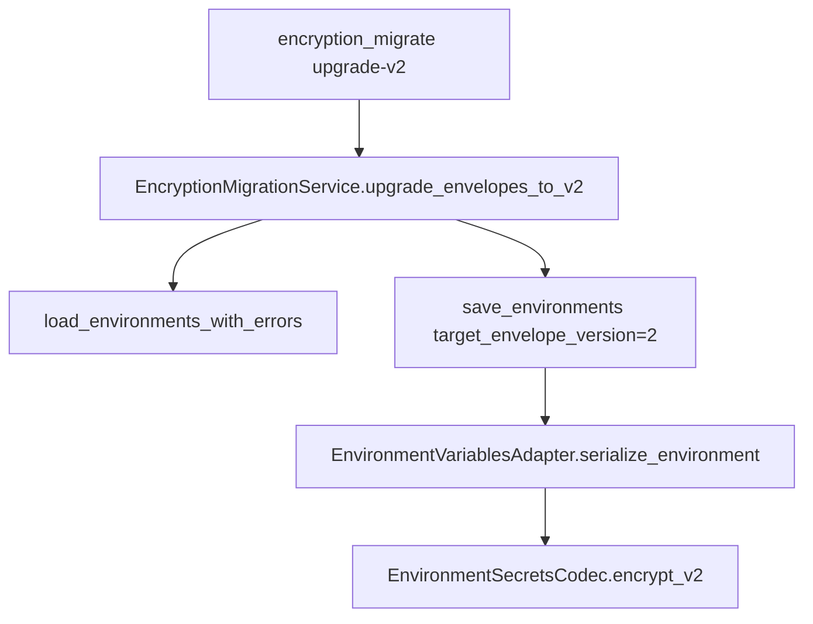

# PYPOST-542: v1 to v2 envelope re-encrypt migration

## Design

## Components

| Component | Change |
| --- | --- |
| `EnvironmentSecretsCodec` | `encrypt_v2()` for v2 fernet/aes-gcm |
| `EnvironmentVariablesAdapter` | Optional `target_envelope_version`; reuse requires matching version |
| `StorageManager.save_environments` | Passes `target_envelope_version` |
| `EncryptionMigrationService` | `v1_envelope_count`, `v2_envelope_count`, `upgrade_envelopes_to_v2()` |
| `scripts/encryption_migrate.py` | `upgrade-v2` subcommand |

## Skip logic

Skip `upgrade_v2` when no invalid hidden data, no plaintext hidden, and `v1_envelope_count == 0`.

## Dry run

Project all hidden values as v2 under active `kid` (same pattern as `re-encrypt` dry run).
