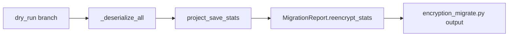

# PYPOST-545: Dry-run projected reencrypt_stats

## Research

- **PYPOST-535** — Live rewrite populates `reencrypt_stats` from `save_environments` aggregate.
- **Gap** — Dry-run projected inventory but omitted stats; operators could not preview rewrite
  scope.
- **Serialize path** — `load_environments_with_errors` retains persisted snapshots; calling
  `serialize_environment` without write yields the same counts as save.

## Implementation Plan

1. Add `StorageManager.project_save_stats(environments, target_envelope_version?)` — aggregate
   serialize stats without file write.
2. In `_rewrite_environments` dry-run branch, call `project_save_stats` after decrypt and attach
   `ReencryptStats` to `MigrationReport`.
3. Extend dry-run log line with projected reuse count.
4. CLI formatters already emit stats when present — no CLI code change required.
5. Extend service and CLI tests; update `doc/dev/encryption_key_migration.md`.

## Flow

