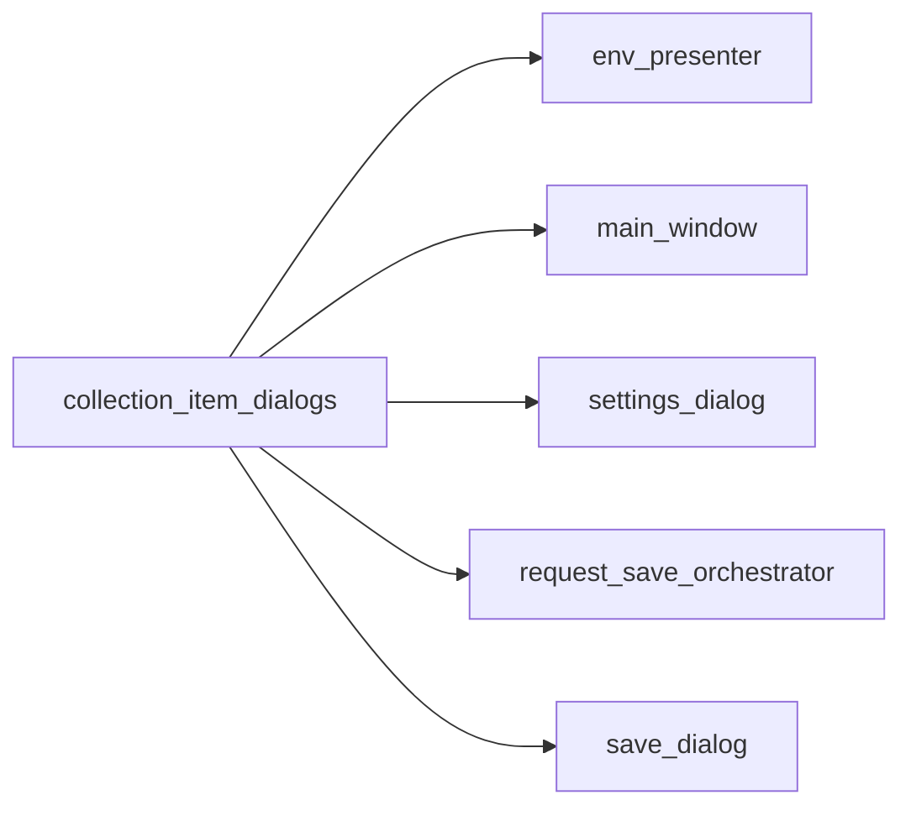

# PYPOST-547: Architecture

## Approach

Extend `pypost/ui/collection_item_dialogs.py` with helpers for the five remaining caller areas.
Callers import helpers at the use site; tests patch the same import path as prior migrations.

## New helpers

| Helper | Caller | Purpose |
|--------|--------|---------|
| `show_env_save_failed` | env_presenter | Environment storage save failure |
| `show_no_environment_selected` | env_presenter | Variable set with no env selected |
| `show_invalid_variable_name_error` | env_presenter | Validator error message |
| `show_mcp_server_start_failed` | env_presenter | MCP startup failure |
| `show_metrics_server_start_failed` | main_window | Metrics server startup failure |
| `show_save_request_name_required` | save_dialog | Empty request name on save |
| `show_save_collection_name_required` | save_dialog | Empty new collection name |
| `confirm_overwrite_request` | request_save_orchestrator | Overwrite existing request |
| `confirm_overwrite_newer_saved_version` | request_save_orchestrator | Stale sibling overwrite |
| `show_migration_result` | settings_dialog | Verify/re-encrypt outcome |
| `confirm_re_encrypt_environments` | settings_dialog | Re-encrypt confirmation |
| `show_invalid_retryable_status_codes` | settings_dialog | Retry policy validation |

## Test strategy

- Unit tests for each new helper in `tests/test_collection_item_dialogs.py`.
- Caller tests patch helpers at module import sites (`env_presenter`, `settings_dialog`,
  `request_save_orchestrator`).
