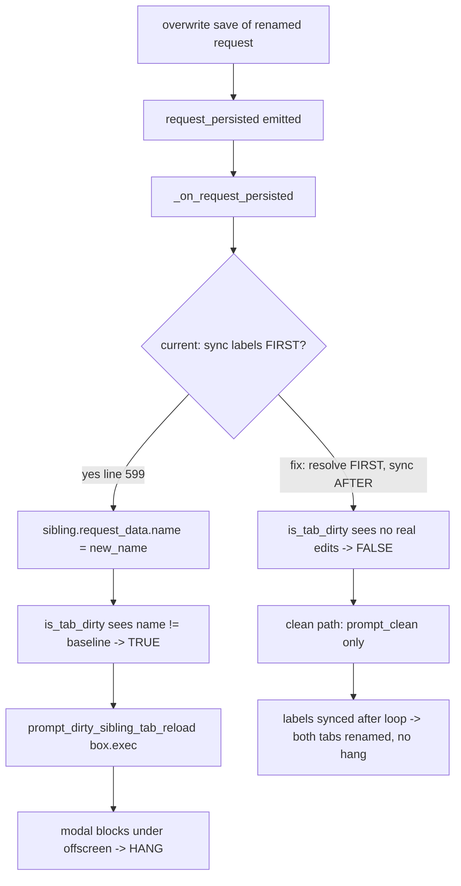

# PYPOST-548: `make test` hangs and never finishes

## Research

### Reproduction and scope

- `make test` runs `QT_QPA_PLATFORM=offscreen .venv/bin/python -m pytest tests/`
  (`Makefile` line 32).
- Collection is healthy: `pytest tests/ --co` reports **886 tests collected** across
  **77 `tests/test_*.py` files**.
- The suite stalls forever on the single item
  `test_save_overwrite_updates_all_matching_tab_labels` in
  `tests/test_tabs_presenter.py` (lines 415-433). Every other file passes.

The investigation confirms the failure has **two independent layers**: a production defect that
causes the hang today (Layer 1) and a missing-but-documented safety net that lets *any* future
hang stall the whole suite (Layer 2).

### Layer 1 — production defect (verified)

Trigger: saving an *overwrite* of a renamed request while a sibling tab shows the same request
id pops a **modal** `QMessageBox.exec()` that nothing can dismiss under `offscreen`, so the
worker blocks indefinitely.

Confirmed call chain (file/line references):

1. `_handle_save_request` emits `request_persisted` then re-syncs labels
   (`pypost/ui/presenters/tabs_presenter.py` lines 661-662).
2. `_on_request_persisted` calls `_sync_tab_labels_for_request(request_id, snapshot.name)` at
   the **top** of the method, *before* the sibling-resolution loop
   (`tabs_presenter.py` line 599, method spans 592-608).
3. `_sync_tab_labels_for_request` mutates `tab.request_data.name = new_name` for **every**
   matching tab (`tabs_presenter.py` lines 580-590).
4. A tab and its editor **share the same `RequestData` object**: `RequestTab.__init__` stores
   `self.request_data = request_data` (line 76) and passes the *same* object into
   `RequestWidget(request_data, ...)` (line 82); the widget keeps it as `self.request_data`
   (`pypost/ui/widgets/request_editor.py` line 60). So step 3 also mutates the editor's name.
5. The loop then calls `_offer_stale_tab_resolution(tab, snapshot)` → `is_tab_dirty(tab)`
   (`tabs_presenter.py` lines 610-621).
6. `is_tab_dirty` compares `request_editor.get_request_data_from_ui()` to
   `tab.persisted_baseline` (`pypost/core/request_sync.py` lines 60-66).
   `get_request_data_from_ui` deep-copies `self.request_data` and overwrites only widget-backed
   fields — **`name` is not a widget field**, so it carries the just-mutated new name
   (`request_editor.py` lines 247-258).
7. Result: the sibling's UI name (`new_name`) differs from its baseline name (`old_name`), so
   `is_tab_dirty` returns **True** for a sibling the user never edited.
8. The false-dirty branch calls `prompt_dirty_sibling_tab_reload`, whose `box.exec()` is a
   blocking modal (`pypost/ui/collection_item_dialogs.py` lines 53-67). The test only patches
   the *clean* prompt `prompt_clean_sibling_tab_reload` (lines 70-84), so the dirty modal is
   live and the suite hangs.

Intended behavior: an overwrite that renames a request should update **all** matching tab
labels to the new name, but a sibling with **no user edits must be treated as clean**. The
dirty check must run against the sibling's real edits, not against a name the label-sync just
wrote.

Fix direction (chosen): in `_on_request_persisted`, run sibling staleness/dirty resolution
**before** any name mutation by removing the early `_sync_tab_labels_for_request` call (line
599) and syncing labels **after** the resolution loop. The redundant second call in
`_handle_save_request` (line 662) already covers the overwrite path, so label-update behavior
(both tabs end on the new name) is preserved while the false-dirty classification disappears.

### Layer 2 — documented-but-unimplemented per-test timeout policy (verified)

`doc/dev/testing.md` (lines 33-67) and `.cursor/lsr/do-testing.md` describe a **mandatory**
per-test timeout policy with **no global default**: every test declares its own
`pytest.mark.timeout(...)`, `tests/conftest.py` fails setup for any test lacking a closest
`timeout` marker, `pytest.ini` registers the marker, and `pytest-timeout` is installed via
`make venv-test`. Today the docs describe behavior that does not exist:

- **`pytest-timeout` install** — promised via `make venv-test`; actually absent. `Makefile`
  lines 19-20 install only `pytest flake8 pytest-cov`.
- **Marker registration** — promised in `pytest.ini`; missing. The file has `addopts` (line 6)
  but no `markers`/`timeout`.
- **Setup enforcement** — promised in `tests/conftest.py`; it only sets `QT_QPA_PLATFORM`
  (lines 1-4), with no hook.
- **Per-test markers** — promised for every test; **0 of 77** files declare one (`rg` for
  `pytest.mark.timeout`/`pytestmark` in `tests/` returns nothing).

Note: `pytest-timeout==2.4.0` happens to be present in the local `.venv` already, but because
the `Makefile` does not declare it, that presence is incidental and not reproducible on a fresh
`make venv-test`/`make install`. Layer 2 makes the dependency and the enforcement honest.

### pytest-timeout: signal vs thread method

`pytest-timeout` offers two interruption methods
([README](https://github.com/pytest-dev/pytest-timeout/blob/main/README.rst),
[PyPI 2.4.0](https://pypi.org/project/pytest-timeout/)):

- **signal** (default where `SIGALRM` exists, i.e. Linux/macOS CI): schedules a per-test
  `SIGALRM`; on expiry the handler dumps other threads' stacks and calls `pytest.fail()`. The
  pytest **process survives**, so the run continues to a verdict. Risk: conflicts only if the
  code under test installs its own `SIGALRM` handler (PyPost does not).
- **thread**: a watchdog timer thread that **terminates the whole process** on expiry; most
  portable (only option on Windows) but it kills the run and prevents remaining tests from
  completing.

For PyPost's Qt widget/presenter tests that drive `QEventLoop.exec()` on the **main thread**,
the **signal** method is required: `SIGALRM` interrupts the blocked main-thread event loop and
fails just that test, letting the suite finish. `.cursor/lsr/do-testing.md` explicitly forbids
`method="thread"` for these (it can segfault while `QEventLoop.exec()` runs). We therefore rely
on the default signal method and never pass a `method=` override.

## Implementation Plan

Ordered, chunked steps (each ≤ ~100 LOC where feasible). Layer 1 first so the suite stops
hanging immediately; Layer 2 then guarantees no future hang can stall the run.

1. **Production fix + regression test (Layer 1).** In
   `pypost/ui/presenters/tabs_presenter.py`, remove the early
   `_sync_tab_labels_for_request` call at the top of `_on_request_persisted` (line 599) so the
   stale/dirty resolution loop runs against unmutated sibling names; rely on the existing
   post-resolution sync in `_handle_save_request` (line 662) and, if needed for the
   external-change path, add the label sync **after** the loop. Add a regression test in
   `tests/test_tabs_presenter.py` that reproduces "overwrite + rename with a clean sibling" and
   asserts `prompt_dirty_sibling_tab_reload` is **never** called (e.g. patched to a sentinel /
   `assert_not_called`) while both tab labels become the new name. (~30-50 LOC.)

2. **Timeout infrastructure (Layer 2 core).** Three small edits:
   - `Makefile` `venv-test`: append `pytest-timeout` to the pip install line (line 20).
   - `pytest.ini`: add a `markers = timeout(seconds): ...` registration; keep existing
     `addopts`/coverage and add **no** global `timeout =` default.
   - `tests/conftest.py`: add `pytest_runtest_setup(item)` that calls `pytest.fail(...)` when
     `item.get_closest_marker("timeout") is None`, preserving the existing
     `QT_QPA_PLATFORM` setup. (~20-30 LOC total.)

3. **Roll out markers across the 77 files.** Add a module-level
   `pytestmark = pytest.mark.timeout(N)` to every `tests/test_*.py` using the tiering policy
   below. This is mechanical but touches all files; split into reviewable batches if needed.

4. **Verify.** Run `make test` and confirm: (a) it completes with a pass/fail verdict,
   (b) the previously hanging test passes, (c) the enforcement hook errors on a temporarily
   marker-less test (negative check), and (d) coverage gate (`--cov-fail-under=50`) still
   passes. Sanity-check the signal method is active on the dev/CI platform.

## Architecture

### Components touched and responsibilities

- **Layer 1 — `pypost/ui/presenters/tabs_presenter.py`**: reorder `_on_request_persisted` so
  sibling staleness resolves *before* names are mutated; keep label sync after the loop.
- **Layer 1 — `tests/test_tabs_presenter.py`**: regression test — a clean renamed sibling never
  triggers the dirty modal.
- **Layer 2 — `Makefile` (`venv-test`)**: declare `pytest-timeout` for reproducible installs.
- **Layer 2 — `pytest.ini`**: register the `timeout` marker (no global default).
- **Layer 2 — `tests/conftest.py`**: `pytest_runtest_setup` hook requiring a closest `timeout`
  marker.
- **Layer 2 — all 77 `tests/test_*.py`**: module-level `pytestmark = pytest.mark.timeout(N)`.

Untouched by design: `request_sync.is_tab_dirty`, `collection_item_dialogs` prompts,
`get_request_data_from_ui`, and the `RequestData` sharing contract — the defect is *ordering*
inside `_on_request_persisted`, not those helpers. Keeping them stable limits blast radius.

### Layer 1 — the hang and the fix



The fix flips the ordering so the dirty/clean classification reflects the sibling's *real* user
edits. Because the tab and editor share one `RequestData`, label syncing must not run while a
staleness decision is still pending.

### Layer 2 — enforcement hook design

`tests/conftest.py` gains a setup-time guard that fails fast for any unmarked test, turning the
documented policy into an executable invariant:

```python
import os
import pytest

os.environ.setdefault("QT_QPA_PLATFORM", "offscreen")


def pytest_runtest_setup(item):
    if item.get_closest_marker("timeout") is None:
        pytest.fail(
            f"{item.nodeid}: missing pytest.mark.timeout marker "
            "(declare module/class/function timeout; see do-testing.md)",
            pytrace=False,
        )
```

- `get_closest_marker` honors closest-marker resolution: a function/class mark overrides the
  module default, matching the documented precedence.
- `pytest.fail(..., pytrace=False)` reports a clean failure (not an error traceback) and does
  not abort collection of other tests.
- `pytest.ini` registers `timeout(seconds)` so the marker is known and `--strict`-friendly; it
  deliberately sets **no** global `timeout =`, forcing a conscious per-module choice.

### Marker tiering policy

Module-level `pytestmark` per file, picked by test kind (`.cursor/lsr/do-testing.md` tiers):

| Test kind | Timeout (s) | Applies to |
| --- | --- | --- |
| Pure unit (mocked I/O) | 30 | non-Qt logic/service/model tests |
| Qt widget / presenter | 60 | tests constructing widgets or driving presenters |
| Integration / e2e / benchmark | 120 | end-to-end, storage, responsiveness, benchmarks |

Qt/event-loop files (e.g. `test_tabs_presenter.py`, `test_env_storage_responsiveness.py`) use
the **default signal** method — no `method=` override — so the main-thread event loop can be
interrupted without a process kill or segfault.

### How the two layers interact

- **Layer 1 removes today's hang**: the renamed-sibling overwrite no longer raises a live modal,
  so the one stuck test passes and `make test` reaches a verdict.
- **Layer 2 guarantees future safety**: even if a *new* code path or test introduces an
  unbounded wait, the per-test signal timeout fails just that item and the run continues; the
  conftest hook makes a missing timeout itself a failure, so the policy cannot silently erode.
- Together they satisfy the Definition of Done: the suite always terminates with pass/fail, no
  single test can stall it forever, and the docs in `doc/dev/testing.md` become true.

## Q&A

- **Q:** Why remove the early `_sync_tab_labels_for_request` call instead of changing
  `is_tab_dirty`? **A:** The helper is correct; the bug is ordering. Syncing names before the
  staleness decision corrupts the decision because tab and editor share one `RequestData`
  (`tabs_presenter.py` lines 76, 82). Reordering is the minimal, lowest-risk fix and preserves
  the existing post-loop sync (line 662).

- **Q:** Will both tabs still show the new name after the fix? **A:** Yes. Label syncing still
  runs (after the resolution loop / via `_handle_save_request` line 662), so both matching tabs
  end on the new name; only the *timing* relative to the dirty check changes.

- **Q:** Why signal and not thread for the timeout method? **A:** Signal (default on
  Linux/macOS) interrupts the blocked main-thread Qt event loop via `SIGALRM` and fails just
  that test, so the run continues; thread terminates the whole process and `do-testing.md`
  forbids it for `QEventLoop.exec()` tests (segfault risk). PyPost installs no `SIGALRM`
  handler, so signal is safe.
  ([pytest-timeout README](https://github.com/pytest-dev/pytest-timeout/blob/main/README.rst))

- **Q:** Why no global `timeout =` default in `pytest.ini`? **A:** The documented policy
  mandates a conscious per-test choice; a global default would mask missing markers and the
  enforcement hook (`get_closest_marker`) would never fire. This matches
  `.cursor/lsr/do-testing.md`.

- **Q:** `pytest-timeout` is already in `.venv` — why edit the Makefile? **A:** Its presence is
  incidental and not declared by `venv-test` (`Makefile` lines 19-20), so a fresh environment
  would lack it. Declaring it makes the install reproducible and the docs honest.

- **Q:** What about the coverage gate? **A:** Unaffected. `--cov-fail-under=50` stays in
  `addopts` (`pytest.ini` line 6); timeout markers and the setup hook do not change coverage.

- **Q:** Is rolling markers across 77 files risky? **A:** It is mechanical (one module-level
  line per file) and additive. The enforcement hook then proves completeness: any missed file
  fails fast, so the rollout is self-checking.
