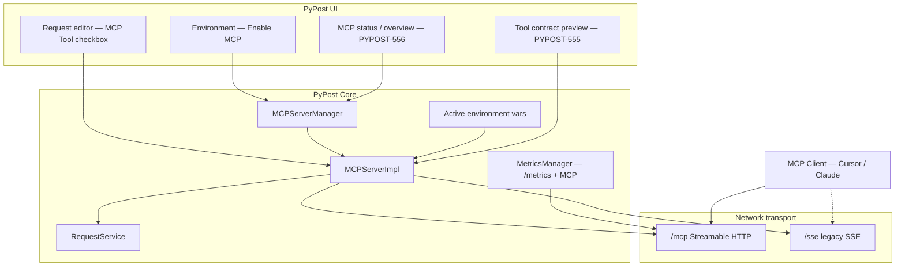

# PYPOST-549: MCP Tools epic — high-level architecture

## Research

- **MCP role**: PyPost acts as an MCP **server** exposing user-defined HTTP requests as
  **tools**; local AI clients connect over HTTP (Streamable HTTP at `/mcp`, legacy SSE at
  `/sse` during transition).
- **Existing modules**: `MCPServerManager` / `MCPServerImpl` (request tools),
  `MetricsManager` (Prometheus + observability MCP), `MCPClientService` (in-app verification),
  `RequestService` (shared execution with GUI).
- **Transport (PYPOST-551)**: Shared `mcp_streamable_http.py` wires `/mcp` + Starlette lifespan
  for both MCP servers.
- **Env injection (PYPOST-550)**: `call_tool` merges active environment variables into template
  resolution before `RequestService` execution.
- **User docs gap**: `doc/mcp_integration.md` (user-facing) still shows SSE URLs — addressed
  by PYPOST-552; dev detail in `doc/dev/mcp_integration.md` already documents `/mcp`.

## Implementation Plan (epic — child story ownership)

| Area | Primary modules | Child story |
| --- | --- | --- |
| Tool registration & execution | `mcp_server_impl.py`, `mcp_server.py`, `request_service.py` | PYPOST-550 (done), PYPOST-557 |
| Network transport | `mcp_streamable_http.py`, `mcp_server_impl.py`, `metrics.py` | PYPOST-551 (done) |
| In-app MCP client | `mcp_client_service.py` | PYPOST-551 (done) |
| Tool metadata / schema | Request model, MCP tool builder | PYPOST-553 |
| Secrets / hidden keys | Env model, MCP execution, logging | PYPOST-554 |
| UI: preview & overview | Presenters / views | PYPOST-555, PYPOST-556 |
| Structured tool results | `mcp_server_impl.py` response shaping | PYPOST-557 |
| E2E + user docs | `doc/mcp_integration.md`, manual Cursor verify | PYPOST-552 |
| Operator metrics docs | README, user docs | PYPOST-561 |
| Extended MCP metrics | `metrics.py` | PYPOST-562 |

## Architecture

### Module responsibilities (program view)

| Module | Responsibility |
| --- | --- |
| `MCPServerManager` | Start/stop MCP server with environment; host/port lifecycle |
| `MCPServerImpl` | Register exposed requests as tools; `list_tools` / `call_tool`; env merge |
| `mcp_streamable_http.py` | Shared Streamable HTTP route + lifespan |
| `RequestService` | HTTP execution shared with GUI |
| `MetricsManager` | Prometheus scrape + observability MCP on metrics port |
| `MCPClientService` | In-app list/call against local server |
| UI presenters | Expose-as-tool, enable MCP, preview, status (child stories) |

### Interfaces (agent-facing)

| Server | Default port | Primary URL |
| --- | --- | --- |
| Request tools | 1080 | `http://127.0.0.1:1080/mcp` |
| Metrics / observability | 9080 | `http://127.0.0.1:9080/mcp` |

Legacy: `http://127.0.0.1:<port>/sse/` (deprecated transport, optional compat).

### Patterns

- **Reuse over rebuild** — Single execution path for GUI and MCP.
- **Adapter** — MCP SDK session manager behind thin ASGI wrapper (`mcp_streamable_http.py`).
- **Dual transport (transition)** — Streamable HTTP primary; SSE mounts retained briefly.
- **Local-first** — Localhost-oriented servers; operator metrics separate from agent context.

## Q&A

| Question | Answer |
| --- | --- |
| One server or two? | Request tools MCP (env port, default 1080) and metrics MCP (9080) — both epic scope. |
| Where is dev detail? | `doc/dev/mcp_integration.md`, `doc/dev/testing.md` |
| Epic code changes? | None — architecture evolves through child story PRs. |

## Worklog

role: execution, step: 2, step_name: Architecture, tokens_used: (subagent aggregate)
