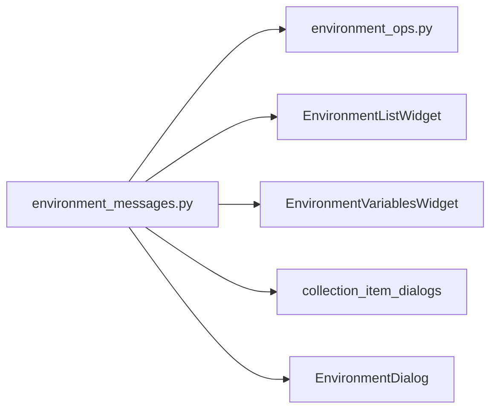

# PYPOST-55: Architecture

## Research

Hardcoded strings were found in:

- `pypost/ui/dialogs/env_dialog.py` — window title
- `pypost/ui/widgets/environments/environment_list_widget.py` — dialogs, menus, copy default
- `pypost/ui/widgets/environments/environment_variables_widget.py` — headers, MCP, menus
- `pypost/ui/collection_item_dialogs.py` — delete/copy QMessageBox text
- `pypost/core/environment_ops.py` — rename validation errors (duplicated wording)

## Design

### Module: `pypost/core/environment_messages.py`

| Category | Examples |
| --- | --- |
| Dialog titles | `DIALOG_TITLE_MANAGE_ENVIRONMENTS`, `DIALOG_TITLE_COPY_ENVIRONMENT` |
| Labels / buttons | `INPUT_LABEL_NAME`, `BUTTON_ADD`, `MCP_ENABLE_LABEL` |
| Actions | `ACTION_RENAME`, `ACTION_COPY`, `ACTION_DELETE`, move up/down |
| Table columns | `COLUMN_VARIABLE`, `COLUMN_VALUE`, `COLUMN_HIDDEN` |
| Messages | `MSG_EMPTY_NAME`, duplicate/delete confirm templates |
| Formatters | `format_delete_environment_confirm`, `format_copy_of_name`, etc. |

Placed under `core/` so `validate_environment_rename` can import validation text without
depending on UI packages.

### Data flow

## Patterns

- **Constants + formatters** for strings with `{name}` placeholders.
- **Import constants at call site** — no string re-export through widgets.

## Worklog

role: execution, step: 2, step_name: Architecture, tokens_used: 1800
