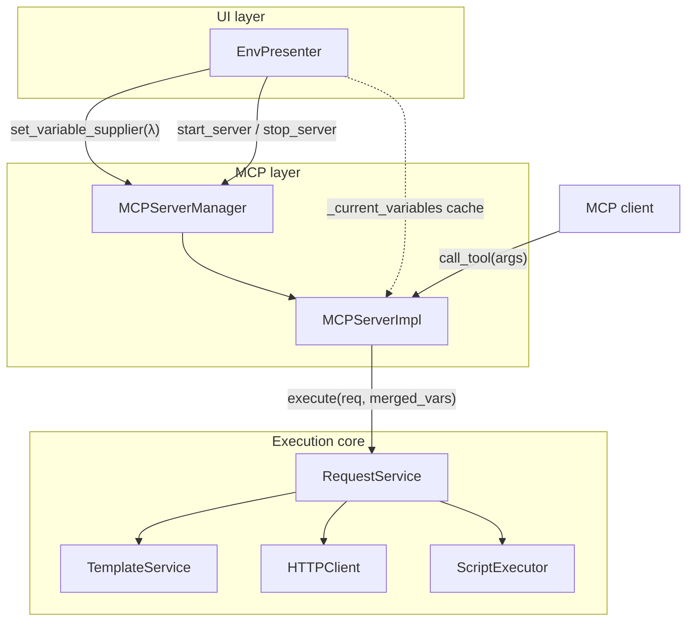
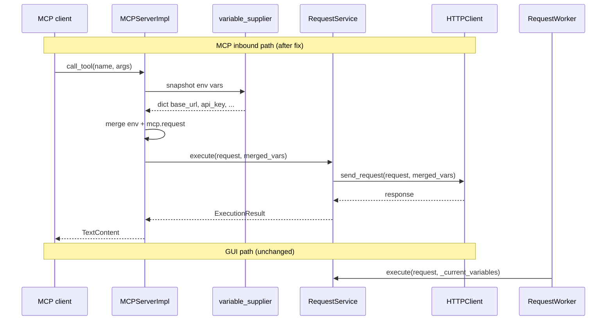

# PYPOST-550: Inject active environment variables into MCP tool execution

## Research

### Current behavior (gap)

**GUI path** — `TabsPresenter` passes the active environment's flat variable dict into
`RequestWorker`, which forwards it to `RequestService.execute()`:

```435:438:pypost/ui/presenters/tabs_presenter.py
        worker = RequestWorker(
            request_data,
            variables=self._current_variables,
            hidden_keys=self._current_hidden_keys,
```

`_current_variables` is kept in sync by `EnvPresenter.env_variables_changed`, which emits
`selected.variables` whenever the user selects or updates an environment.

**MCP inbound path** — `MCPServerImpl._execute_request_sync` builds only the MCP argument
namespace and omits environment variables:

```97:101:pypost/core/mcp_server_impl.py
    def _execute_request_sync(self, request_data: RequestData, args: dict):
        # Prepare context
        context = {"mcp": {"request": args}}

        return self.request_service.execute(request_data, context)
```

`RequestService.execute()` already renders templates (URL, headers, body, params) and runs
post-request scripts against whatever `variables` dict it receives. `HTTPClient.send_request()`
and `TemplateService.render_string()` require no MCP-specific changes — the gap is entirely in
how `MCPServerImpl` constructs the variables dict.

### Template variable shape

`TemplateService` uses Jinja2 with a single variables mapping:

- Environment placeholders: `{{ base_url }}`, `{{ api_key }}` → top-level keys in the dict.
- MCP tool arguments: `{{ mcp.request.user_id }}` → nested `{"mcp": {"request": {...}}}`.

The GUI supplies only flat env keys. The MCP path must supply **both** shapes in one dict so
combined placeholders resolve in a single render pass (requirement FR-3).

### Lifecycle and freshness

`EnvPresenter._on_env_changed` owns MCP server start/stop and already restarts the server when
the active environment or its `enable_mcp` flag changes. Environment variable edits (via the
manager dialog or post-request script updates) also flow through `_on_env_changed`, which
re-emits the latest `variables` dict.

However, `MCPServerManager` / `MCPServerImpl` never receive those variables today. The MCP
server thread can outlive a single `start_server` call while variables change in the UI thread,
so variables must be read **at `call_tool` time**, not captured once at server start.

### Hidden variables and history

`hidden_keys` affects history masking and UI display only; execution always uses real values
(`RequestWorker` passes `hidden_keys` for history, not for rendering). `MCPServerImpl`'s
`RequestService` has no `history_manager`, so inbound MCP tools do not record history. No
`hidden_keys` wiring is required for this task.

### Collision semantics

If an environment variable is named `mcp`, merging must preserve the nested
`mcp.request.*` namespace. Merge order: spread env vars first, then set `"mcp"` from tool
arguments (env key `mcp` cannot override the MCP namespace). This matches the de-facto GUI
behavior where env vars are flat and `mcp.request.*` is a separate namespace.

### Existing tests to update

- `tests/test_mcp_server_impl.py::test_call_tool_invokes_request_service_with_mcp_context` —
  asserts context is MCP-only; must include env vars after the fix.
- `tests/test_mcp_server_integration.py::test_call_tool_passes_mcp_arguments_to_request_service`
  — same.

New tests should demonstrate parity: a tool with `{{ base_url }}` in the URL resolves the
same way via MCP as via `RequestService.execute()` with the env dict.

## Implementation Plan

1. **Add a variable supplier to the MCP stack**
   - `MCPServerImpl.__init__` accepts an optional `variable_supplier: Callable[[], dict[str, str]]`
     defaulting to `lambda: {}` (empty snapshot).
   - `MCPServerManager` stores the supplier and forwards it to `_impl` (constructor or
     `set_variable_supplier`).
   - `EnvPresenter` registers `lambda: dict(self._current_variables)` on the manager during
     `__init__`. The cache is updated on the main thread in `_on_env_changed` (mirrors
     `TabsPresenter._current_variables`).

2. **Merge variables at the MCP execution boundary**
   - Add `_build_execution_variables(env_vars, mcp_args) -> dict` on `MCPServerImpl` (private
     static or module-level helper).
   - `_execute_request_sync` calls the supplier, merges, and passes the result to
     `RequestService.execute()`.

3. **Wire EnvPresenter**
   - After MCP manager is injected, call
     `mcp_manager.set_variable_supplier(lambda: dict(self._current_variables))`.
   - `_on_env_changed` (main thread) sets `self._current_variables = dict(variables)` before
     emitting signals; supplier never touches Qt widgets.
   - No change to MCP start/stop logic; supplier keeps values fresh across env edits.

4. **Tests (Step 3)**
   - Unit: `_build_execution_variables` / `_execute_request_sync` passes merged dict.
   - Unit: supplier invoked per `call_tool` (mock returns different snapshots).
   - Integration: tool URL `{{ base_url }}/{{ mcp.request.id }}` with supplier
     `{"base_url": "http://api"}` and args `{"id": "1"}` → `RequestService` receives both.
   - Parity: same `RequestData` + env dict + MCP args → identical resolved URL via direct
     `RequestService.execute()` and via `MCPServerImpl._execute_request_sync`.

5. **Out of scope (unchanged)**
   - `list_tools` / schema generation (still MCP-arg placeholders only).
   - Metrics-server MCP, transport, tool naming.
   - `RequestService`, `HTTPClient`, `TemplateService` internals.

## Architecture

### Module diagram



### GUI vs MCP execution (target)



### Module responsibilities

| Module | Responsibility | Change |
| --- | --- | --- |
| **EnvPresenter** | Owns active environment, MCP lifecycle, `_current_variables` cache | Register variable supplier; refresh cache in `_on_env_changed` (main thread) |
| **MCPServerManager** | Thread/uvicorn lifecycle, tool registration | Hold and forward `variable_supplier` to impl |
| **MCPServerImpl** | `list_tools`, `call_tool`, SSE app | Snapshot env vars via supplier; merge with MCP args before `execute()` |
| **RequestService** | Template render, HTTP/MCP client, post-script | **No change** — already accepts arbitrary `variables` dict |
| **TemplateService** | Jinja2 render | **No change** |
| **RequestWorker** | GUI background execution | **No change** — reference path for parity |

### Main interfaces

```python
# pypost/core/mcp_server.py
class MCPServerManager:
    def set_variable_supplier(
        self, supplier: Callable[[], dict[str, str]] | None
    ) -> None: ...

# pypost/core/mcp_server_impl.py
class MCPServerImpl:
    def __init__(
        self,
        ...,
        variable_supplier: Callable[[], dict[str, str]] | None = None,
    ) -> None: ...

    def _build_execution_variables(
        self, mcp_args: dict[str, Any]
    ) -> dict[str, Any]:
        """Merge active env snapshot with mcp.request namespace."""
        ...

    def _execute_request_sync(
        self, request_data: RequestData, args: dict
    ) -> ExecutionResult:
        variables = self._build_execution_variables(args)
        return self.request_service.execute(request_data, variables)
```

**Merge contract** (single source of truth for Step 3):

```python
def _build_execution_variables(
    env_vars: dict[str, str], mcp_args: dict[str, Any]
) -> dict[str, Any]:
    return {**env_vars, "mcp": {"request": mcp_args}}
```

### Architectural patterns

| Pattern | Application | Justification |
| --- | --- | --- |
| **Dependency injection** | `variable_supplier` injected into `MCPServerImpl` / `MCPServerManager` | Keeps MCP core free of Qt/UI imports; testable with lambdas |
| **Strategy (callable supplier)** | Fresh env snapshot per `call_tool` | Satisfies FR-4; main-thread cache + `dict(copy)` snapshot avoids Qt cross-thread access |
| **Reuse existing pipeline** | No fork of render/HTTP logic | GUI parity by construction — same `RequestService.execute()` entry point |
| **Thin adapter** | Merge only in `MCPServerImpl` | Minimal diff; aligns with PYPOST-410 render-once design |

### Design decisions

1. **Fix at MCP adapter, not in `RequestService`** — The service already supports env vars; only
   the inbound MCP adapter omitted them. Avoids duplicating GUI logic.

2. **Callable supplier over stored dict** — Env vars can change while the server is running.
   A supplier returning `dict(self._current_variables)` avoids stale copies and does not require
   new restart hooks beyond existing `_on_env_changed` behavior.

3. **Main-thread cache, not Qt widget reads** — `MCPServerImpl._execute_request_sync` runs on a
   Starlette threadpool worker (not the Qt main thread). The supplier must not call
   `QComboBox.currentData()` or other Qt APIs. `EnvPresenter` mirrors `TabsPresenter`: it
   updates `_current_variables` in `_on_env_changed` on the main thread; the supplier only
   returns `dict(self._current_variables)`.

4. **Snapshot copy in supplier** — `lambda: dict(self._current_variables)` prevents the MCP
   thread from observing partial writes if the UI mutates the environment dict mid-request.

5. **`mcp` namespace wins on merge** — Tool arguments always populate `mcp.request.*` even if
   an env var is named `mcp`; protects existing MCP placeholder semantics.

6. **No `hidden_keys` on MCP inbound path** — Execution uses real values; masking is irrelevant
   for agent-facing tool output (response body is not masked today).

7. **Post-request scripts** — Receive the merged variables dict automatically via existing
   `ScriptExecutor.execute(..., variables)` call in `RequestService.execute()` (FR-6).

## Q&A

| Question | Answer |
| --- | --- |
| Should `RequestService` be modified? | No. Pass the correct merged `variables` dict from `MCPServerImpl`. |
| How do env vars reach the MCP thread? | `variable_supplier` registered by `EnvPresenter`; invoked in `_execute_request_sync` (threadpool worker). Supplier reads `_current_variables` cache only — never Qt widgets. Cache updated on main thread in `_on_env_changed`. |
| What if no environment is selected? | Supplier returns `{}`; behavior matches GUI with "No Environment" — only `mcp.request.*` placeholders resolve. |
| Do we restart MCP when vars change? | Not required for correctness; supplier reads fresh values. Existing restart-on-env-change remains unchanged. |
| MCP arg vs env name collision? | Separate namespaces: flat env keys vs `mcp.request.*`. Document `mcp` env key as unsupported edge case. |
| Parity test approach? | Call `RequestService.execute()` directly with merged dict; compare resolved URL/headers to MCP path with same inputs. |
