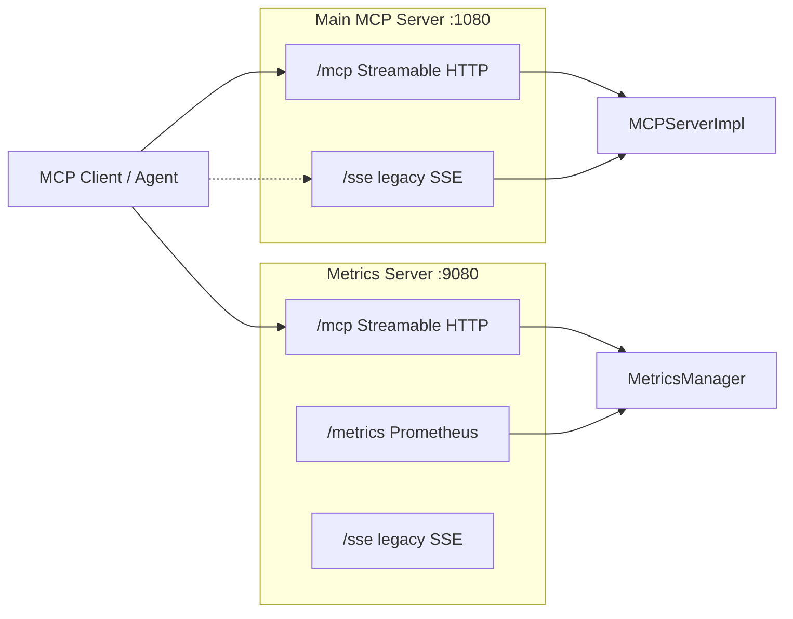

# PYPOST-551: Migrate MCP network transport from deprecated SSE to Streamable HTTP

## Research

- **MCP spec direction**: HTTP+SSE transport (`GET /sse` + `POST /messages`) is deprecated;
  **Streamable HTTP** is the current remote transport (single endpoint, session-aware POST/GET).
- **Python MCP SDK** (project dependency `mcp` 1.27.x):
  - Server: `mcp.server.streamable_http_manager.StreamableHTTPSessionManager` manages sessions
    and must run inside a Starlette **lifespan** (`async with session_manager.run()`).
  - ASGI handler: delegate `scope/receive/send` to `session_manager.handle_request()`.
  - Client: `mcp.client.streamable_http.streamable_http_client(url, http_client=...)`.
  - Legacy server: `mcp.server.sse.SseServerTransport` remains available for backward compat.
- **FastMCP reference** (`mcp.server.fastmcp.server`): mounts `Route("/mcp", endpoint=...)`
  with `lifespan=lambda app: session_manager.run()`.
- **PyPost today**: `MCPServerImpl` nests SSE under `Mount("/sse")`; `MetricsManager` exposes
  `/sse` + `/messages` alongside `/metrics`. `MCPClientService` and integration tests use
  `sse_client`.

## Implementation Plan

1. Add `pypost/core/mcp_streamable_http.py` — shared `/mcp` route + lifespan factory.
2. **`MCPServerImpl.create_app()`** — primary `Route("/mcp")` with Streamable HTTP; keep
   existing SSE sub-app under `Mount("/sse")` for optional backward compatibility.
3. **`MetricsManager._create_app()`** — same `/mcp` + lifespan; keep `/sse` and `/messages`.
4. **`MCPClientService`** — switch to `streamable_http_client`; document URL
   `http://<host>:<port>/mcp`.
5. **Tests** — integration round-trip via Streamable HTTP; routing tests assert `/mcp`;
   unit tests update example URLs.
6. **Docs (Step 7)** — `doc/dev/mcp_integration.md` and `doc/dev/testing.md` connection URLs.

## Architecture

### Module responsibilities

| Module | Change |
| --- | --- |
| `mcp_streamable_http.py` | Shared `StreamableHTTPASGIApp`, `build_streamable_http_route()` |
| `mcp_server_impl.py` | Primary transport at `/mcp`; SSE mount retained |
| `metrics.py` | `/mcp` on observability server; SSE mounts retained |
| `mcp_client_service.py` | `streamable_http_client` for in-app MCP verification |
| `tests/*` | Live round-trip and routing assertions on new transport |

### Interfaces

- **Connection URL (primary)**: `http://<mcp_host>:<mcp_port>/mcp`
- **Legacy (optional)**: `http://<host>:<port>/sse/` (unchanged paths)
- **Starlette lifespan**: required on apps using `StreamableHTTPSessionManager`
- **Client**: `streamable_http_client(url)` → `(read_stream, write_stream, get_session_id)`

### Patterns

- **Adapter**: thin ASGI wrapper over SDK session manager (same as FastMCP).
- **Dual transport**: Streamable HTTP primary; SSE optional during ecosystem transition.
- **No tool/execution changes**: `list_tools`, `call_tool`, env-var merge unchanged.

## Q&A

| Question | Answer |
| --- | --- |
| Why a shared helper module? | Both MCP servers need identical `/mcp` + lifespan wiring; avoids drift. |
| Stateless vs stateful? | Default **stateful** session manager (SDK default); matches Cursor/Claude clients. |
| Keep SSE? | Yes — Jira marks backward compat optional; low cost to retain existing mounts. |
| Change ports? | No — existing `mcp_port` / metrics port settings unchanged. |
| `HTTPClient` SSE probe? | Unchanged — still probes legacy `/sse` URLs in saved requests. |

## Worklog

role: execution, step: 2, step_name: Architecture, tokens_used: (subagent aggregate)
