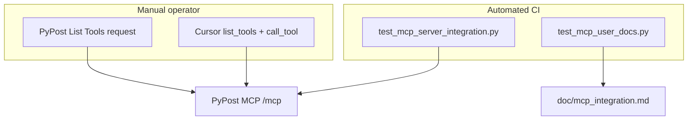

# PYPOST-552: E2E verify MCP tools with Cursor (list_tools + call_tool)

## Research

- PYPOST-551: Streamable HTTP at `GET/POST /mcp`; legacy SSE at `/sse/` retained.
- `tests/test_mcp_server_integration.py`: automated `list_tools` + `call_tool` via SDK.
- User doc gap tracked as PYPOST-551 TD-4/TD-5 and PYPOST-578.
- Cursor MCP config: remote URL with Streamable HTTP transport (not SSE type).

## Components

| Component | Change |
| --- | --- |
| `doc/mcp_integration.md` | User-facing setup — primary `/mcp`, Cursor steps, troubleshooting |
| `config/test/README.md` | Test harness instructions + Cursor section |
| `examples/collections/mcp.json` | List Tools URL → `/mcp` |
| `ai-tasks/PYPOST-552/cursor-verification-checklist.md` | Manual E2E checklist |
| `tests/test_mcp_user_docs.py` | CI guard for doc/collection URLs |

No changes to `MCPServerImpl`, `MCPClientService`, or Cursor itself.

## Verification layers

## Interfaces

- **Operator → docs**: follows `doc/mcp_integration.md` and checklist.
- **Operator → PyPost**: MCP Test env, Send on List Tools request.
- **Cursor → PyPost**: Streamable HTTP client to `http://127.0.0.1:1080/mcp`.

## Patterns

- **Docs-as-code**: pytest asserts on markdown/json paths.
- **Layered verification**: SDK integration (protocol) + doc tests (setup) + manual Cursor
  (agent UX).

## Worklog

role: execution, step: 2, step_name: Architecture, tokens_used: 2800
