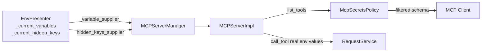

# PYPOST-554: Secrets and hidden variables policy for network MCP

## Research

- **Hidden variables (PYPOST-437)**: `Environment.hidden_keys` marks secrets masked in UI and
  history (PYPOST-446); execution uses real values.
- **MCP execution (PYPOST-550)**: `variable_supplier` injects env vars at `call_tool`; schema
  previously exposed only `mcp.request.*` placeholders (PYPOST-553 adds param metadata).
- **Epic principle (PYPOST-549)**: Safety by default — withhold secrets from agent-visible
  payloads and logs; operator sees more than the agent.

## Implementation Plan

1. Add `McpSecretsPolicy` — pure rules for agent-visible vs execution-only data.
2. Register `hidden_keys_supplier` from `EnvPresenter` (mirrors `variable_supplier` pattern).
3. Apply policy in `MCPServerImpl._generate_schema` before building JSON Schema.
4. Extend execution DEBUG log with `hidden_key_count` (counts only).
5. Unit tests for policy; integration tests for `list_tools` / `call_tool`.

## Architecture

### Module responsibilities

| Module | Change |
| --- | --- |
| `McpSecretsPolicy` | Extract template vars; filter agent param specs; safe log fields |
| `MCPServerImpl` | Use policy in `_generate_schema`; `hidden_keys_supplier`; execution log |
| `MCPServerManager` | Forward `set_hidden_keys_supplier` |
| `EnvPresenter` | Cache `_current_hidden_keys`; register supplier at init |

### Policy rules

| Surface | Hidden env values | Hidden key names | Env placeholders |
| --- | --- | --- | --- |
| `list_tools` schema | Never | Never | Never (execution-only) |
| `call_tool` execution | Real values | N/A (not passed to agent) | Real values |
| DEBUG logs | Never | Never (counts only) | Never |

## Q&A

| Question | Answer |
| --- | --- |
| Why filter explicit `mcp_params` for hidden keys? | Defense in depth — hidden keys must not become agent inputs even if misconfigured. |
| Collision: env `host` vs `mcp.request.host`? | `mcp.request.host` stays in schema; env `host` remains execution-only. |
