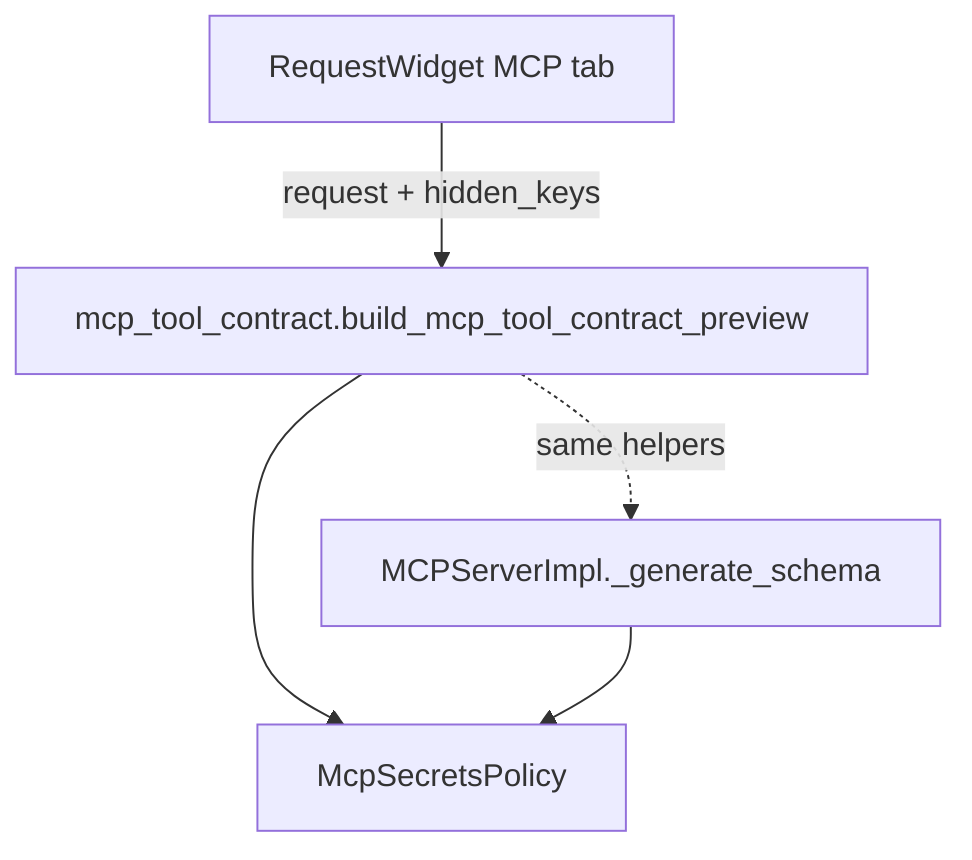

# PYPOST-555: UI preview of MCP tool contract

## Research

- **list_tools path (PYPOST-553/554)**: `MCPServerImpl._generate_schema` discovers
  `mcp.request.*` placeholders, merges `mcp_params`, filters via `McpSecretsPolicy`, and
  builds JSON Schema. Description from `mcp_description` with name fallback.
- **UI today**: `RequestWidget` MCP tab has editable description and params table only.
- **Hidden keys**: `TabsPresenter` propagates `env_hidden_keys_changed` to
  `RequestWidget.set_hidden_keys`.

## Implementation Plan

1. Add `pypost/core/mcp_tool_contract.py` with `build_mcp_tool_contract_preview` and
   `format_mcp_tool_contract_preview` — reuses `_tool_description`, `_resolve_mcp_param_specs`,
   `_build_tool_input_schema`, and `McpSecretsPolicy.filter_agent_param_specs`.
2. Add read-only preview `QPlainTextEdit` below the MCP params table.
3. Refresh preview on MCP tab field edits, template-bearing fields, and `set_hidden_keys`.
4. Inject `TemplateService` into `RequestWidget` from `TabsPresenter` for env-var discovery.
5. Unit tests in `tests/test_mcp_tool_contract.py`.

## Architecture

### Module responsibilities

| Module | Change |
| --- | --- |
| `mcp_tool_contract.py` | Pure preview builder + text formatter |
| `request_editor.py` | Preview panel, refresh hooks |
| `tabs_presenter.py` | Pass `template_service` to new tabs |
| `mcp_server_impl.py` | Optional: `normalize_mcp_tool_name` import (shared) |

### Preview content

| Section | Source |
| --- | --- |
| Tool name | `normalize_mcp_tool_name(request.name)` |
| Description | `_tool_description(request)` |
| inputSchema | Filtered specs → `_build_tool_input_schema` |
| Policy exclusions | Diff before/after `filter_agent_param_specs` with reason labels |

## Q&A

| Question | Answer |
| --- | --- |
| Why a new module vs calling `MCPServerImpl`? | Avoid constructing server instance; keep UI layer free of async MCP handlers. |
| Why not live `list_tools` HTTP call? | Local computation is faster, works when MCP server is off, and guarantees parity. |
