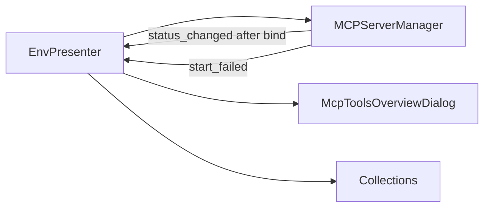

# PYPOST-556: MCP tools overview and reliable server status

## Research

- `MCPServerManager.start_server` emits `status_changed(True)` immediately when the worker
  thread starts, before uvicorn binds (`pypost/core/mcp_server.py`).
- Integration tests use `_wait_for_port` to confirm listen readiness
  (`tests/test_mcp_server_integration.py`).
- Uvicorn `Server.startup()` runs after sockets bind; hooking it is the lightest signal that
  the server is listening.
- `EnvPresenter` owns MCP status label and tool collection via `_get_mcp_tools()`.

## Implementation Plan

1. **Startup signaling** — Remove premature `status_changed(True)`; patch uvicorn `startup` to
   emit True after bind; catch `OSError` and emit `start_failed(str)` + False.
2. **Overview UI** — Add `McpToolsOverviewDialog` and a top-bar button showing tool count;
   populate from collections where `expose_as_mcp=True`.
3. **Presenter wiring** — Connect `start_failed` to `QMessageBox`; refresh status label from
   `is_running()` after env changes; export `normalize_mcp_tool_name` for display parity.

## Architecture

| Component | Change |
| --- | --- |
| `MCPServerManager` | `start_failed` signal; deferred `status_changed(True)` |
| `McpToolsOverviewDialog` | Read-only table of exposed tools |
| `EnvPresenter` | Overview button, error dialog, status sync |

## Q&A

| Question | Answer |
| --- | --- |
| Cross-thread signals? | Qt signals from uvicorn thread are safe for UI slots. |
| Tool name in overview? | Same normalization as `MCPServerImpl._normalize_name`. |

## Worklog

role: execution, step: 2, step_name: Architecture, tokens_used: 3800
