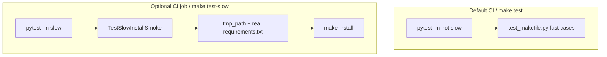

# PYPOST-559: Architecture for optional slow install smoke

## Research

### Current codebase findings

1. `tests/test_makefile.py` (PYPOST-307/310) uses `make_workspace` with empty
   `requirements.txt` for fast install execution tests.
2. Default CI (`.github/workflows/test.yml`) runs full `tests/` on Python 3.11 and 3.13.
3. PYPOST-307 tech debt tracked full network install as follow-up ([PYPOST-559](https://pypost.atlassian.net/browse/PYPOST-559)).
4. `actions/setup-python` supports `cache: pip` for dependency reuse.

## Implementation Plan

1. Register `slow` marker in `pytest.ini`.
2. Add `make_workspace_full_deps` fixture copying real `requirements.txt`.
3. Add `TestSlowInstallSmoke` with `@pytest.mark.slow` and 180s timeout.
4. Exclude slow tests from main CI job (`-m "not slow"`) and `make test`.
5. Add `make-install-smoke` CI job (Python 3.11, pip cache) running `-m slow`.
6. Add `make test-slow` for local opt-in.
7. Document in `doc/dev/testing.md`.

## Architecture

### Components

| Component | Responsibility |
| --------- | -------------- |
| `make_workspace_full_deps` | Isolated workspace with copied `requirements.txt` |
| `TestSlowInstallSmoke` | Full install success + import sanity check |
| `make-install-smoke` job | Separate CI job with pip cache |
| `make test-slow` | Local opt-in entry point |

## Patterns

- Reuse PYPOST-307 isolation model — no repo `.venv` mutation.
- Black-box subprocess checks; post-install `import pydantic` sanity only (no Qt import).
- Closest-marker timeout: class 180s, `_run_make` subprocess timeout 170s.
