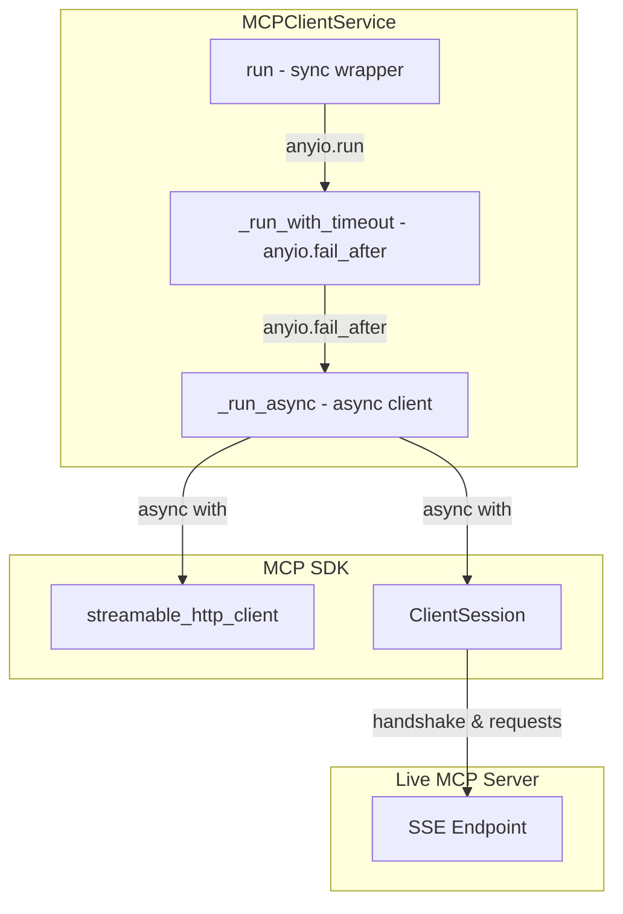

# PYPOST-560: Architecture — MCPClientService anyio.run Fix

## Research

- **Problem**: `MCPClientService.run` used `asyncio.run` and `asyncio.wait_for` to wrap the async `_run_async` method. This caused hangs when interacting with live streamable HTTP MCP servers because `sse_client` from the `mcp` SDK relies on `anyio` task groups, which do not interoperate well with raw `asyncio.run` in certain event loop configurations.
- **Solution**: Replace `asyncio.run` with `anyio.run` and `asyncio.wait_for` with `anyio.fail_after` inside `MCPClientService.run`. This ensures that the `anyio` task groups inside `sse_client` are driven by `anyio`'s own event loop runner, resolving the deadlock/hang.
- **Teardown**: Ensure `ClientSession` is used as an async context manager (`async with ClientSession(...) as session`) to guarantee clean teardown and avoid leaking anyio task groups or stream resources.

## Architecture Layout

## Modules Under Test

| Component | File | Test approach |
| --- | --- | --- |
| MCP Client Service | `pypost/core/mcp_client_service.py` | Unit tests with mock `_run_async` and integration tests against live server |
| MCP Client Service Tests | `tests/test_mcp_client_service.py` | Unit tests with mocked async runner and timeout exceptions |
| MCP Server Integration Tests | `tests/test_mcp_server_integration.py` | Live integration test `test_mcp_client_service_list_tools_over_live_streamable_http` starting a real uvicorn-backed MCP server |

## Out of Scope

- Modifying the underlying `mcp` SDK or `streamable_http_client` implementation.
- Real outbound HTTP requests to external hosts (handled via mocks/stubs).

## Files Changed

| File | Change |
| --- | --- |
| `pypost/core/mcp_client_service.py` | Replaced `asyncio.run` + `asyncio.wait_for` with `anyio.run` + `anyio.fail_after`; used `ClientSession` as async context manager. |
| `tests/test_mcp_client_service.py` | Updated mock assertions and exception classes from `asyncio.TimeoutError` to `TimeoutError`. |
| `tests/test_mcp_server_integration.py` | Added `test_mcp_client_service_list_tools_over_live_streamable_http` regression test. |
