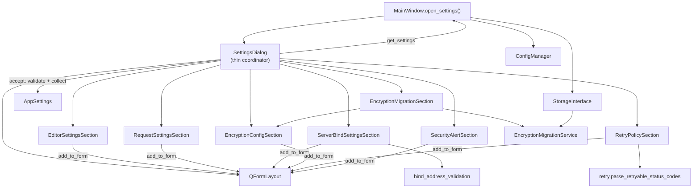
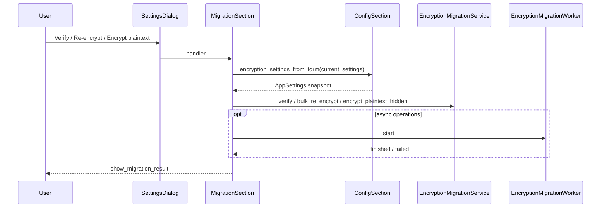

# PYPOST-598: Separate settings domains in Settings dialog

## Research

### Sources reviewed

- Requirements: `ai-tasks/PYPOST-598/10-requirements.md`
- PYPOST-374 audit finding **D1** (`ai-tasks/PYPOST-374/30-dialogs-audit-report.md`)
- Current monolith: `pypost/ui/dialogs/settings_dialog.py` (~576 LOC)
- Facade precedent: `pypost/ui/dialogs/env_dialog.py` + `pypost/ui/widgets/environments/`
- Widget extraction precedent: PYPOST-496 (`EnvironmentListWidget`, `EnvironmentVariablesWidget`)
- Test contracts: `tests/test_settings_dialog.py`, `tests/test_settings_encryption.py`,
  `tests/test_settings_encryption_migration_ui.py`, `tests/test_settings_persistence.py`,
  `tests/test_settings_encryption_main_window_e2e.py`, `tests/test_settings_key_source_main_window_e2e.py`
- Dev docs: `doc/dev/settings_dialog.md`

### Current structure (single class)

`SettingsDialog` owns nine configuration domains in one `__init__`, one `QFormLayout`, and
one `accept()`:

| Domain | Widgets / behavior | Lines (approx.) |
| --- | --- | --- |
| Editor | `font_size_spin`, `indent_size_spin` | 145–151, 300–301 |
| Request | `timeout_spin`, `confirm_overwrite_check` | 153–172, 302–309 |
| MCP server | `mcp_port_spin`, `mcp_host_edit` | 157–162, 303–304 |
| Metrics server | `metrics_port_spin`, `metrics_host_edit` | 164–169, 305–306 |
| Env encryption | mode/key-source/fallback combos, help + warning labels | 181–234, 310–323 |
| Encryption migration | section header, three buttons, worker orchestration | 236–248, 324–327, 348–460 |
| Retry defaults | four spin/edit controls | 250–274, 328–331 |
| Security / logging | `security_logging_section_label`, `log_hidden_key_names_check` | 174–179, 332–334 |
| Alerting | log path, webhook URL/auth, clear checkbox | 276–299, 335–339 |

Cross-domain coupling today:

- `accept()` validates bind addresses and retry codes centrally, then builds one `AppSettings`.
- Encryption migration handlers call `_encryption_settings_from_form()` (duplicated parsing
  with `accept()` — out of scope per PYPOST-600).
- `MainWindow.open_settings()` depends only on `SettingsDialog` constructor, `exec()`,
  `get_settings()`, and optional `storage` kwarg.

### Architectural options considered

| Option | Pros | Cons | Decision |
| --- | --- | --- | --- |
| **A. Section builders + thin coordinator** | Preserves single scrollable form and section headers; matches `EnvironmentDialog` facade; tests keep accessing `dlg.<widget>` | Coordinator still wires `accept()` | **Selected** |
| B. Tabbed sub-dialogs | Strong visual separation | Changes UX; violates “recognizable layout” requirement |
| C. Presenter/MVP layer | Testable without Qt | Large new abstraction; overkill for structural refactor |
| D. One QWidget per row | Maximum granularity | File explosion; harder to preserve form order |

### Qt/PySide6 composition (web)

Brief research on large-form patterns in Qt/PySide6:

- **Composite widgets** — Qt docs describe grouping child widgets under a container with a
  layout manager as the standard composition unit
  ([QWidget composite widgets](https://doc.qt.io/qtforpython-6/PySide6/QtWidgets/QWidget.html)).
- **Nested layouts** — `QHBoxLayout` / `QVBoxLayout` / `QFormLayout` nest for structural
  grouping; `QFormLayout` is the idiomatic choice for label–field pairs
  ([Layout Management](https://doc.qt.io/qt-6.8/layout.html),
  [Nested Layouts tutorial](https://doc.qt.io/qt-6/qtwidgets-tutorials-widgets-nestedlayouts-example.html)).
- **Large forms** — community guidance splits complex UIs into one widget (or promoted page)
  per tab/section rather than one monolithic form
  ([Qt Centre large forms](https://qtcentre.org/threads/36620-best-practices-for-large-forms),
  [Python GUIs project layout](https://www.pythonguis.com/faq/structuring-a-large-pyqt-application/)).

**Applied here:** section builders own widget creation but **do not** introduce nested
`QWidget` containers; controls are parented directly to the dialog (`parent=dialog`) so focus
chain and `widget.parent() is dlg` assertions in tests remain valid. The coordinator owns the
single `QFormLayout` and calls each section’s `add_*_to_form` methods in legacy row order
(see [Interleaved form assembly](#interleaved-form-assembly)).

### Out-of-scope follow-ups (unchanged behavior)

- **PYPOST-600 (D3)** — deduplicate encryption form-state builder between `accept()` and
  migration handlers.
- **PYPOST-602 (D5)** — inject `EncryptionMigrationService` from caller instead of
  constructing inside dialog (constructor already accepts optional `migration_service`).

## Implementation Plan

### Phase 1 — Package scaffold

1. Create `pypost/ui/widgets/settings/` package with `__init__.py`.
2. Add `pypost/ui/widgets/settings/_common.py` for shared helpers:
   `make_section_header()`, `SECTION_HEADER_STYLE`.
3. Leave `pypost/ui/dialogs/settings_dialog.py` as the **public entry point** (import path
   unchanged for `main_window.py` and all tests).

### Phase 2 — Extract domain section builders

Each section is a **plain Python class** (not a `QWidget`) that:

- Receives `(current_settings: AppSettings, parent: QWidget)` in `__init__`.
- Creates controls with `parent=parent` (the dialog).
- Exposes `add_to_form(form: QFormLayout) -> None` (or split `add_*_to_form` helpers when
  rows must be interleaved with another section) to append rows in the required order.
- Exposes `collect_fields() -> dict[str, Any]` with only its domain’s `AppSettings` keys.
- Optionally exposes `validate(parent: QWidget) -> T | None` when save can be blocked.

Extract in dependency order (leaves first):

| Module | Class | Responsibility |
| --- | --- | --- |
| `editor_section.py` | `EditorSettingsSection` | Font size, JSON indent |
| `request_section.py` | `RequestSettingsSection` | Timeout, confirm-overwrite (split `add_*_to_form`) |
| `server_bind_section.py` | `ServerBindSettingsSection` | MCP + metrics host/port; bind validation |
| `encryption_config_section.py` | `EncryptionConfigSection` | Tri-state mode, key source, fallback, help/warning |
| `encryption_migration_section.py` | `EncryptionMigrationSection` | Migration header, buttons, worker lifecycle |
| `retry_policy_section.py` | `RetryPolicySection` | Retry defaults + codes validation |
| `security_alert_section.py` | `SecurityAlertSection` | “Security / Logging” header, hidden-key logging, alert fields |

`security_alert_section.py` keeps security and alert rows in one module because tests assert
**relative form index ordering** across retry → security header → checkbox → alert fields.

### Phase 3 — Thin `SettingsDialog` coordinator

Refactor `settings_dialog.py` to:

1. Construct all section instances, then assemble the form via **interleaved** `add_*_to_form`
   calls in the exact current row order (see [Interleaved form assembly](#interleaved-form-assembly)
   and form order table below).
2. After each section is built, **assign every control attribute onto `self`** so existing
   tests and e2e patches (`dlg.timeout_spin`, `dlg.env_encryption_mode_combo`, …) keep
   working without test edits.
3. Keep `self.form_layout`, `self.buttons`, `self.new_settings`, `self.current_settings`.
4. Delegate migration state to `EncryptionMigrationSection` but **mirror** on dialog:
   `self._migration_service`, `self._migration_worker`, `self._on_verify_encryption`, etc.
5. Implement `accept()` as orchestration only:

```text
bind_result = server_bind_section.validate(self)  # None → abort
retry_policy = retry_policy_section.validate(self)  # None → abort
build AppSettings from current_settings + all section.collect_fields()
super().accept()
```

6. Re-export module-level symbols unchanged:

   `parse_env_encryption_enabled_from_mode`, `ENCRYPTION_MODE_*`, `WEBHOOK_AUTH_*`,
   `_resolve_webhook_auth_header`, `KEY_SOURCE_*` (imported from `key_source_constants`).

7. Keep logger name `pypost.ui.dialogs.settings_dialog` and patch targets
   (`show_invalid_bind_address`, `show_invalid_retryable_status_codes`,
   `show_migration_result`, `confirm_*`) on that module.

### Phase 4 — Verification

Run without test changes:

```bash
make test  # or targeted:
pytest tests/test_settings_dialog.py tests/test_settings_encryption.py \
  tests/test_settings_encryption_migration_ui.py tests/test_settings_persistence.py \
  tests/test_settings_encryption_main_window_e2e.py \
  tests/test_settings_key_source_main_window_e2e.py -v
```

Update `doc/dev/settings_dialog.md` in Step 7 only (file paths for sections).

### Required form row order (must not change)

| # | Row label / content | Section |
| ---: | --- | --- |
| 1–2 | Application Font Size, JSON Indent Size | Editor |
| 3 | Request Timeout | Request |
| 4–5 | MCP Server Port/Host | Server bind |
| 6–7 | Metrics Server Port/Host | Server bind |
| 8 | Confirm before overwriting | Request |
| 9–12 | Encryption mode, key source, fallback, warning, help | Encryption config |
| 13–16 | “Encryption migration” header + three buttons | Encryption migration |
| 17–20 | Max retries, delay, backoff, retryable codes | Retry |
| 21 | “Security / Logging” header | Security / alert |
| 22 | Hidden-key logging checkbox | Security / alert |
| 23–25 | Alert log path, webhook URL, auth header | Security / alert |
| 26 | Remove stored auth checkbox (conditional) | Security / alert |

### Interleaved form assembly

Request settings and server bind share one visual block in the legacy form: timeout appears
**before** MCP/metrics rows, while confirm-overwrite appears **after** them. A single
`RequestSettingsSection.add_to_form()` would violate row order, so the coordinator interleaves
three section calls:

```python
editor.add_to_form(self.form_layout)
request.add_timeout_to_form(self.form_layout)       # row 3
server_bind.add_to_form(self.form_layout)           # rows 4–7
request.add_confirm_overwrite_to_form(self.form_layout)  # row 8
encryption_config.add_to_form(self.form_layout)
encryption_migration.add_to_form(self.form_layout)
retry_policy.add_to_form(self.form_layout)
security_alert.add_to_form(self.form_layout)
```

| Call order | Rows added | Section |
| ---: | --- | --- |
| 1 | 1–2 | `EditorSettingsSection.add_to_form` |
| 2 | 3 | `RequestSettingsSection.add_timeout_to_form` |
| 3 | 4–7 | `ServerBindSettingsSection.add_to_form` |
| 4 | 8 | `RequestSettingsSection.add_confirm_overwrite_to_form` |
| 5–8 | 9–26 | Remaining sections (each `add_to_form` in one block) |

`RequestSettingsSection` still exposes a single `collect_fields()` for save; only layout
assembly is split. No other section requires interleaving.

## Architecture

### Module diagram



### Section interaction on Save

```mermaid
sequenceDiagram
  participant User
  participant SettingsDialog
  participant ServerBind
  participant Retry
  participant Sections
  participant AppSettings

  User->>SettingsDialog: Save (accept)
  SettingsDialog->>ServerBind: validate(parent)
  alt invalid bind address
    ServerBind-->>SettingsDialog: None
    Note over SettingsDialog: new_settings stays None; dialog open
  else valid
    ServerBind-->>SettingsDialog: mcp_host, mcp_port, metrics_host, metrics_port
  end
  SettingsDialog->>Retry: validate(parent)
  alt invalid retry codes
    Retry-->>SettingsDialog: None
  else valid
    Retry-->>SettingsDialog: RetryPolicy
  end
  SettingsDialog->>Sections: collect_fields() from each
  Sections-->>SettingsDialog: partial field dicts
  SettingsDialog->>AppSettings: model construct with preserved metadata fields
  SettingsDialog->>SettingsDialog: super().accept()
```

### Encryption migration interaction (unchanged semantics)



### Patterns and justification

| Pattern | Application | Why |
| --- | --- | --- |
| **Facade** | `SettingsDialog` composes sections, exposes stable surface | Callers (`MainWindow`, tests) keep one import |
| **Composition over inheritance** | Section builders hold widgets; dialog does not subclass sections | Avoids deep Qt widget hierarchies |
| **Single Responsibility** | One module per settings domain | Satisfies D1; domain edits stay local |
| **Dependency Injection** | `storage`, optional `migration_service` passed into dialog → migration section | Preserves optional migration without UI in tests |
| **Strangler fig** | Logic moves out incrementally; `settings_dialog.py` remains entry point | Low-risk refactor, no import churn |

### Section interfaces

```python
# Conceptual — implemented in Step 3

class SettingsSection(Protocol):
    def add_to_form(self, form: QFormLayout) -> None: ...
    # RequestSettingsSection instead exposes:
    #   add_timeout_to_form, add_confirm_overwrite_to_form

class ValidatingSettingsSection(SettingsSection, Protocol):
    def validate(self, parent: QWidget) -> Any | None: ...

class CollectingSettingsSection(SettingsSection, Protocol):
    def collect_fields(self) -> dict[str, Any]: ...
```

**`EncryptionConfigSection`** additionally exposes:

```python
def encryption_settings_from_form(self, base: AppSettings) -> AppSettings:
    """Snapshot used by migration actions (PYPOST-600 may unify with accept path)."""
```

**`EncryptionMigrationSection`** constructor:

```python
def __init__(
    self,
    parent: QWidget,
    *,
    storage: StorageInterface | None,
    migration_service: EncryptionMigrationService | None,
    encryption_config: EncryptionConfigSection,
    current_settings: AppSettings,
) -> None: ...
```

### Public API preservation checklist

| Surface | Requirement |
| --- | --- |
| Import path | `from pypost.ui.dialogs.settings_dialog import SettingsDialog` |
| Constructor | `SettingsDialog(current_settings, parent=None, *, storage=None, migration_service=None)` |
| Dialog API | `accept()`, `get_settings()`, `new_settings`, `current_settings`, `form_layout` |
| Widget attrs on `dlg` | All names used in tests (see table below) |
| Migration hooks | `_migration_service`, `_migration_worker`, `_on_verify_encryption`, `_on_re_encrypt_environments`, `_on_encrypt_plaintext_hidden`, `_encryption_settings_from_form` |
| Module helpers | `parse_env_encryption_enabled_from_mode`, `_resolve_webhook_auth_header`, `ENCRYPTION_MODE_*`, `WEBHOOK_AUTH_*` |
| Re-exports | `KEY_SOURCE_ENVIRONMENT`, `KEY_SOURCE_KEYRING`, `KEY_SOURCE_SECRET_STORE` |
| Logging | Logger `pypost.ui.dialogs.settings_dialog`; same event strings on validation/migration |
| Patch paths | `pypost.ui.dialogs.settings_dialog.show_invalid_bind_address` (and siblings) |

### Test-contract widget attributes (must remain on `SettingsDialog`)

| Attribute | Primary test module |
| --- | --- |
| `timeout_spin` | `test_settings_dialog`, `test_settings_persistence` |
| `font_size_spin`, `indent_size_spin` | (implicit via accept paths) |
| `confirm_overwrite_check` | persistence / e2e |
| `mcp_host_edit`, `mcp_port_spin`, `metrics_host_edit`, `metrics_port_spin` | `test_settings_dialog` |
| `env_encryption_mode_combo`, `env_encryption_key_source_combo`, `env_encryption_key_source_fallback_edit`, `env_encryption_help_label`, `env_encryption_fallback_warning_label` | `test_settings_encryption`, e2e |
| `encryption_migration_section_label`, `verify_encryption_btn`, `reencrypt_environments_btn`, `encrypt_plaintext_btn` | `test_settings_encryption_migration_ui` |
| `max_retries_spin`, `retry_delay_spin`, `retry_backoff_spin`, `retryable_codes_edit` | `test_settings_dialog` |
| `security_logging_section_label`, `log_hidden_key_names_check` | `test_settings_dialog` |
| `alert_log_path_edit`, `alert_webhook_url_edit`, `alert_webhook_auth_edit`, `alert_webhook_auth_clear_check` | `test_settings_dialog` |
| `_had_webhook_auth` | internal; drives conditional clear checkbox row |

### Dependencies between new modules

```text
settings_dialog.py
  ├── widgets/settings/editor_section.py
  ├── widgets/settings/request_section.py
  ├── widgets/settings/server_bind_section.py
  │     └── core/bind_address_validation.py
  ├── widgets/settings/encryption_config_section.py
  │     └── core/key_source_constants.py
  ├── widgets/settings/encryption_migration_section.py
  │     ├── encryption_config_section (read form state)
  │     ├── core/encryption_migration.py
  │     ├── core/encryption_migration_worker.py
  │     └── ui/collection_item_dialogs.py (confirm/result)
  ├── widgets/settings/retry_policy_section.py
  │     └── models/retry.py
  └── widgets/settings/security_alert_section.py
        └── platformdirs (default alert log path helper)
```

No section imports another domain section except `encryption_migration_section` →
`encryption_config_section` (read-only snapshot for migration).

### Files touched in Step 3 (development)

| File | Action |
| --- | --- |
| `pypost/ui/dialogs/settings_dialog.py` | Slim coordinator + re-exports |
| `pypost/ui/widgets/settings/__init__.py` | New package |
| `pypost/ui/widgets/settings/_common.py` | Shared header helper |
| `pypost/ui/widgets/settings/editor_section.py` | New |
| `pypost/ui/widgets/settings/request_section.py` | New |
| `pypost/ui/widgets/settings/server_bind_section.py` | New |
| `pypost/ui/widgets/settings/encryption_config_section.py` | New |
| `pypost/ui/widgets/settings/encryption_migration_section.py` | New |
| `pypost/ui/widgets/settings/retry_policy_section.py` | New |
| `pypost/ui/widgets/settings/security_alert_section.py` | New |

**Not modified in this task:** `main_window.py`, test files, `AppSettings`, persistence layer.

## Q&A

| Question | Answer |
| --- | --- |
| Why not tabs? | Requirements mandate recognizable single-form layout with existing section headers. |
| Why section builders instead of QWidget subclasses? | Tests require `widget.parent() is dlg`; parenting to dialog is simpler without nested widget containers. |
| Will tests need updates? | No — facade assigns the same attributes and keeps `settings_dialog` module patch paths. |
| How does this satisfy SRP? | Each domain file can change independently; coordinator only sequences validate/collect. |
| Where does bind validation live? | `ServerBindSettingsSection.validate()` — dialog `accept()` calls it first. |
| Where does retry validation live? | `RetryPolicySection.validate()` returns `RetryPolicy` or `None`. |
| Fix encryption parsing duplication now? | No — PYPOST-600; migration section calls `EncryptionConfigSection.encryption_settings_from_form`. |
| Inject migration service at call site? | Optional follow-up PYPOST-602; constructor already supports `migration_service`. |
| Reference patterns | [PYPOST-374 D1](../PYPOST-374/30-dialogs-audit-report.md), `EnvironmentDialog` facade (PYPOST-496). |
| Why interleave request + server bind? | Legacy row order places MCP/metrics between timeout and confirm-overwrite; split `add_*_to_form` preserves order without merging unrelated domains. |

## Worklog

```text
role: execution, step: 2, step_name: Architecture, tokens_used: 1400
```
