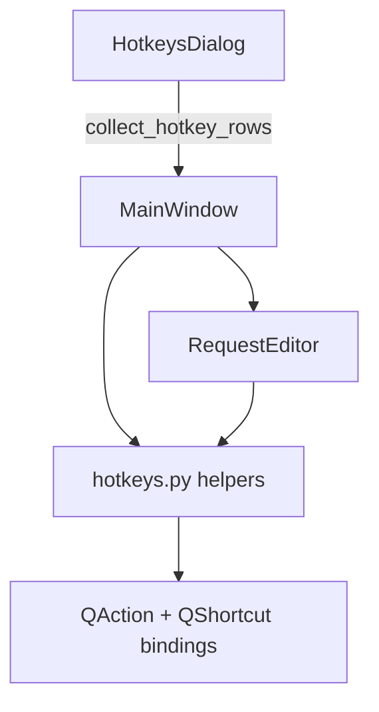

# PYPOST-599: HotkeysDialog derives shortcuts from app actions

## Research

### Sources reviewed

- Requirements: `ai-tasks/PYPOST-599/10-requirements.md`
- PYPOST-374 audit finding **D2** (`ai-tasks/PYPOST-374/30-dialogs-audit-report.md`)
- Current hardcoded dialog: `pypost/ui/dialogs/hotkeys_dialog.py`
- Shortcut registration: `pypost/ui/main_window.py`, `pypost/ui/widgets/request_editor.py`
- Tech debt note: `doc/dev/tech-debt/PYPOST-11.md`

### Current structure

| Location | Mechanism | Examples |
| --- | --- | --- |
| `main_window._create_menu_bar` | `QAction.setShortcut` | Quit (Ctrl+Q) |
| `main_window._setup_shortcuts` | `QShortcut` lambdas | Ctrl+N, F5, Alt+1..9 |
| `main_window.keyPressEvent` | Manual Ctrl+Return | Send request |
| `request_editor._setup_shortcuts` | `QShortcut` | Ctrl+S, Ctrl+Shift+S |
| `hotkeys_dialog.setup_ui` | Hardcoded `list[tuple]` | All rows |

### Architectural options considered

| Option | Pros | Cons | Decision |
| --- | --- | --- | --- |
| **A. QAction metadata + collectors** | Qt-idiomatic; help reads live actions | Needs refactor of QShortcut-only bindings | **Selected** |
| B. Static registry module only | Simple table | Still two places if not wired to actions | Rejected |
| C. Introspect all `QShortcut` children | Fully automatic | No human labels; noisy rows | Rejected |
| D. Full command bus / registry service | Extensible | Overkill for help dialog | Rejected |

## Implementation Plan

### Phase 1 — `pypost/ui/hotkeys.py`

Add helpers:

- `register_hotkey(parent, section, label, keys, slot, order)` — creates `QAction` with
  primary shortcut and optional alternate `QShortcut` bindings; stores metadata properties.
- `register_hotkey_group(...)` — one help row for independent bindings (Alt+1..9).
- `tag_action(action, section, order, keys?, label?)` — mark existing menu `QAction`s.
- `collect_hotkey_rows(root)` — `findChildren(QAction)`, group by section, sort by order.
- `format_shortcut_display(keys, collapse?)` — `"F5 / Ctrl+Return"` or `"Alt+1 ... Alt+9"`.

Properties (Qt dynamic):

- `pypost_hotkey_section`, `pypost_hotkey_order`, `pypost_hotkey_alt_keys`,
  `pypost_hotkey_collapse_keys`, `pypost_hotkey_label`.

### Phase 2 — Register shortcuts at source

**`MainWindow`**

- Tag File → Quit action.
- Replace `_setup_shortcuts` QShortcut block with `register_hotkey` / `register_hotkey_group`.
- Move Ctrl+Return send binding into `register_hotkey` (remove `keyPressEvent` override).

**`RequestEditor`**

- Set shortcuts on existing Save / Save As menu `QAction`s, `addAction` for global context.
- `tag_action` with help labels "Save Request" / "Save As Request".

### Phase 3 — `HotkeysDialog`

- Call `collect_hotkey_rows(self.parent() or self)` instead of hardcoded list.
- Preserve section header styling in table.

### Phase 4 — Tests

`tests/test_hotkeys.py`:

- Format helpers (join / collapse).
- `collect_hotkey_rows` ordering and labels.
- Dialog table populated from parent actions.

Run targeted suites: `test_hotkeys`, `test_main_window`, `test_save_flow_integration`,
`test_request_editor_gui_metrics`, `test_tabs_presenter`.

## Architecture

### Patterns

| Pattern | Application | Why |
| --- | --- | --- |
| Single registration point | `register_hotkey` / `tag_action` | Behavior and help share metadata |
| Convention over configuration | Qt dynamic properties on `QAction` | No parallel dict |
| Facade | `HotkeysDialog` only renders collected rows | Thin UI |

### Files touched

| File | Action |
| --- | --- |
| `pypost/ui/hotkeys.py` | New module |
| `pypost/ui/main_window.py` | Use helpers; remove keyPressEvent send hack |
| `pypost/ui/widgets/request_editor.py` | QAction shortcuts + tags |
| `pypost/ui/dialogs/hotkeys_dialog.py` | Dynamic collection |
| `tests/test_hotkeys.py` | New tests |
| `doc/dev/hotkeys.md` | New dev doc (Step 7) |

**Not modified:** shortcut handlers in presenters, menu structure, user-facing key bindings.

## Q&A

| Question | Answer |
| --- | --- |
| Why properties on QAction? | `findChildren(QAction)` from `MainWindow` reaches nested editors. |
| How are Alt+1..9 handled? | `register_hotkey_group` — one display row, nine shortcuts. |
| Menu text vs help label? | `pypost_hotkey_label` override (e.g. "Quit Application"). |
| Contextual shortcuts (F2, Ctrl+F)? | Out of scope; can adopt same helpers later. |
