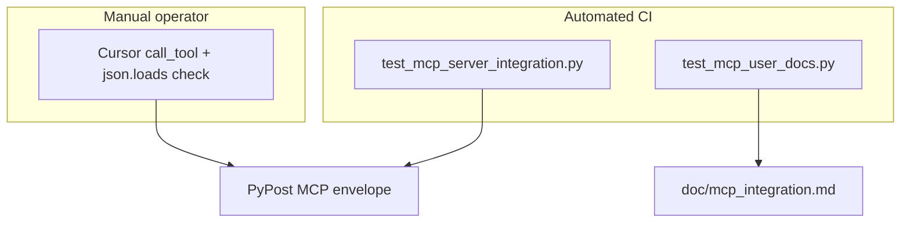

# PYPOST-680: Agent JSON envelope documentation

## Research

- PYPOST-557: `format_structured_tool_result()` returns JSON with `status`, `error`, `body`,
  optional `logs`, `error_category`, `error_message` in `TextContent.text`.
- `tests/test_mcp_server_integration.py`: `_mcp_call_tool` already uses `json.loads`.
- User doc gap tracked in `ai-tasks/PYPOST-557/60-tech-debt.md` line 12.

## Components

| Component | Change |
| --- | --- |
| `doc/mcp_integration.md` | User-facing envelope schema + `json.loads` example |
| `doc/dev/mcp_integration.md` | Agent parsing subsection under PYPOST-557 |
| `ai-tasks/PYPOST-552/cursor-verification-checklist.md` | `call_tool` envelope verification |
| `config/test/README.md` | Cursor section — parse envelope after tool call |
| `tests/test_mcp_user_docs.py` | CI guard for envelope guidance phrases |

No changes to `MCPServerImpl`, MCP transport, or Cursor configuration.

## Verification layers

## Patterns

- **Docs-as-code**: pytest asserts envelope keywords in user-facing markdown.
- **Layered docs**: user-facing setup + dev reference + checklist cross-links.
