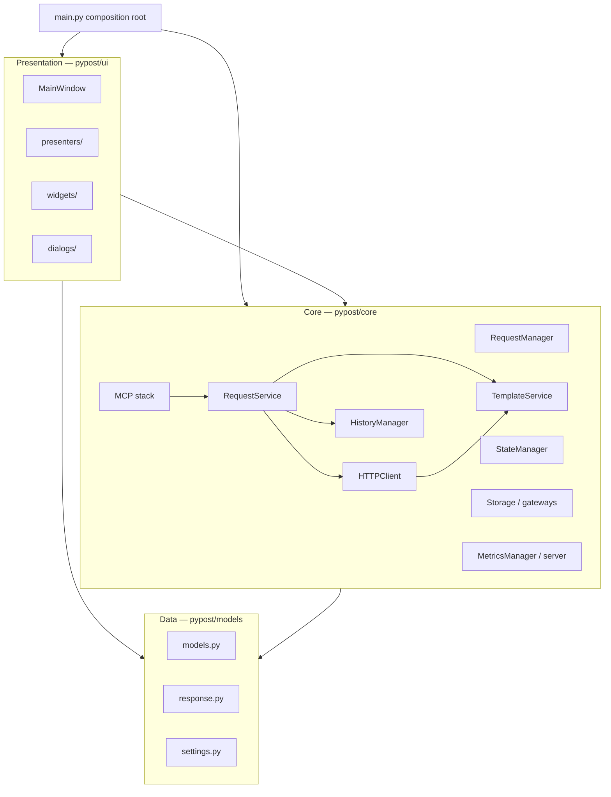
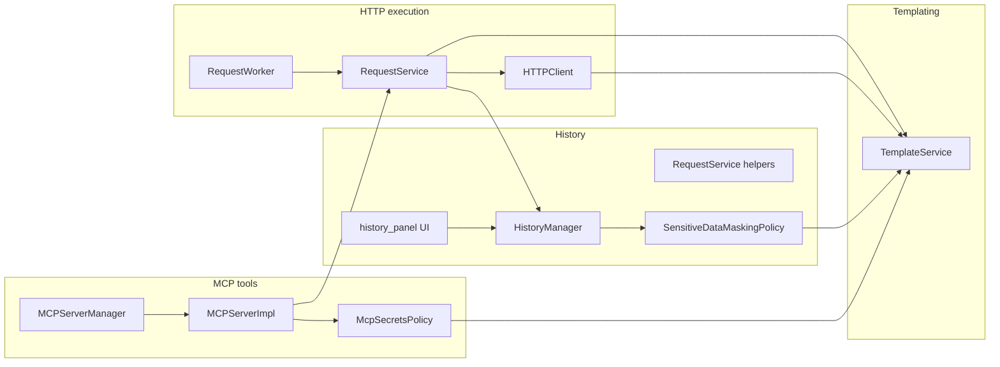

# PYPOST-684: Audit — architecture and package boundaries

## Research

### Audit focus (vs PYPOST-40)

PYPOST-40 assessed SOLID compliance and maintainability broadly. PYPOST-684 narrows the lens to:

- **Layer separation** — presentation (`ui/`), core business logic (`core/`), data definitions
  (`models/`), and external integration (MCP stack in `core/`).
- **Dependency direction** — which packages may import which; inward vs outward violations;
  circular-import risks affecting startup, tests, and refactors.
- **Service ownership** — HTTP execution, templating, request history, and MCP tool exposure:
  single owner vs duplicated or blurred responsibilities.

The audit is **read-only** (no refactors). Findings and remediation tickets belong in Steps 3–6.

### Documented layering baseline

`doc/dev/architecture.md` defines the intended structure:

| Layer | Package | Responsibility |
| --- | --- | --- |
| Composition root | `pypost/main.py` | Wire shared services once; inject into `MainWindow` |
| Core | `pypost/core/` | Request lifecycle, HTTP, templating, storage, MCP server, metrics |
| Models | `pypost/models/` | Requests, responses, environments, settings schemas |
| UI | `pypost/ui/` | PySide6 windows, presenters, widgets, dialogs |
| Utilities | `pypost/utils/` | Shared helpers (minimal surface) |
| Test fixtures | `pypost/fixtures/` | MCP/integration test helpers (out of production path) |

**Intended dependency direction** (dependencies point inward):

```text
main.py  →  ui/, core/
ui/      →  core/, models/     (not models → ui or core → ui)
core/    →  models/            (not models → core)
models/  →  (stdlib / typing only)
```

Protocols and interfaces (`ExecuteRequestProtocol`, `HTTPClientProtocol`,
`StorageInterface`, `MetricsTrackerProtocol`) document seams introduced after PYPOST-40;
`doc/dev/testability.md` describes the composition root and injection table.

### Python-specific review notes

Per `.cursor/lsr/do-python.md` and project conventions:

- Packages use `__init__.py` directories under `pypost/`.
- Constructor injection at the composition root (`main.py`) is the production pattern;
  optional defaults in leaf classes exist for isolated unit tests (`testability.md`).
- Circular imports are a first-class risk in Python; audit will trace `TYPE_CHECKING` guards
  and lazy imports separately from runtime cycles.
- Qt (PySide6) ties presentation to an event loop; MCP runs on background threads — boundary
  review includes thread/async bridging, not only static imports.

## Implementation Plan

### Audit methodology

#### 1. Establish scope and baseline

1. Confirm in-scope packages: `pypost/core/`, `pypost/models/`, `pypost/ui/`, `pypost/utils/`,
   `pypost/main.py`, `pypost/fixtures/` (fixtures noted but not primary).
2. Read baseline documents (see [Reference documents](#reference-documents)) and extract
   **stated** layer rules, composition-root wiring, and per-capability ownership claims.
3. Record explicit out-of-scope items from `10-requirements.md` (performance, security pen-test,
   CI/tooling, implementing fixes).

#### 2. Package and layer mapping

1. Inventory top-level packages and subpackages (presenters, widgets, MCP modules, key_sources).
2. For each module, assign a **primary layer** and **capability tags** (HTTP, templating,
   history, MCP, storage, metrics, encryption, UI-only).
3. Build a layer diagram and capability-to-module map (no violation judgments yet).

#### 3. Dependency-direction review

1. **Static import scan** — grep / scripted pass over `pypost/**/*.py` for cross-layer imports:
   - `core/` → `ui/` (inversion)
   - `models/` → `core/` or `ui/` (inversion)
   - `ui/` → `fixtures/` in non-test code
2. **Protocol vs concrete coupling** — which consumers depend on protocols vs concrete classes.
3. **Circular dependency detection** — attempt `python -c` import of key entry modules;
   review `TYPE_CHECKING` and deferred imports in hot paths (`main.py`, `mcp_server_impl.py`,
   `request_service.py`, `main_window.py`).
4. **Composition-root fidelity** — compare `main.py` wiring to `testability.md` injection table;
   note modules that still self-instantiate dependencies in production paths.

#### 4. Service-boundary review

For each named capability, trace the **end-to-end call chain** from all entry points (GUI,
MCP `call_tool`, metrics MCP, workers) and document **which modules participate** — without
yet scoring violations:

| Capability | Documented owner(s) | Entry points to trace |
| --- | --- | --- |
| HTTP execution | `RequestService`, `HTTPClient`, `RequestWorker` | GUI send, MCP `call_tool`, tests |
| Templating | `TemplateService` (+ expression helpers) | `HTTPClient`, `RequestService`, MCP schema, hover UI |
| History | `HistoryManager`, masking policy | `RequestService._record_execution_history`, UI panel |
| MCP tools | `MCPServerManager`, `MCPServerImpl`, policies | Tool registration, `call_tool`, secrets policy |

Check for **duplicated orchestration** (e.g. URL render in both service and client), **UI logic
in core**, and **core logic in widgets** — findings recorded in Step 3 only.

#### 5. Documentation alignment

1. Compare observed structure to `doc/dev/architecture.md` directory tree (stale entries,
   missing modules).
2. Cross-check capability docs (`request_execution.md`, `template_service.md`,
   `mcp_integration.md`, `collection_loading.md`, `state_manager.md`) against code paths.
3. Note ADRs only if referenced from `doc/dev/`; absence of a central ADR index is a
   documentation observation, not a code defect.

#### 6. Prioritization framework (for Step 3 findings)

| Severity | Criteria |
| --- | --- |
| **High** | Breaks intended dependency direction; risks import cycles or startup failure; blurs ownership of HTTP/MCP/history across layers |
| **Medium** | Increases test friction or duplicate logic; documentation materially wrong |
| **Low** | Minor drift, naming inconsistency, or isolated leak with clear workaround |

Impact statements will explain **maintainability and change risk**, not style preferences.

### Audit process flow


## Architecture

### System layer diagram (intended)



### Package / layer map (current tree)

Scope: **141** Python modules under `pypost/` (excluding `__pycache__`).

#### Root

| Path | Layer | Role |
| --- | --- | --- |
| `main.py` | Composition root | `ConfigManager`, `MetricsManager`, `TemplateService`, `AlertManager` → `MainWindow` |
| `version.py` | Meta | Application version string |

#### `pypost/models/` (6 modules)

| Module | Role |
| --- | --- |
| `models.py` | `RequestData`, `Collection`, environments, history entry types |
| `response.py` | HTTP response structures |
| `settings.py` | `AppSettings` and persisted preferences |
| `retry.py` | Retry policy models |
| `errors.py` | Shared error types / categories |
| `__init__.py` | Package marker |

#### `pypost/core/` (57 top-level modules + `key_sources/`)

| Sub-area | Modules | Primary concerns |
| --- | --- | --- |
| **Request lifecycle** | `request_manager.py`, `request_service.py`, `request_sync.py`, `worker.py`, `execute_request_protocol.py` | CRUD, execution orchestration, background workers |
| **HTTP transport** | `http_client.py`, `http_client_protocol.py`, `curl_generator.py`, `yaml_json_converter.py` | Network I/O, cURL export, body conversion |
| **Templating** | `template_service.py`, `function_registry.py`, `function_expression_resolver.py`, `template_expression_tokenizer.py`, `template_expression_types.py` | Jinja2 substitution, expression functions |
| **History & masking** | `history_manager.py`, `sensitive_data_masking_policy.py`, `hidden_toggle_log_policy.py` | Append/list history, safe fields |
| **Scripts** | `script_executor.py` | Post-request Python scripts |
| **Persistence** | `storage.py`, `storage_interface.py`, `config_manager.py`, `state_manager.py` | Collections, settings, UI session state |
| **Environments / encryption** | `environment_ops.py`, `environment_variables_adapter.py`, `environment_storage_gateway.py`, `environment_storage_worker.py`, `environment_secrets_codec.py`, `environment_messages.py`, `encryption_config.py`, `encryption_key.py`, `encryption_migration.py`, `encryption_migration_worker.py`, `key_provider.py`, `key_sources/*` | Env load/save, encryption at rest, key sources |
| **MCP integration** | `mcp_server.py`, `mcp_server_impl.py`, `mcp_streamable_http.py`, `mcp_legacy_sse.py`, `mcp_transport_routes.py`, `mcp_tool_contract.py`, `mcp_secrets_policy.py`, `mcp_tools_overview.py`, `mcp_client_service.py`, `mcp_activity_log.py` | Server lifecycle, tools, transports, policies |
| **Metrics / observability** | `metrics.py`, `metrics_server.py`, `metrics_registry.py`, `metrics_protocol.py`, `metrics_otel.py` | Prometheus + metrics MCP |
| **Cross-cutting** | `alert_manager.py`, `collection_item_strategies.py`, `variable_name_validation.py`, `bind_address_validation.py`, `server_bind.py`, `style_manager.py`, `constants.py` | Alerts, strategies, validation, UI style bridge |
| **Protocols / policies** | `execute_request_protocol.py`, `http_client_protocol.py`, `storage_interface.py`, `metrics_protocol.py` | Test seams and DIP |

`key_sources/` (9 modules): `protocol.py`, `registry.py`, `chain.py`, `env.py`, `keyring.py`,
`file_cache.py`, `factory.py`, `secret_store.py`, `registry_validation.py`.

#### `pypost/ui/` (53 modules)

| Subpackage | Files | Role |
| --- | ---: | --- |
| Root | 6 | `main_window.py`, `main_window_signals.py`, `hotkeys.py`, `collection_item_dialogs.py`, `request_save_orchestrator.py` |
| `presenters/` | 5 | `collections_presenter`, `tabs_presenter`, `env_presenter`, `collection_tree_actions` |
| `dialogs/` | 8 | Settings, env, save, MCP activity/tools, about, hotkeys |
| `widgets/` | 37 | Request/response editors, history panel, validation, fold, settings sections, environments |
| `delegates/` | 3 | Tree/env delegates |
| `styles/`, `theme/`, `resources/` | assets | QSS, icons, JSON syntax theme (non-Python or thin wrappers) |

#### `pypost/utils/`

Package exists (`__init__.py`); minimal or empty helper surface — confirm usage in Step 3.

#### `pypost/fixtures/`

`mcp_test_fixtures.py` — test support only; verify no production imports.

### Capability ownership map (documented baseline)

Used in Step 3 to compare **documented** vs **observed** boundaries:



### Module interaction scheme (runtime)

1. **Startup** — `main.py` loads config, starts metrics server, creates `TemplateService`, injects
   into `MainWindow` (`architecture.md`, `testability.md`).
2. **GUI request** — UI → `RequestWorker` (thread) → `RequestService.execute()` → `HTTPClient` /
   `ScriptExecutor` → signals → `ResponseView`; history via `HistoryManager`.
3. **MCP request** — External client → `MCPServerImpl.call_tool` → threadpool →
   `RequestService.execute()` (same HTTP/templating path per `request_execution.md`).
4. **Collections** — UI presenters → `RequestManager.get_collections()` only (not direct
   `Storage`); see `collection_loading.md`.
5. **Session state** — Presenters → `StateManager` (debounced) vs Settings dialog →
   `ConfigManager` (immediate); see `state_manager.md`.

### Architectural patterns (audit lens)

| Pattern | Where documented | Audit check |
| --- | --- | --- |
| Layered modular monolith | `architecture.md` | Import directions match layers |
| Composition root / DI | `main.py`, `testability.md` | Production paths inject shared services |
| Protocol-based seams | `*_protocol.py`, `storage_interface.py` | Consumers use protocols where claimed |
| Presenter split | PYPOST-43, `solid_audit.md` | UI orchestration vs widgets |
| Background workers | `worker.py`, MCP thread | Core owns threading rules; UI stays on Qt thread |
| Strategy registry | `collection_item_strategies.py` | Extensibility without UI conditionals |

### Main interfaces between modules (audit reference)

| Interface | Modules | Purpose |
| --- | --- | --- |
| `ExecuteRequestProtocol` | `RequestService`, workers, MCP | Uniform execute contract |
| `HTTPClientProtocol` | `HTTPClient`, tests | Transport mocking |
| `StorageInterface` | `Storage`, `RequestManager` | Persistence abstraction |
| `MetricsTrackerProtocol` | Metrics consumers | Optional metrics tracking |
| Qt signals/slots | `MainWindow`, workers, MCP manager | Cross-thread UI updates |
| MCP SDK callbacks | `MCPServerImpl` | Tool list / call_tool |
| `TemplateService.render_string` / `parse` | HTTP, MCP, masking, hover | Single templating API |

### Reference documents

Compare observed code against these `doc/dev/` sources (primary first):

| Document | Use in audit |
| --- | --- |
| [architecture.md](../../doc/dev/architecture.md) | Layer diagram, directory tree, composition root, component roles |
| [testability.md](../../doc/dev/testability.md) | Injection table, protocol seams, test substitutes |
| [mcp_integration.md](../../doc/dev/mcp_integration.md) | MCP lifecycle, threading, tool execution delegation |
| [request_execution.md](../../doc/dev/request_execution.md) | HTTP/MCP pipeline, history recording, error handling |
| [template_service.md](../../doc/dev/template_service.md) | Templating ownership, consumer matrix |
| [mcp_secrets_policy.md](../../doc/dev/mcp_secrets_policy.md) | MCP schema vs execution variable boundaries |
| [collection_loading.md](../../doc/dev/collection_loading.md) | RequestManager as sole collection loader |
| [state_manager.md](../../doc/dev/state_manager.md) | UI state vs settings persistence |
| [solid_audit.md](../../doc/dev/solid_audit.md) | Prior SOLID findings; avoid duplicate tickets |
| [collection_storage.md](../../doc/dev/collection_storage.md) | Storage boundaries |
| [environment_storage_async.md](../../doc/dev/environment_storage_async.md) | Async env gateway/worker |
| [sensitive_data_masking_policy.md](../../doc/dev/sensitive_data_masking_policy.md) | History safe fields |
| [ui_mixins.md](../../doc/dev/ui_mixins.md) | UI/core boundary for hover templating |
| [README.md](../../doc/dev/README.md) | Index of additional feature docs (spot-check if relevant) |

Prior audit artifact: [PYPOST-40/30-audit-report.md](../PYPOST-40/30-audit-report.md).

### Analysis plan for Step 3 (Development / audit execution)

Step 3 produces `ai-tasks/PYPOST-684/30-audit-report.md` (or equivalent). **No findings in
this document** — only the inspection checklist below.

#### Phase A — Inventory and metrics

- [ ] Run `scripts/audit_baseline_metrics.py` for LOC anchors (compare to PYPOST-376 caps).
- [ ] Confirm module counts per package match this map; update map if drift found.
- [ ] Tag each `core/` module with capability labels (HTTP, templating, history, MCP, storage,
  metrics, encryption).

#### Phase B — Dependency-direction inspection

- [ ] Grep: `pypost/core/**` importing `pypost.ui` (full file context, `TYPE_CHECKING` vs runtime).
- [ ] Grep: `pypost/models/**` importing `pypost.core` or `pypost.ui`.
- [ ] Grep: `pypost/ui/**` importing other UI subpackages — acceptable; flag `ui` → `fixtures`.
- [ ] Review `style_manager.py`, `request_sync.py` and any other core→ui imports.
- [ ] Trace `TemplateService` hover path: `ui/widgets/mixins.py` module-level service vs injection
  (`testability.md` table).
- [ ] Attempt import smoke test: `python -c "from pypost.main import main"` (or key subgraphs).
- [ ] List modules using lazy imports inside functions — classify as cycle mitigation vs smell.

#### Phase C — Service boundary traces

**HTTP execution**

- [ ] `ui/presenters/tabs_presenter.py`, `ui/main_window.py` → `worker.py` → `request_service.py`
  → `http_client.py`
- [ ] `mcp_server_impl.py` `call_tool` path vs GUI path — shared vs forked logic
- [ ] `request_sync.py` role and layer placement
- [ ] Default instantiation in `RequestService` / `RequestWorker` vs `testability.md` claims

**Templating**

- [ ] All `render_string` / `parse` call sites (grep `TemplateService` and `template_service`)
- [ ] Confirm no parallel Jinja2 paths outside `template_service.py` (per template_service.md)
- [ ] `curl_generator.py`, `sensitive_data_masking_policy.py`, `mcp_secrets_policy.py` boundaries

**History**

- [ ] `request_service.py` private history helpers vs `history_manager.py` API
- [ ] `ui/widgets/history_panel.py` — presentation only vs persistence logic
- [ ] `models.py` history types vs core mutations

**MCP tools**

- [ ] `mcp_server.py` (lifecycle) vs `mcp_server_impl.py` (tools) separation
- [ ] `metrics_server.py` second MCP surface — overlap with collection MCP
- [ ] `EnvPresenter` suppliers into MCP (`mcp_secrets_policy.md` diagram)
- [ ] `mcp_client_service.py` — client vs server boundary

#### Phase D — Presentation vs core

- [ ] `MainWindow` and presenters: delegate to `RequestManager` / `StateManager` vs inline logic
- [ ] `ui/widgets/validate/*` — UI-only validation vs domain rules
- [ ] `request_save_orchestrator.py`, `collection_item_dialogs.py` — orchestration layer check
- [ ] Encryption UI sections vs `core/encryption_*` — direction of dependencies

#### Phase E — Documentation alignment

- [ ] Diff `architecture.md` directory tree against live `pypost/` tree
- [ ] Verify composition-root table in `testability.md` against `main.py`
- [ ] Spot-check `mcp_integration.md` transport paths vs `mcp_transport_routes.py`
- [ ] Note stale or missing docs; do not conflate with code defects in findings text

#### Phase F — Report assembly (Step 3 deliverable)

- [ ] Executive summary
- [ ] Layer boundary section (AC-2)
- [ ] Dependency-direction section (AC-3)
- [ ] Service-boundary section (AC-4)
- [ ] Documentation alignment section (AC-5)
- [ ] Prioritized recommendations (AC-6)
- [ ] Out-of-scope appendix
- [ ] Step 6: Jira follow-ups for remediation (AC-7)

### Deliverable locations

| Step | Artifact |
| --- | --- |
| 2 (this doc) | `ai-tasks/PYPOST-684/20-architecture.md` |
| 3 | `ai-tasks/PYPOST-684/30-audit-report.md` |
| 6 | `ai-tasks/PYPOST-684/60-tech-debt.md` + Jira Debt issues |

### Out of scope (explicit)

- Code refactors or fixes
- Re-running full PYPOST-40 SOLID assessment (reference only)
- Performance profiling, security pen-testing, UI/UX review
- CI/build tooling or dependency version changes
- Defining target future architecture (remediation tasks may do so later)

## Q&A

| Question | Answer |
| --- | --- |
| Why a separate architecture step for an audit? | Step 2 fixes methodology, scope, and baseline maps so Step 3 findings are consistent and traceable to `doc/dev/`. |
| How is this different from PYPOST-40? | PYPOST-40 = SOLID/maintainability; PYPOST-684 = layers, import direction, and named service ownership (HTTP, templating, history, MCP). |
| Where do findings go? | `30-audit-report.md` in Step 3; this file intentionally has no violation list. |
| What tools will Step 3 use? | ripgrep import scans, import smoke tests, manual call-chain tracing, `audit_baseline_metrics.py`, comparison to docs above. |
| Are ADRs in scope? | Only if referenced from `doc/dev/`; no central ADR index is assumed. |
