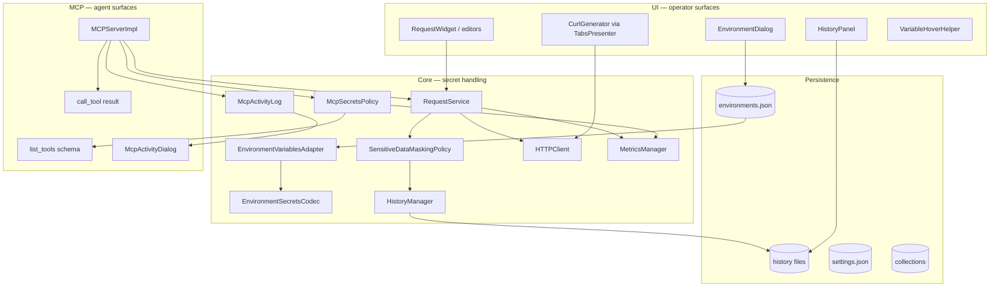
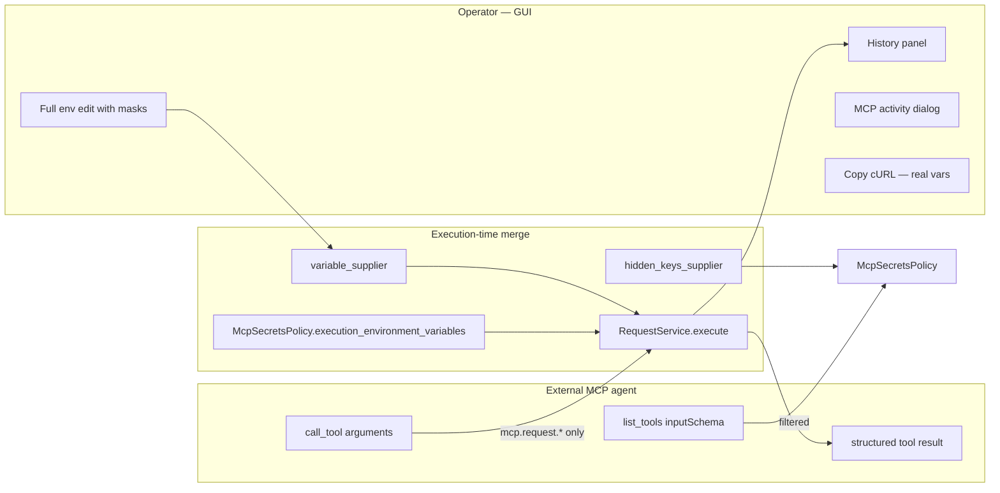

# PYPOST-685: Audit — security and secrets handling

## Research

### Audit focus (vs prior work)

PYPOST-685 narrows the lens to **secrets and sensitive-data handling** end to end. Related
prior work:

| Task | Focus | Relationship to this audit |
| --- | --- | --- |
| PYPOST-554 | MCP secrets policy implementation | Baseline for agent-visible vs execution-only data |
| PYPOST-446 | History masking policy | Baseline for persisted request history |
| PYPOST-447 / PYPOST-481+ | Encryption at rest | Baseline for on-disk env persistence |
| PYPOST-437 / PYPOST-448 | Hidden variables and toggle logging | Baseline for UI masking and diagnostic logs |
| PYPOST-684 | Package boundaries and layer ownership | Cross-reference when boundaries affect secret flow |
| PYPOST-40 | SOLID / maintainability | Reference only; avoid duplicate tickets |

The audit is **read-only** (no fixes). Findings and remediation tickets belong in Steps 3–6.

### Documented security baseline

Policies under `doc/dev/` define the **intended** operator-vs-agent and storage-vs-display
boundaries:

| Policy area | Document | Core enforcement |
| --- | --- | --- |
| Hidden variable UI masking | [hidden_variables.md](../../doc/dev/hidden_variables.md) | `Environment.hidden_keys`, `HIDDEN_MASK`, hover helpers |
| History sanitization | [sensitive_data_masking_policy.md](../../doc/dev/sensitive_data_masking_policy.md) | `SensitiveDataMaskingPolicy`, `RequestService` history block |
| Hidden-flag toggle logs | [hidden_variables.md](../../doc/dev/hidden_variables.md) (PYPOST-448) | `HiddenToggleLogPolicy`, `AppSettings.log_hidden_key_names` |
| Encryption at rest | [environment_encryption_at_rest.md](../../doc/dev/environment_encryption_at_rest.md) | `EnvironmentSecretsCodec`, `EnvironmentVariablesAdapter`, key sources |
| MCP agent contract filtering | [mcp_secrets_policy.md](../../doc/dev/mcp_secrets_policy.md) | `McpSecretsPolicy`, `MCPServerImpl._generate_schema` |
| Execution pipeline | [request_execution.md](../../doc/dev/request_execution.md) | Shared GUI/MCP path through `RequestService` |
| MCP lifecycle and activity | [mcp_integration.md](../../doc/dev/mcp_integration.md) | `MCPServerImpl`, `McpActivityLog`, tool registration |
| cURL export | [copy_curl.md](../../doc/dev/copy_curl.md) | `CurlGenerator` — uses **real** env vars for active requests |

**Trust model (audit assumption):**

- **Operator UI** — intended full visibility of secrets the operator stored (with deliberate
  masking for hidden values in display surfaces).
- **External MCP agents** — less trusted; must not receive hidden env keys in `list_tools`
  schemas or execution-only placeholders; real values merged only at `call_tool`.
- **Persisted artifacts** — history and on-disk storage should contain only policy-allowed data.
- **Operational logs / metrics** — should avoid secret values; key names may be configurable
  (toggle logs).

### Secrets surfaces map (scope inventory)

End-to-end paths the audit must trace:

## Implementation Plan

### Audit methodology

#### 1. Establish scope and baseline

1. Confirm in-scope capability areas from `10-requirements.md` (storage, UI, execution,
   history, logs, MCP, transport, collections).
2. Read baseline documents (see [Reference documents](#reference-documents)) and extract
   **stated** masking, encryption, and visibility rules.
3. Record explicit out-of-scope items (fixes, pen-test, compliance, PYPOST-684 layer review
   except where it affects secrets).

#### 2. Surface and module mapping

1. Tag each relevant module with **surface labels**: `storage`, `ui-display`, `execution`,
   `history`, `logs`, `metrics`, `mcp-schema`, `mcp-result`, `mcp-activity`, `export`,
   `transport`.
2. Build a **credential flow diagram** from env load → template render → HTTP send → history
   write → log/metric emission → MCP response (no violation judgments yet).
3. Note **operator-only** vs **agent-visible** vs **persisted** for each labeled module.

#### 3. Policy alignment review

For each documented policy, compare **stated rules** to **observed code paths**:

| Policy | Key questions |
| --- | --- |
| Hidden variables | Are all UI display paths masked? Does execution still use real values? |
| History masking | Is masking applied before every `HistoryManager.append`? Any bypass paths? |
| Encryption at rest | When enabled, are hidden values encrypted on disk? Plaintext leakage paths? |
| MCP secrets | Are env-only and hidden keys stripped from `list_tools`? Real merge at `call_tool` only? |
| Toggle logging | Does `log_hidden_key_names` setting apply consistently? Values never logged? |
| Activity log | Are argument **values** excluded per `mcp_integration.md` table? |
| cURL export | Does active-request copy resolve real secrets? History copy uses masked fields? |

#### 4. Cross-surface consistency review

Trace the same secret through **all** surfaces it may touch:

1. **Define** — operator sets hidden flag or encryption in env dialog / settings.
2. **Persist** — `StorageManager` / `EnvironmentVariablesAdapter` write `environments.json`.
3. **Display** — env dialog, request editors, hover previews, MCP tools overview.
4. **Execute** — GUI `RequestWorker` and MCP `call_tool` (merged variables).
5. **Record** — history entry, debug logs, metrics, MCP activity, structured tool result body.
6. **Export** — Copy cURL (active vs history), YAML/JSON export if applicable.

Check for **inconsistencies** (e.g. masked in history but exposed in tool result body, log line,
or clipboard export).

#### 5. Transport and exposure review

| Area | Inspect |
| --- | --- |
| Outbound HTTP | TLS defaults in `HTTPClient` / `requests`; cleartext assumptions; redirect behavior |
| Inbound MCP | Bind host/port defaults (`bind_address_validation`, settings); local vs LAN exposure |
| Collection exposure | `expose_as_mcp` registration; unintended tool catalog entries; cross-collection access |
| Metrics MCP | Second MCP surface — secrets in tool schemas or responses |

Document where security relies on **operator-controlled network posture** vs product-enforced
controls.

#### 6. Prioritization framework (for Step 3 findings)

| Severity | Criteria |
| --- | --- |
| **Critical** | Credential or PII reaches external MCP agent, unencrypted disk, or third-party network without documented intent |
| **High** | Secret values in persisted history, logs, metrics, or clipboard export contrary to policy |
| **Medium** | Policy gap, stale documentation, or partial masking on a secondary surface |
| **Low** | Key-name visibility, diagnostic opt-in behavior, or edge case with low exposure likelihood |

Impact statements explain **user trust and exposure risk**, not style preferences.

### Audit process flow

## Architecture

### Operator vs agent visibility (intended)

### Module map by security surface

Scope: modules that **read, write, transform, or expose** secrets or sensitive data.

#### Persistence and encryption

| Module | Surface tags | Role |
| --- | --- | --- |
| `storage.py` | storage | Atomic env/collection I/O |
| `environment_variables_adapter.py` | storage, logs | Serialize/deserialize; encryption policy |
| `environment_secrets_codec.py` | storage | Envelope encrypt/decrypt |
| `encryption_config.py`, `key_provider.py` | storage | Key resolution chain |
| `key_sources/*` | storage | Env, keyring, secret-store backends |
| `environment_storage_gateway.py`, `environment_storage_worker.py` | storage | Async encrypted load/save |
| `encryption_migration.py`, `encryption_migration_worker.py` | storage | Migration tooling paths |

#### Execution and masking

| Module | Surface tags | Role |
| --- | --- | --- |
| `request_service.py` | execution, history, logs | Orchestration; history helpers; debug logs |
| `http_client.py` | execution, transport | HTTP I/O; resolved fields for history |
| `worker.py` | execution | Forwards `hidden_keys` to execute |
| `sensitive_data_masking_policy.py` | history | `build_history_safe_fields` |
| `template_service.py` | execution, mcp-schema | Render for HTTP, MCP schema, masking |
| `script_executor.py` | execution, mcp-result | Post-script logs in tool results |
| `curl_generator.py` | export | cURL with resolved variables |

#### MCP agent surfaces

| Module | Surface tags | Role |
| --- | --- | --- |
| `mcp_secrets_policy.py` | mcp-schema, execution | Schema filter; execution env copy |
| `mcp_server_impl.py` | mcp-schema, mcp-result, mcp-activity | `list_tools`, `call_tool`, schema gen |
| `mcp_tool_contract.py` | mcp-schema | Tool metadata from `RequestData` |
| `mcp_server.py` | transport | Lifecycle; supplier wiring |
| `mcp_activity_log.py` | mcp-activity | Ring buffer of MCP operations |
| `mcp_tools_overview.py` | ui-display | Operator overview of exposed tools |
| `mcp_streamable_http.py`, `mcp_legacy_sse.py` | transport | HTTP transports |
| `bind_address_validation.py`, `server_bind.py` | transport | Bind address validation and errors |

#### UI presentation

| Module | Surface tags | Role |
| --- | --- | --- |
| `ui/dialogs/env_dialog.py` | ui-display, logs | Hidden checkbox; toggle logs |
| `ui/presenters/env_presenter.py` | ui-display, mcp-schema | Suppliers to MCP; hidden key propagation |
| `ui/presenters/tabs_presenter.py` | execution, export | Worker creation; Copy cURL |
| `ui/widgets/history_panel.py` | ui-display, export | History display; cURL from history |
| `ui/widgets/mixins.py` | ui-display | Hover masking |
| `ui/widgets/request_editor.py` | ui-display, mcp-schema | `expose_as_mcp` checkbox |
| `ui/dialogs/mcp_activity_dialog.py` | mcp-activity | Operator MCP log viewer |
| `ui/dialogs/settings_dialog.py` | storage, transport | Encryption and bind settings |

#### Models and observability

| Module | Surface tags | Role |
| --- | --- | --- |
| `models/models.py` | storage | `Environment.hidden_keys`, `expose_as_mcp` |
| `models/settings.py` | storage | Encryption toggle, bind host/port, log settings |
| `history_manager.py` | history | Append/list; no masking logic per policy doc |
| `hidden_toggle_log_policy.py` | logs | Key-name redaction for toggle events |
| `metrics.py`, `metrics_registry.py` | metrics | Masking counters; encryption metrics |
| `metrics_server.py` | transport, mcp-schema | Secondary MCP surface |

### Credential lifecycle (runtime)

1. **Load** — `StorageManager` / gateway loads `environments.json`; codec decrypts hidden
   values when encryption enabled → plain `Environment.variables` in memory.
2. **Propagate** — `EnvPresenter` tracks `_current_variables` and `_current_hidden_keys`;
   signals update request widgets and MCP suppliers.
3. **Execute (GUI)** — `TabsPresenter` → `RequestWorker(hidden_keys)` →
   `RequestService.execute()` → `HTTPClient` renders URL/headers/body with **real** values.
4. **Execute (MCP)** — `MCPServerImpl.call_tool` merges `variable_supplier()` +
   agent args → same `RequestService` path.
5. **Record** — `_record_execution_history()` applies `SensitiveDataMaskingPolicy` when
   hidden keys present → `HistoryManager.append()`.
6. **Observe** — debug logs, metrics, `McpActivityLog`, structured JSON tool results.

### Main interfaces (audit reference)

| Interface | Modules | Security relevance |
| --- | --- | --- |
| `hidden_keys_supplier` / `variable_supplier` | `EnvPresenter` → `MCPServerManager` → `MCPServerImpl` | Source of truth for MCP filtering and execution merge |
| `McpSecretsPolicy.filter_agent_param_specs` | `MCPServerImpl._generate_schema` | Agent-visible parameter set |
| `SensitiveDataMaskingPolicy.build_history_safe_fields` | `RequestService._build_history_entry` | Persisted history safety |
| `EnvironmentSecretsCodec` | `EnvironmentVariablesAdapter` | At-rest encryption |
| `CurlGenerator.generate` vs `generate_from_history` | `TabsPresenter`, `HistoryPanel` | Active (real) vs history (masked) export |
| `format_structured_tool_result` | `MCPServerImpl` | Agent-visible response body and logs |

### Reference documents

Compare observed behavior against these `doc/dev/` sources (primary first):

| Document | Use in audit |
| --- | --- |
| [mcp_secrets_policy.md](../../doc/dev/mcp_secrets_policy.md) | Agent vs execution variable boundaries; wiring diagram |
| [environment_encryption_at_rest.md](../../doc/dev/environment_encryption_at_rest.md) | Encryption architecture, key sources, async storage, troubleshooting |
| [encryption_key_migration.md](../../doc/dev/encryption_key_migration.md) | Migration paths; verify/re-encrypt tooling |
| [sensitive_data_masking_policy.md](../../doc/dev/sensitive_data_masking_policy.md) | History masking rules, invariants, metrics |
| [hidden_variables.md](../../doc/dev/hidden_variables.md) | UI masking, toggle log policy, signal propagation |
| [request_execution.md](../../doc/dev/request_execution.md) | GUI/MCP execution path; history recording helpers |
| [mcp_integration.md](../../doc/dev/mcp_integration.md) | Tool registration, activity log fields, structured results, transport |
| [copy_curl.md](../../doc/dev/copy_curl.md) | cURL export — real vars vs history entries |
| [environment_storage_async.md](../../doc/dev/environment_storage_async.md) | Async encrypted persistence |
| [settings_dialog.md](../../doc/dev/settings_dialog.md) | Encryption UI, bind address validation |
| [architecture.md](../../doc/dev/architecture.md) | Component locations; encryption and MCP modules |
| [template_service.md](../../doc/dev/template_service.md) | Templating consumers including masking and MCP |
| [collection_loading.md](../../doc/dev/collection_loading.md) | Collection access patterns |
| [testability.md](../../doc/dev/testability.md) | Injection seams for isolated security tests |
| [solid_audit.md](../../doc/dev/solid_audit.md) | Prior findings; avoid duplicate tickets |
| [README.md](../../doc/dev/README.md) | Index for additional feature docs |

Prior related artifacts:

- [PYPOST-684/20-architecture.md](../PYPOST-684/20-architecture.md) — package map for
  cross-reference
- Feature task docs in `ai-tasks/PYPOST-437`, `PYPOST-446`, `PYPOST-447`, `PYPOST-554`

### Analysis plan for Step 3 (Development / audit execution)

Step 3 produces `ai-tasks/PYPOST-685/30-audit-report.md`. **No findings in this document** —
only the inspection checklist below.

#### Phase A — Baseline and inventory

- [ ] Confirm module list above against live `pypost/` tree; add any drift.
- [ ] Grep for `hidden_keys`, `HIDDEN_MASK`, `HIDDEN_PLACEHOLDER`, `expose_as_mcp` across
  `pypost/` — build call-site inventory.
- [ ] List all `environments.json`, history, and settings persistence paths in `storage.py`.
- [ ] Read existing security-focused tests:
  `test_sensitive_data_masking_policy.py`, `test_mcp_secrets_policy.py`, encryption tests,
  MCP integration tests.

#### Phase B — Storage and encryption

- [ ] Trace `StorageManager.save_environments` / load paths with encryption on and off.
- [ ] Verify `EnvironmentVariablesAdapter` encrypts only intended fields (hidden keys).
- [ ] Inspect plaintext leakage: error messages, migration output, metrics labels.
- [ ] Confirm async gateway does not log decrypted values (`environment_storage_gateway.py`).
- [ ] Compare on-disk JSON shape to `environment_encryption_at_rest.md` envelope schema.
- [ ] Key source chain: env var names in logs? keyring entry naming?

#### Phase C — UI display and operator surfaces

- [ ] `EnvironmentDialog` — mask display, `UserRole` real value storage, rename/delete paths.
- [ ] Hover previews (`VariableHoverHelper`) — all variable-aware widgets.
- [ ] Request editors — any field showing resolved secrets post-execution?
- [ ] `McpToolsOverviewDialog` — does it expose env placeholder names or values?
- [ ] Settings encryption section — sensitive data in UI logs on save failure?

#### Phase D — Execution, history, and export

- [ ] Trace GUI path: `TabsPresenter` → `RequestWorker` → `RequestService` → `HTTPClient`.
- [ ] Trace MCP path: `call_tool` → variable merge → `RequestService` (same as GUI?).
- [ ] History: every `HistoryManager.append` caller — is masking applied first?
- [ ] `RequestService` debug logs — inspect format strings for URL, headers, body content.
- [ ] `CurlGenerator.generate` (active) vs `generate_from_history` — secret exposure delta.
- [ ] Post-script output in history and MCP `logs` field — sanitization?
- [ ] Response body in history — third-party PII vs credential leakage.

#### Phase E — MCP agent safety

- [ ] `list_tools`: walk `_generate_schema` → `filter_agent_param_specs` for sample requests
  with env-only, hidden, and `mcp.request.*` placeholders.
- [ ] Tool descriptions and names — resolved templates or raw placeholders?
- [ ] `call_tool` structured result: does upstream response body contain echoed secrets?
- [ ] `McpActivityLog` entries — confirm values never stored; review `detail` on errors.
- [ ] `McpActivityDialog` display — any reconstruction of sensitive args?
- [ ] Supplier staleness: env change while MCP client connected — wrong secrets served?
- [ ] Metrics MCP server (`metrics_server.py`) — separate secrets surface?

#### Phase F — Transport and collection exposure

- [ ] `HTTPClient` — TLS verification, proxy, redirect following, error messages.
- [ ] Default MCP bind address and port; `bind_address_validation` edge cases.
- [ ] Streamable HTTP and legacy SSE — authentication on inbound connections?
- [ ] `expose_as_mcp` tool registration — only intended requests exposed?
- [ ] Agent invoking tool for request in non-active collection — possible?
- [ ] Document operator assumptions (localhost-only MCP, trusted LAN, etc.).

#### Phase G — Logs, metrics, and documentation alignment

- [ ] Grep `logger.` in secret-touching modules — classify each log line (safe vs risky).
- [ ] Metrics labels and values — encryption errors, masking counters, env counts only?
- [ ] `hidden_toggle_log_policy` — both settings modes; dialog policy snapshot behavior.
- [ ] Compare each policy doc section to observed behavior; note stale or missing docs.
- [ ] Cross-check PYPOST-684 module map for modules that blur UI/core secret boundaries.

#### Phase H — Report assembly (Step 3 deliverable)

- [ ] Executive summary
- [ ] Storage and UI section (AC-2)
- [ ] Execution and history section (AC-3)
- [ ] MCP section (AC-4)
- [ ] Transport section (AC-5)
- [ ] Collection exposure section (AC-6)
- [ ] Documentation alignment section (AC-7)
- [ ] Prioritized recommendations (AC-8)
- [ ] Out-of-scope appendix
- [ ] Step 6: Jira follow-ups for remediation (AC-9)

### Deliverable locations

| Step | Artifact |
| --- | --- |
| 2 (this doc) | `ai-tasks/PYPOST-685/20-architecture.md` |
| 3 | `ai-tasks/PYPOST-685/30-audit-report.md` |
| 6 | `ai-tasks/PYPOST-685/60-tech-debt.md` + Jira Debt issues |

### Out of scope (explicit)

- Code refactors or security fixes
- Penetration testing, formal threat modeling, compliance certification
- Full PYPOST-684 layer audit (cross-reference only when secrets cross layers)
- Performance, general UI/UX, dependency upgrades
- Defining target future security architecture (remediation tasks may do so later)

## Q&A

| Question | Answer |
| --- | --- |
| Why a separate architecture step for a security audit? | Step 2 fixes methodology, surface map, and policy baselines so Step 3 findings are consistent and traceable to `doc/dev/`. |
| How is this different from PYPOST-554? | PYPOST-554 implemented MCP secrets policy; this audit verifies the **full** secrets surface and policy consistency. |
| How is this different from PYPOST-684? | PYPOST-684 = layers and imports; PYPOST-685 = credentials, masking, encryption, MCP exposure, transport. |
| Where do findings go? | `30-audit-report.md` in Step 3; this file intentionally has no violation list. |
| What tools will Step 3 use? | ripgrep for call sites and log patterns, existing pytest security tests, manual flow tracing, policy doc comparison. |
| Is Copy cURL in scope? | Yes — it exports resolved credentials for active requests; audit verifies against stated intent in `copy_curl.md` and history masking policy. |
