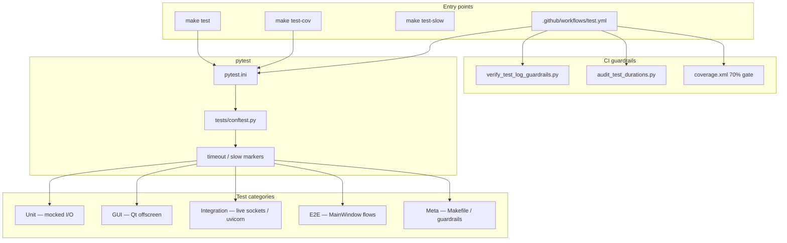

# PYPOST-686: Audit — test coverage and test quality

## Research

### Audit focus

PYPOST-686 assesses **automated pytest health** end to end: coverage, timeouts, CI guardrails,
integration balance, flaky patterns, and maintainability. Related prior work:

| Task / doc | Focus | Relationship |
| --- | --- | --- |
| `doc/dev/testing.md` | Developer pytest reference | Baseline for commands, CI parity, coverage threshold |
| `.cursor/lsr/do-testing.md` | Agent timeout and caplog rules | Compliance baseline for per-test timeouts |
| PYPOST-429 | Qt/PySide6 segfault investigation | Context for native crash in server manager tests |
| PYPOST-573 / PYPOST-572 | Duration audit, log guardrails | CI observability scripts |
| PYPOST-40 / PYPOST-376 | SOLID baseline regression tests | `test_solid_audit_baseline.py` LOC caps |
| PYPOST-382 | Unit testability patterns | Injection seams for isolated tests |
| PYPOST-684 / PYPOST-685 | Architecture and security audits | Cross-reference only; no duplicate scope |

The audit is **read-only** (no test or source fixes). Findings belong in Step 3; follow-ups in
Step 6.

### Test suite topology

## Implementation Plan

### Audit methodology

#### 1. Establish scope and baseline

1. Confirm in-scope areas from `10-requirements.md`.
2. Read `doc/dev/testing.md`, `do-testing.md`, `pytest.ini`, `Makefile`, CI workflow.
3. Record out-of-scope items (fixes, manual MCP testing, security re-audit).

#### 2. Suite inventory

1. Count test files (`tests/test_*.py`) and collected test items (`pytest --collect-only`).
2. Categorize by naming and imports: unit, GUI (Qt), integration, e2e, slow, meta/guardrail.
3. Map `tests/helpers/` shared fixtures (`mcp_live_server.py`, `mcp_test_collection.py`).

#### 3. Coverage analysis

1. Run `make test` for pass/fail summary and runtime.
2. Run coverage (`make test-cov` or batched `--cov=pypost` if full run aborts locally).
3. List modules below 70% line coverage and modules with no direct test references.
4. Compare against `--cov-fail-under=70` in `pytest.ini`.

#### 4. Timeout compliance

1. Grep `pytest.mark.timeout` / `pytestmark` across `tests/`.
2. Confirm `conftest.py` `pytest_runtest_setup` enforces markers at collection/runtime.
3. Summarize timeout tier distribution (10 / 30 / 60 / 120 seconds per `do-testing.md`).
4. Check internal waits (`time.sleep`, `QTest.qWait`) for bounded deadlines.

#### 5. Integration vs unit balance

1. Count integration-named modules and live-server tests.
2. Assess pyramid: majority should be fast unit/GUI with targeted integration for MCP, metrics,
   bind hosts, and save flows.
3. Note duplication between `test_mcp_server_integration.py` and
   `test_mcp_test_collection_integration.py`.

#### 6. Flaky and environment-sensitive patterns

1. Record failures from audit `make test` run.
2. Investigate segfaults (PYPOST-429), order-dependent failures, Python version coupling in
   Makefile tests.
3. Review `test_solid_audit_baseline.py` drift vs growing modules.

#### 7. Maintainability

1. Assess helper reuse vs copy-paste polling loops in server manager tests.
2. Review meta-tests (`test_verify_test_log_guardrails.py`, `test_audit_test_durations.py`,
   `test_pytest_exit_policy.py`).
3. Note `unittest.TestCase` vs pytest style mix.

#### 8. Test observability

1. CI log capture (`--log-file`, `log_cli` settings).
2. `scripts/verify_test_log_guardrails.py` and `tests/expected_log_allowlist.yaml`.
3. `caplog` usage vs `do-testing.md` error-path contract.

#### 9. Report assembly (Step 3)

- Executive summary with suite stats
- Coverage, timeout, balance, flaky, CI, maintainability, observability sections
- Prioritized P1/P2/P3 recommendations

### Prioritization framework

| Severity | Criteria |
| --- | --- |
| **P1** | Merge gate risk, suite abort (segfault), or critical path under-tested |
| **P2** | Coverage gap on important module, flaky test in CI, guardrail weakness |
| **P3** | Minor gap, documentation drift, nice-to-have test expansion |

### Analysis plan checklist (Step 3)

- [x] `make test` — 1,423 collected; 1,408 passed, 15 failed locally (macOS 3.11)
- [x] Coverage — 88% line (batched run, excluding segfault file); CI gate 70%
- [x] Timeout grep — 135/135 test files declare markers; conftest enforces
- [x] `tests/` structure — 135 files, 62 GUI-touching, 13 integration-named, 7 e2e-named
- [x] CI config — `.github/workflows/test.yml` matrix 3.11/3.13 + slow job
- [x] Low coverage modules — `mcp_server.py` 38%, `metrics_server.py` 50%, `main.py` 0%
- [x] Flaky patterns — segfault in `test_mcp_server_manager.py`; makefile Python version drift

### Deliverable locations

| Step | Artifact |
| --- | --- |
| 2 (this doc) | `ai-tasks/PYPOST-686/20-architecture.md` |
| 3 | `ai-tasks/PYPOST-686/30-audit-report.md` |
| 6 | `ai-tasks/PYPOST-686/60-tech-debt.md` |
| 7 | `doc/dev/test_audit.md` |

### Out of scope (explicit)

- Writing or fixing tests
- Raising coverage threshold
- Security or architecture re-audit
- Manual exploratory testing

## Q&A

| Question | Answer |
| --- | --- |
| Why architecture for a test audit? | Fixes methodology and inventory so Step 3 findings are reproducible. |
| Does local `make test` match CI? | Intended parity; macOS segfaults and Python default version may differ — documented in report. |
| Where do findings go? | `30-audit-report.md`; this file has no violation list. |
