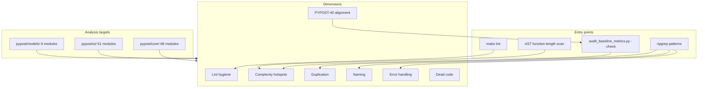

# PYPOST-687: Audit — code quality and maintainability

## Research

### Audit focus

PYPOST-687 assesses **application source maintainability** end to end: lint hygiene, complexity,
duplication, naming, error handling, SOLID alignment, dead code, and regression since the
2026-06-11 baseline. Related prior work:

| Task / doc | Focus | Relationship |
| --- | --- | --- |
| PYPOST-40 | Original SOLID audit | Audit-era LOC and violation inventory |
| PYPOST-376 | Regression caps + `test_solid_audit_baseline.py` | Numeric guardrails |
| `doc/dev/solid_audit.md` | Developer SOLID summary | Cap commands and dialog audit |
| `scripts/audit_baseline_metrics.py` | LOC measurement | `--check` for cap violations |
| PYPOST-684 | Architecture boundaries | Cross-reference; layer violations out of scope |
| PYPOST-686 | Test suite health | Cross-reference; test failures cited where they block caps |
| `.flake8` / `make lint` | Flake8 max-line-length 100 | Lint hygiene baseline |

The audit is **read-only** (no source fixes). Findings belong in Step 3; follow-ups in Step 6.

### Maintainability analysis topology

## Implementation Plan

### Audit methodology

#### 1. Establish scope and baseline

1. Confirm in-scope areas from `10-requirements.md`.
2. Read `doc/dev/solid_audit.md`, PYPOST-40 report, `baseline-metrics.md`.
3. Record out-of-scope items (test fixes, security, architecture re-audit).

#### 2. Lint and type hygiene

1. Run `make lint` (flake8 on `pypost/`).
2. Note absence of `make analyze`, mypy, pyright.
3. Count `from __future__ import annotations` and `# type: ignore` / typing noqa usage.

#### 3. Complexity and caps

1. Run `scripts/audit_baseline_metrics.py --check` and full markdown output.
2. List top 15 files by LOC (`wc -l`).
3. AST-scan functions ≥50 LOC; flag ≥80 LOC as hotspots.

#### 4. Duplication and naming

1. Compare fold scanner modules (`json_`, `xml_`, `yaml_` structure scanners).
2. Note centralized `collection_item_dialogs.py` vs scattered QMessageBox usage.
3. Review re-export noqa patterns in `settings_dialog.py`.

#### 5. Error handling and observability

1. Count `except Exception` vs specific exceptions vs bare `except:`.
2. Map `logger.error` / `logger.exception` density by module.
3. Cross-reference `collection_item_dialogs.py` user messaging.

#### 6. SOLID alignment (PYPOST-40)

1. Compare audit-era vs current LOC for capped modules.
2. Verify resolved items: MetricsManager singleton, template_service global.
3. Note remaining DIP gaps (RequestService/Worker default instantiation).

#### 7. Dead code and regressions

1. Flake8 F841/F401 in `pypost/`.
2. Cap violations vs 2026-06-11 baseline snapshot.

#### 8. Report assembly (Step 3)

- Executive summary with scale stats
- Lint, complexity, duplication, naming, error handling, SOLID, dead code sections
- Prioritized P1/P2/P3 recommendations

### Prioritization framework

| Severity | Criteria |
| --- | --- |
| **P1** | Cap regression failing guardrails, lint gate broken, critical module runaway growth |
| **P2** | Hotspot function/file, broad error handling, missing type tooling, meaningful duplication |
| **P3** | Minor dead code, style nits, documentation of conventions |

### Analysis plan checklist (Step 3)

- [x] `make lint` — **FAIL** (4 violations in `pypost/`)
- [x] `audit_baseline_metrics.py --check` — **FAIL** (3 cap violations)
- [x] Scale — 141 modules, ~16,425 LOC under `pypost/`
- [x] Long functions — 29 functions ≥50 LOC; 12 ≥80 LOC; max 225 LOC
- [x] PYPOST-40 alignment — MainWindow decomposed; caps exceeded; injection partial
- [x] Error handling — 29 `except Exception`; 0 bare `except:`; 37 modules with logger.error+

### Deliverable locations

| Step | Artifact |
| --- | --- |
| 2 (this doc) | `ai-tasks/PYPOST-687/20-architecture.md` |
| 3 | `ai-tasks/PYPOST-687/30-audit-report.md` |
| 6 | `ai-tasks/PYPOST-687/60-tech-debt.md` |
| 7 | `doc/dev/maintainability_audit.md` |

### Out of scope (explicit)

- Fixing lint or cap violations
- Refactoring hotspot modules
- Adding mypy to CI
- Re-auditing package import directions

## Q&A

| Question | Answer |
| --- | --- |
| Why architecture for a maintainability audit? | Fixes methodology so Step 3 measurements are reproducible. |
| Does CI run `make lint`? | No — flake8 installed in test workflow but not executed as a gate. |
| Where do findings go? | `30-audit-report.md`; this file has no violation list. |
