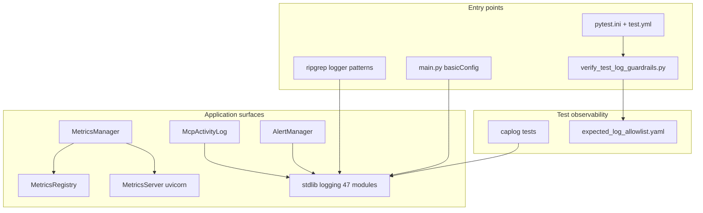

# PYPOST-688: Audit — observability and logging

## Research

### Audit focus

PYPOST-688 assesses **application observability** end to end: logging levels and configuration,
structured log context, Prometheus metrics (MetricsManager / MetricsRegistry / MetricsServer), MCP
activity log, alert webhooks, pytest `log_cli` and CI guardrails, and sensitive data in log
lines. Related prior work:

| Task / doc | Focus | Relationship |
| --- | --- | --- |
| PYPOST-685 | Security and secrets in logs | Cross-ref E-003, M-004; avoid duplicate |
| PYPOST-686 | Test suite health | Cross-ref log guardrails, caplog |
| PYPOST-570/671 | log_cli review and CI disable | pytest.ini vs test.yml |
| PYPOST-572/573 | ERROR allowlist verifier | `verify_test_log_guardrails.py` |
| PYPOST-141 | MCP activity log | Ring buffer + UI |
| `doc/dev/testing.md` | log_cli, CI guardrails | Dev doc baseline |
| `doc/dev/mcp_integration.md` | MCP activity viewer | UI integration |

The audit is **read-only** (no source fixes). Findings belong in Step 3; follow-ups in Step 6.

### Observability analysis topology

## Audit Methodology

### Phase 1 — Logging inventory

1. Count `logger.(debug|info|warning|error|exception)` calls per module and level.
2. Identify `logging.getLogger` adoption vs `print()` fallbacks.
3. Inspect `main.py` `basicConfig` and absence of settings-driven log level.
4. Sample event naming (`snake_case_event key=value` convention).

### Phase 2 — Metrics stack

1. Trace `MetricsManager` → `MetricsRegistry` + `MetricsServer` composition.
2. Count Prometheus `Counter` / `Histogram` / `Gauge` registrations in `_init_metrics`.
3. Review server lifecycle logs and uvicorn `log_level`.
4. Count metrics-related test modules.

### Phase 3 — MCP activity and alerts

1. Read `McpActivityLog.append` INFO events and entry fields.
2. Trace `AlertManager.emit` — rotating JSON file vs application logger lines.
3. Review webhook delivery logging (URL visibility, auth header omission).

### Phase 4 — Test/CI logging

1. Compare `pytest.ini` (`log_cli=true`, `WARNING`) vs CI (`log_cli=false`, `--log-file`).
2. Review `expected_log_allowlist.yaml` baseline (72 ERROR + margin 5).
3. Count `caplog` test modules.

### Phase 5 — Sensitive data

1. Grep logger calls near `url`, `endpoint`, `token`, `password`, `Authorization`.
2. Cross-reference PYPOST-685 E-003 (resolved URLs in http_client ERROR logs).
3. Note PASS patterns (key_id only, mcp_arg_count not values).

## Deliverables

| Step | Artifact | Content |
| --- | --- | --- |
| 3 | `30-audit-report.md` | Full findings with grep evidence |
| 4 | `40-code-cleanup.md` | Artifact hygiene; N/A code fixes |
| 5 | `50-observability.md` | Meta-observability of audit process |
| 6 | `60-tech-debt.md` | P1/P2/P3 follow-ups (no Jira links) |
| 7 | `doc/dev/observability_audit.md` | Developer summary |

## Risks and Assumptions

- Grep counts are point-in-time (2026-06-12); line numbers may drift.
- No runtime log capture — analysis is static.
- PYPOST-685 owns full secrets matrix; this audit cites overlapping log findings only.
