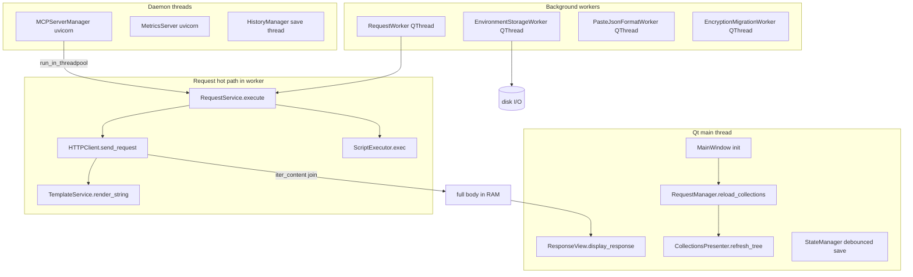

# PYPOST-689: Audit — performance and scalability

## Research

### Audit focus

PYPOST-689 assesses **client-side performance** end to end: HTTP/MCP request execution hot paths,
template rendering cost, Qt UI responsiveness, MCP server threading, collection/history I/O, and
in-memory growth patterns. Related prior work:

| Task / doc | Focus | Relationship |
| --- | --- | --- |
| PYPOST-410 | Single URL render per send | Hot-path dedup baseline |
| PYPOST-455/628 | Template compile LRU | Sub-ms render evidence |
| PYPOST-486 | Async environment storage | QThread pattern to mirror |
| PYPOST-364/109 | Large-doc thresholds (100 KB) | Response search / paste JSON |
| PYPOST-41 | History async save + cap | Memory bound for history |
| `doc/dev/request_execution.md` | Execution pipeline | Flow reference |
| `doc/dev/environment_storage_async.md` | Encrypted env worker | Async I/O precedent |

The audit is **read-only** (no source fixes). Findings belong in Step 3; follow-ups in Step 6.

### Performance analysis topology



## Audit Methodology

| Step | Action |
| --- | --- |
| 1 | Trace GUI send: `TabsPresenter` → `RequestWorker` → `RequestService` → `HTTPClient` |
| 2 | Count `render_string` call sites and compile-cache usage |
| 3 | Inventory `QThread` and `threading.Thread` modules |
| 4 | Trace startup: `MainWindow.__init__` synchronous I/O |
| 5 | Trace MCP inbound: `call_tool` → `run_in_threadpool` → `RequestService` |
| 6 | Review large-document constants (`100 * 1024`) and caps (history 500, MCP activity 100) |
| 7 | Cross-reference PYPOST-455 micro-benchmarks and PYPOST-486 async env pattern |

### Evidence commands (2026-06-12)

```bash
rg -c 'render_string' pypost/
rg -l 'QThread|threading\.Thread' pypost/
rg 'iter_content|stream=True|processEvents' pypost/
rg 'LARGE_DOC|100 \* 1024|DEFAULT_MAX_ENTRIES' pypost/
```

No application code modified. Line numbers reference commit at audit date.

## Scope Boundaries

| In scope | Out of scope |
| --- | --- |
| Client hot paths and threading | Server/API performance |
| In-memory bounds and caps | Prometheus cardinality under load |
| Main-thread blocking inventory | Full profiler runs |
| Collection/history file I/O | CDN or proxy tuning |
