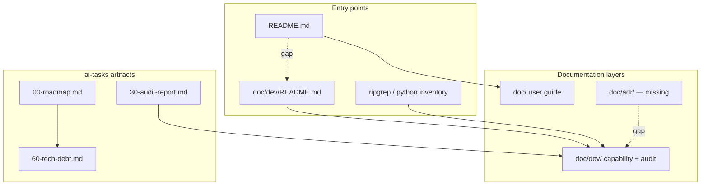

# PYPOST-690: Audit — documentation and ADR alignment

## Research

### Audit focus

PYPOST-690 assesses **developer documentation completeness**, **stale docs vs code**,
**ADR/index gaps**, **audit doc cross-links**, **README TOC**, and **ai-tasks artifact
quality**. Related prior work:

| Task / doc | Focus | Relationship |
| --- | --- | --- |
| PYPOST-684 | Architecture audit | Doc alignment section in 30-audit-report |
| PYPOST-685–689 | Code Audit summaries | Cross-link targets for hub |
| PYPOST-40 | SOLID audit (legacy) | Pre-epic naming; solid_audit.md |
| `doc/dev/README.md` | Dev doc TOC | Primary navigation surface |
| `doc/dev/tech_debt_inventory.md` | Debt index | Missing from TOC |

The audit is **read-only** (no source fixes). Findings belong in Step 3; follow-ups in Step 6.

### Documentation analysis topology

## Audit Methodology

### Phase 1 — Inventory and TOC

1. List all `doc/dev/**/*.md` files.
2. Parse `doc/dev/README.md` TOC links.
3. Compute missing-from-TOC set.
4. Check root `README.md` for dev doc link.

### Phase 2 — Stale vs code

1. Verify `architecture.md` module counts against `find pypost -name '*.py'`.
2. Sample alignment of `request_execution.md`, `mcp_integration.md`, `template_service.md`
   (prior PYPOST-684 PASS).
3. Flag stale narratives in `solid_audit.md` (MainWindow LOC).
4. Note `testability.md` composition-root omissions (from PYPOST-684).

### Phase 3 — ADR and decisions

1. Search for `doc/adr/`, `ADR`, `architecture decision` in repo.
2. Catalog decision scatter in `ai-tasks/` and inline PYPOST refs.

### Phase 4 — Audit cross-links

1. Read all `doc/dev/*_audit.md` files.
2. Count links to sibling audits and full reports.
3. Note Jira URL inconsistency in dev summaries.

### Phase 5 — ai-tasks quality

1. Count folders with `00-roadmap.md`, `60-tech-debt.md`.
2. Count thin folders (≤2 markdown files).
3. Verify Code Audit tasks 684–689 have 8-file pattern.

## Deliverables

| Step | Artifact |
| --- | --- |
| 3 | `30-audit-report.md` |
| 6 | `60-tech-debt.md` (no Jira links) |
| 7 | `doc/dev/documentation_audit.md`, README TOC update |

## Open Questions

| Question | Resolution |
| --- | --- |
| Are ADRs required? | No formal ADRs exist; index is a P1 documentation gap |
| Include user doc/README? | Root README link only; no user guide rewrite |
| Ticket Jira in 60-tech-debt? | No — per audit workflow convention |
