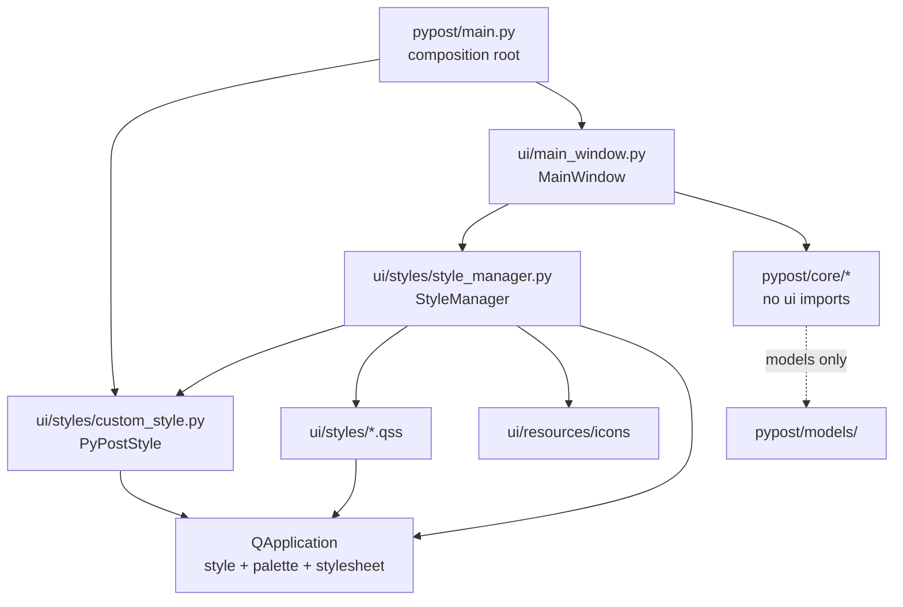

# PYPOST-692: Move StyleManager out of core

## Research

### Current state

`StyleManager` lives in `pypost/core/style_manager.py` (~130 lines). It is the **only**
confirmed runtime import from `core/` into `ui/` (audit finding **D-001** / **L-004**,
recommendation **R-P1-001**).

```python
# pypost/core/style_manager.py:8 — the boundary violation
from pypost.ui.styles.custom_style import PyPostStyle
```

Responsibilities today:

| Method | Behavior |
|--------|----------|
| `load_styles()` | Reads sorted `pypost/ui/styles/*.qss`, substitutes `%ICONS_DIR%` with `ui/resources/icons`, logs WARNING/DEBUG |
| `apply_theme(app, theme)` | `system` → `PyPostStyle`; `light`/`dark` → Fusion + palette; invalid theme → `system` |
| `apply_styles(app_or_widget, font_size)` | Combines QSS + optional `QWidget { font-size: Npt; }`, replaces application stylesheet |

Path resolution uses `Path(__file__).parent.parent` to reach `pypost/`, then
`ui/styles` and `ui/resources/icons` — the module already conceptually belongs to the
presentation layer.

### Import graph (production)

```text
pypost/main.py
  └─ PyPostStyle (ui/styles/custom_style)     # duplicate bootstrap — PYPOST-702

pypost/ui/main_window.py
  └─ StyleManager (core/style_manager)        # sole production consumer
       └─ PyPostStyle (ui/styles/custom_style) # core → ui violation

pypost/core/* (all other modules)
  └─ no StyleManager import
```

### Test import sites

| File | Usage |
|------|-------|
| `tests/test_style_manager_theme.py` | Theme application (system/light/dark/invalid) |
| `tests/test_style_manager_font.py` | Font-size QSS injection, tooltip QSS presence |
| `tests/test_tab_layout_regression.py` | QSS content guard, tab geometry with applied styles |
| `tests/test_apply_settings_font.py` | Mocks `window.style_manager.apply_*` |
| `tests/test_settings_alert_main_window_e2e.py` | Patches `window.style_manager.apply_styles` |
| `tests/test_main_window_alert_reload.py` | Patches `window.style_manager.apply_styles` |

No test or production code outside `ui/` and tests imports `StyleManager` from core.

### Related modules (unchanged by this task)

- `pypost/ui/styles/custom_style.py` — `PyPostStyle(QProxyStyle)`; platform-native metrics
  by default; opt-in close-indicator override.
- `pypost/ui/styles/main.qss` — bundled global QSS.
- `pypost/main.py` — installs `PyPostStyle()` before `MainWindow` (duplicate of
  `apply_theme("system")`; tracked as **R-P3-004** / PYPOST-702, out of scope).

### Option analysis: move to `ui/` vs extract neutral module

| Criterion | Move to `pypost/ui/styles/` | Extract neutral module (e.g. shared `styles/` package) |
|-----------|----------------------------|----------------------------------------------------------|
| Fixes core → ui import | Yes — `StyleManager` leaves `core/` | Partially — would still need to move `StyleManager` or leave Qt UI code in core |
| Fixes L-004 (UI concern in core) | Yes — entire class is presentation | No — `StyleManager` would remain in core with QPalette/QSS/Qt deps |
| Cohesion with assets | High — colocated with `custom_style.py`, `main.qss`, icons path | Low — splits styling code across three packages |
| Consumers | Only `MainWindow` (ui) | No core consumer exists for a neutral split |
| `PyPostStyle` placement | Stays in `ui/` (correct — it is `QProxyStyle`) | Would move to neutral, but it is not business logic; adds a third package for pure Qt |
| Change size | Small — one file move + import updates | Larger — new package, two moves, unclear ownership |
| Future headless core | Style code correctly excluded from core | Neutral module still pulls PySide6 |

**Decision: move `StyleManager` to `pypost/ui/styles/style_manager.py`.**

Do **not** extract a neutral module. Both `StyleManager` and `PyPostStyle` are Qt
presentation concerns; neither belongs in `core/` or a framework-neutral layer. A shared
package would add indirection without restoring a meaningful core boundary.

### External references

- [Qt QProxyStyle](https://doc.qt.io/qt-6/qproxystyle.html) — recommended for overriding
  platform style metrics while delegating native rendering (matches `PyPostStyle` role).
- [Qt Styles and Style Aware Widgets](https://doc.qt.io/qt-6/style-reference.html) —
  `QApplication::setStyle()` + `setPalette()` for theme; QSS via `setStyleSheet()`.
- [Qt QStyle](https://doc.qt.io/qt-6/qstyle.html) — application-wide style set via
  `QApplication::setStyle()`; palette not applied automatically on style change.
- Project audit: `ai-tasks/PYPOST-684/30-audit-report.md` (D-001, L-004),
  `doc/dev/architecture_audit.md` (R-P1-001).

## Implementation Plan

High-level steps for Step 3 (development):

1. **Relocate module**
   - Move `pypost/core/style_manager.py` → `pypost/ui/styles/style_manager.py`.
   - Change path resolution: `self.root_dir = Path(__file__).parent.parent.parent`
     (package root) **or** prefer `self.styles_dir = Path(__file__).parent` and
     `self.icons_dir = Path(__file__).parent.parent / "resources" / "icons"` for clarity.
   - Keep `from pypost.ui.styles.custom_style import PyPostStyle` (now same package subtree).
   - Delete `pypost/core/style_manager.py`; no re-export shim in core (shim would preserve
     the wrong dependency direction).

2. **Update production import**
   - `pypost/ui/main_window.py`: `from pypost.ui.styles.style_manager import StyleManager`.
   - No change to `MainWindow.__init__` wiring or `apply_settings` call sequence.

3. **Update test imports**
   - `tests/test_style_manager_theme.py`
   - `tests/test_style_manager_font.py`
   - `tests/test_tab_layout_regression.py`
   - Tests that patch `window.style_manager` need no import change (attribute path unchanged).

4. **Verify boundary**
   - Confirm no `pypost/core/` module imports `pypost.ui` at runtime (grep / import check).
   - Run `make check`.

5. **Out of scope (do not change in Step 3 unless unavoidable)**
   - `main.py` duplicate `PyPostStyle` bootstrap (PYPOST-702).
   - Composition-root injection of `StyleManager` (requirements: not a goal).
   - `doc/dev/architecture.md` exception note (Step 7).

## Architecture

### Target module diagram



### Modules and responsibilities

| Module | Layer | Responsibility |
|--------|-------|----------------|
| `pypost/ui/styles/style_manager.py` | UI | Theme application, QSS loading, font-size rule injection, structured logging |
| `pypost/ui/styles/custom_style.py` | UI | `PyPostStyle` proxy over platform style; opt-in tab close-indicator metrics |
| `pypost/ui/styles/*.qss` | UI | Declarative global stylesheet assets |
| `pypost/ui/main_window.py` | UI | Owns `StyleManager` instance; calls `apply_theme` then `apply_styles` from `apply_settings` |
| `pypost/main.py` | Composition root | Creates `QApplication`, wires services; early `PyPostStyle` install (unchanged) |
| `pypost/core/*` | Core | Business logic — **no** appearance imports after remediation |

### Interaction scheme

Unchanged runtime sequence (behavioral parity):

```text
Startup:
  main.py → QApplication + PyPostStyle()
  MainWindow.__init__ → StyleManager()
  MainWindow.apply_settings(settings):
    1. style_manager.apply_theme(app, settings.theme)
    2. style_manager.apply_styles(app, font_size=settings.font_size)
    3. app.setFont(...)  # point size from settings

Settings save / theme change:
  same apply_settings path
```

Dependency direction after fix:

```text
models/  ←  core/  ←  ui/styles/style_manager.py  ←  ui/main_window.py
                     (ui imports core + models only; core does not import ui)
```

### Patterns and justification

- **Layered architecture (preserved)** — Restores documented rule: `core/` depends on
  `models/` only; `ui/` depends on `core/` and `models/`. Appearance orchestration
  belongs in the outer layer because it manipulates `QApplication`, `QPalette`, and QSS.
- **Proxy pattern (`QProxyStyle`, unchanged)** — `PyPostStyle` remains the single
  programmatic style extension; `StyleManager.apply_theme("system")` installs it.
- **Colocation** — Style orchestration, custom proxy style, and QSS assets live under
  `ui/styles/`, matching how developers already document the pipeline
  (`doc/dev/ui_font_and_styles.md`).
- **Minimal move (no new abstractions)** — File relocation + import updates only; no
  interfaces, factories, or neutral packages. Matches project preference for focused diffs.

### Interfaces (unchanged public API)

```python
class StyleManager:
    def load_styles(self) -> str: ...
    def apply_theme(self, app, theme: str = "system") -> None: ...
    def apply_styles(self, app_or_widget, font_size: int | None = None) -> None: ...
```

- Theme literals: `"system"`, `"light"`, `"dark"`; invalid values fall back to `"system"`.
- Logging events and severities unchanged (`styles_loaded`, `theme_applied`, WARNING paths).
- `MainWindow.style_manager` attribute name unchanged for test patches.

### Files touched (Step 3)

| Action | Path |
|--------|------|
| Move | `pypost/core/style_manager.py` → `pypost/ui/styles/style_manager.py` |
| Edit import | `pypost/ui/main_window.py` |
| Edit import | `tests/test_style_manager_theme.py` |
| Edit import | `tests/test_style_manager_font.py` |
| Edit import | `tests/test_tab_layout_regression.py` |
| Delete | `pypost/core/style_manager.py` |

## Q&A

- **Q**: Why not extract `PyPostStyle` to a neutral module so `StyleManager` can stay in core?
- **A**: `PyPostStyle` subclasses `QProxyStyle` — it is presentation, not domain logic.
  Keeping `StyleManager` in core would retain L-004 (UI concern in core) and PySide6
  coupling in `core/`. Moving the orchestrator to `ui/` is the minimal correct fix.

- **Q**: Should `StyleManager` be injected from `main.py`?
- **A**: Not required for R-P1-001. Requirements explicitly state composition-root wiring
  is not a goal unless needed for the boundary fix. `MainWindow` construction stays as today.

- **Q**: Should Step 3 remove duplicate `PyPostStyle` setup in `main.py`?
- **A**: No — that is PYPOST-702 (R-P3-004). Touch `main.py` only if unavoidable; expected
  outcome is import path unchanged for `main.py`.

- **Q**: Will tests need more than import path updates?
- **A**: No. Behavior, assertions, and `window.style_manager` patching stay the same.
  Observability loggers will report `pypost.ui.styles.style_manager` (Step 5 note).

- **Q**: Does `core/style_manager.py` leave anything behind?
- **A**: No shim. A core re-export would perpetuate the wrong layer association and tempt
  future core → ui imports.
