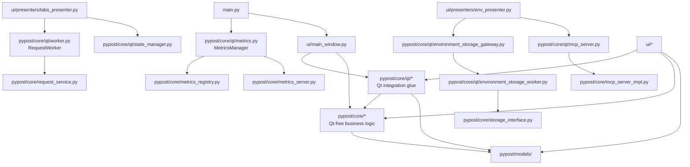

# PYPOST-693: Resolve Qt throughout core

## Research

### Current state (2026-07-14 scan)

Nine modules under `pypost/core/` import PySide6. They use Qt for **concurrency and
event-loop integration** (threads, signals, timers) — not widgets — to bridge background
work and UI presenters without blocking the main thread.

| Module | Qt types | Capability | Qt-free collaborators (stay in `core/`) |
| --- | --- | --- | --- |
| `worker.py` | `QThread`, `Signal` | HTTP request execution off UI thread | `RequestService`, `ExecuteRequestProtocol` |
| `mcp_server.py` | `QObject`, `Signal` | MCP uvicorn lifecycle + UI status/activity | `MCPServerImpl`, `McpActivityLog` |
| `state_manager.py` | `QObject`, `QTimer` | Debounced UI session persistence | `ConfigManager`, `AppSettings` |
| `metrics.py` | `QObject`, `Signal` | Metrics facade; `start_failed` to UI | `MetricsRegistry`, `MetricsServer` |
| `collection_storage_worker.py` | `QThread`, `Signal` | Async collection load | `StorageInterface` |
| `collection_storage_gateway.py` | `QObject`, `Signal` | Single-flight async collection load queue | worker + `StorageInterface` |
| `environment_storage_worker.py` | `QThread`, `Signal` | Async env load/save | `StorageInterface` |
| `environment_storage_gateway.py` | `QObject`, `Signal`, `QElapsedTimer`, `QApplication` | Coalesced env save + `wait_idle()` | worker + `StorageInterface` |
| `encryption_migration_worker.py` | `QThread`, `Signal` | Background bulk re-encryption | `EncryptionMigrationService` |

**Import graph (production):**

```text
main.py
  └─ MetricsManager (core/metrics.py)

ui/main_window.py
  ├─ MetricsManager, MCPServerManager, StateManager
  └─ (constructs gateways via presenters)

ui/presenters/tabs_presenter.py
  └─ RequestWorker, StateManager

ui/presenters/env_presenter.py
  ├─ EnvironmentStorageGateway, MCPServerManager
  └─ (env suppliers to MCP)

ui/presenters/collections_async_loader.py
  └─ CollectionStorageGateway

ui/widgets/settings/encryption_migration_section.py
  └─ EncryptionMigrationWorker
```

**Cross-layer checks:**

- No Qt-dependent core module imports `pypost.ui` (D-001 remediated in PYPOST-692).
- No Qt-free `core/` module imports the nine Qt modules today — the split is acyclic.
- `metrics_registry.py`, `metrics_server.py`, `mcp_server_impl.py`, `encryption_migration.py`,
  and `storage.py` remain importable without PySide6.

### Audit context

Finding **D-004** (MEDIUM): PySide6 in core weakens the documented presentation/core boundary.
Recommendation **R-P1-002**: document as accepted compromise **or** split `core/qt/` /
`core/integration/` with an explicit "requires PySide6" boundary.

Related **L-001**: MCP/worker Qt glue in core is a known caveat; this task closes D-004 by
making that caveat **structural and discoverable**, not tribal knowledge.

### Option 1 — Document as accepted compromise

| Criterion | Assessment |
| --- | --- |
| Closes D-004 | Yes — explicit documented stance |
| DoD: discoverability without scanning | **Weak** — developers still grep `core/` or read a maintained list |
| Diff size | Minimal — `doc/dev/` + module docstrings only |
| Behavioral risk | None |
| Enforcement | Review discipline only; new Qt code can land anywhere in `core/` |
| Layer rule honesty | `core/` → `models/` remains partially inaccurate |

**Would include:** boundary section in `architecture.md` / `testability.md`, module-level
"requires PySide6" notes, audit D-004 marked remediated in Step 7.

### Option 2 — Split `pypost/core/qt/` subpackage

| Criterion | Assessment |
| --- | --- |
| Closes D-004 | Yes — structural boundary |
| DoD: discoverability without scanning | **Strong** — `pypost.core.qt.*` ≡ requires PySide6 |
| Diff size | Moderate — move 9 files + update import paths (~25 prod/test sites) |
| Behavioral risk | Low — moves only; no threading/signal semantics change |
| Enforcement | Package path signals intent; Qt-free `core/` root is grep-verifiable |
| Layer rule honesty | `core/` (root) → `models/`; `core/qt/` → `models/`, Qt-free `core/` |

**Would not include:** replacing `QThread`/`Signal` with stdlib, worker-object refactor,
moving glue to `ui/` (blurs service ownership), or composition-root elevation (PYPOST-694/695).

### Why not move glue to `ui/`?

Unlike PYPOST-692 (`StyleManager` was pure presentation with a `core → ui` import violation),
these modules are **service integration adapters**:

- `RequestWorker` orchestrates `RequestService` — same execution pipeline as MCP inbound.
- `MCPServerManager` wraps `MCPServerImpl` — MCP is documented as core integration.
- Storage gateways coordinate `StorageInterface` — persistence domain stays in core.
- `MetricsManager` is wired in `main.py` composition root alongside Qt-free counters.

Moving them to `ui/` would invert ownership (presentation owning MCP lifecycle and storage
queues) without removing Qt dependency.

### Why not replace Qt threading now?

Qt's queued signal delivery is how presenters receive results on the GUI thread today.
Replacing with `threading` + callbacks would require presenter rewiring and risks subtle
regressions in cancellation, coalescing, and `wait_idle()` semantics. Out of scope per
requirements (behavioral parity, no user-visible change).

Qt docs confirm signal emission from `QThread.run()` is thread-safe and cross-thread
connections are queued by default
([Threads and QObjects](https://doc.qt.io/qtforpython-6/overviews/qtdoc-threads-qobject.html),
[QThread](https://doc.qt.io/qtforpython-6/PySide6/QtCore/QThread.html)).
PyPost's subclassed-`QThread` pattern is established; refactoring to worker-object +
`moveToThread` is a separate improvement, not required for D-004.

### Decision

**Recommend Option 2: split `pypost/core/qt/` subpackage.**

Option 1 satisfies the letter of R-P1-002 but not the DoD item that developers determine
Qt requirements **without manually scanning dozens of modules**. Option 2 is the minimal
**structural** fix: file moves and import updates only, no new abstractions, no behavior
change — aligned with PYPOST-692's precedent of boundary fixes via relocation rather than
documentation-only acceptance.

## Implementation Plan

High-level steps for Step 3 (development):

1. **Create subpackage**
   - Add `pypost/core/qt/__init__.py` with boundary contract (see Architecture below).
   - Move the nine modules into `pypost/core/qt/` keeping filenames unchanged.
   - Delete originals from `pypost/core/`; **no** re-export shims at `core/` root (shims
     would hide the Qt boundary, same rationale as PYPOST-692).

2. **Fix internal imports**
   - Update relative imports within moved modules (`pypost.core.*` → unchanged for
     Qt-free core; gateway → worker paths become same-package imports).
   - `metrics.py` continues importing `metrics_registry` / `metrics_server` from parent
     `pypost.core`.

3. **Update production import sites**

   | Consumer | Old import | New import |
   | --- | --- | --- |
   | `main.py` | `pypost.core.metrics` | `pypost.core.qt.metrics` |
   | `ui/main_window.py` | `metrics`, `mcp_server`, `state_manager` | `pypost.core.qt.*` |
   | `ui/presenters/tabs_presenter.py` | `worker`, `state_manager` | `pypost.core.qt.*` |
   | `ui/presenters/env_presenter.py` | `environment_storage_gateway`, `mcp_server` | `pypost.core.qt.*` |
   | `ui/presenters/collections_async_loader.py` | `collection_storage_gateway` | `pypost.core.qt.*` |
   | `ui/presenters/collections_presenter.py` | `state_manager` | `pypost.core.qt.state_manager` |
   | `ui/request_save_orchestrator.py` | `state_manager` | `pypost.core.qt.state_manager` |
   | `ui/widgets/settings/encryption_migration_section.py` | `encryption_migration_worker` | `pypost.core.qt.*` |

4. **Update test import sites**
   - All tests importing the nine modules (worker, gateways, MCP manager, metrics manager,
     state manager, encryption migration worker) → `pypost.core.qt.*`.
   - Existing `pytest-qt` / `QApplication` fixtures remain sufficient.

5. **Verify boundary**
   - `rg 'PySide6' pypost/core/` — matches only under `pypost/core/qt/`.
   - `rg 'from pypost\.core\.(worker|mcp_server|state_manager|metrics|collection_storage|environment_storage|encryption_migration_worker)'` — zero hits.
   - `make check` passes.

6. **Out of scope (Step 3)**
   - `doc/dev/architecture_audit.md` D-004 remediation note (Step 7).
   - Composition-root elevation (PYPOST-694, PYPOST-695).
   - Worker-object refactor or stdlib threading replacement.

## Architecture

### Target module diagram



### Package layout after remediation

```text
pypost/core/
├── qt/                              # REQUIRES PySide6 — framework integration glue
│   ├── __init__.py                  # Boundary contract
│   ├── worker.py
│   ├── mcp_server.py
│   ├── state_manager.py
│   ├── metrics.py
│   ├── collection_storage_worker.py
│   ├── collection_storage_gateway.py
│   ├── environment_storage_worker.py
│   ├── environment_storage_gateway.py
│   └── encryption_migration_worker.py
├── request_service.py               # Qt-free
├── mcp_server_impl.py               # Qt-free (async ASGI)
├── metrics_registry.py              # Qt-free
├── metrics_server.py                # Qt-free (threading + uvicorn)
├── encryption_migration.py          # Qt-free
└── ...                              # remaining ~59 modules, no PySide6
```

### `pypost/core/qt/__init__.py` boundary contract

```python
"""Qt framework integration layer within core.

Modules in this package import PySide6 for QThread, QObject, Signal, and QTimer.
They bridge async work to UI presenters via queued signal delivery.

Import rule: code that must run headless without PySide6 must NOT import from
``pypost.core.qt``. Use Qt-free modules in ``pypost.core`` and protocols in
``pypost.core.metrics_protocol`` instead.

Test setup: prefer ``pytest-qt`` or an offscreen ``QApplication`` when testing
modules here; see ``doc/dev/testability.md`` (updated in Step 7).
"""
```

### Modules and responsibilities

| Module | Layer | Responsibility |
| --- | --- | --- |
| `core/qt/worker.py` | Core / Qt glue | One-shot `QThread` per HTTP send; signals for progress, errors, streaming |
| `core/qt/mcp_server.py` | Core / Qt glue | MCP uvicorn thread lifecycle; status/activity signals to UI |
| `core/qt/state_manager.py` | Core / Qt glue | Debounced persistence of high-churn UI session fields |
| `core/qt/metrics.py` | Core / Qt glue | `MetricsManager` facade; `start_failed` signal bridge to UI |
| `core/qt/collection_storage_*` | Core / Qt glue | Async collection load with single-flight queue |
| `core/qt/environment_storage_*` | Core / Qt glue | Async env load/save with coalescing and `wait_idle()` |
| `core/qt/encryption_migration_worker.py` | Core / Qt glue | Background bulk re-encryption with progress signals |
| `core/*` (Qt-free) | Core | HTTP, templating, storage logic, MCP impl, metrics counters |
| `ui/*` | Presentation | Presenters connect to `core/qt` signals; no duplicate glue |

### Dependency direction (after fix)

```text
models/     ←  core/ (Qt-free)
models/     ←  core/qt/  ←  core/ (Qt-free)
core/qt/    ←  ui/
core/       ←  ui/
main.py     →  ui/, core/, core/qt/
```

**Rules:**

- `core/` (package root, excluding `qt/`) must not import `pypost.core.qt` or PySide6.
- `core/qt/` may import Qt-free `core/` and `models/`; must not import `ui/`.
- `ui/` may import both `core/` and `core/qt/`.
- No re-export shims at `pypost.core` that obscure the Qt boundary.

### Interaction scheme (unchanged runtime)

```text
HTTP send:
  TabsPresenter → new RequestWorker → start()
  RequestWorker.run() → RequestService.execute()
  Signals (queued) → presenter slots on GUI thread

MCP lifecycle:
  EnvPresenter / MainWindow → MCPServerManager.start_server()
  threading.Thread → uvicorn; QObject signals → UI status + activity log

Session state:
  Presenters → StateManager.set_* → QTimer debounce → ConfigManager.save_config

Metrics:
  main.py → MetricsManager.start_server()
  MetricsServer (core/) bind failure → MetricsManager.start_failed → UI alert

Async storage:
  Presenters → Gateway.load_async/save_async → Worker QThread → StorageInterface
  Gateway signals → presenter refresh / error handling

Encryption migration:
  Settings section → EncryptionMigrationWorker → EncryptionMigrationService
  finished/failed signals → UI progress dialog
```

### Patterns and justification

- **Explicit integration subpackage** — Makes framework coupling a package-level decision
  rather than an undocumented convention scattered across `core/` root. Satisfies R-P1-002
  and DoD discoverability without removing Qt (still a PySide6 desktop app).
- **Layered monolith (preserved)** — Business logic stays in Qt-free `core/`; only
  thread/signal/timer adapters move. Matches audit direction to "keep HTTP/templating/history
  in Qt-free modules."
- **Minimal relocation (no new abstractions)** — Same classes, same public APIs, same signal
  names. Follows PYPOST-692 focused-diff convention.
- **Protocol seams (unchanged)** — Consumers of tracking inject `MetricsTrackerProtocol`
  from Qt-free `metrics_protocol.py`; only the `MetricsManager` facade requires Qt.

### Public interfaces (unchanged)

All moved classes retain their current public API and signal signatures:

- `RequestWorker` — signals: `finished`, `error`, `retry_attempt`, `env_update`,
  `script_output`, `chunk_received`, `headers_received`; `stop()` cooperative cancel.
- `MCPServerManager` — signals: `status_changed`, `start_failed`, `activity_recorded`;
  helpers `mcp_tools_signature`, `format_mcp_bind_error` stay with the manager module.
- `StateManager` — debounced `set_*` / `flush_pending_save()` / `save()`.
- `MetricsManager` — `connect_start_failed`, `start_server`, tracking `track_*` delegates.
- `CollectionStorageGateway` / `EnvironmentStorageGateway` — async load/save signals,
  `wait_idle()` on env gateway.
- `EncryptionMigrationWorker` — `finished`, `failed` signals.

Import path is the only intentional breaking change for internal/test code:

```python
# Before
from pypost.core.worker import RequestWorker

# After
from pypost.core.qt.worker import RequestWorker
```

### Files touched (Step 3)

| Action | Path |
| --- | --- |
| Create | `pypost/core/qt/__init__.py` |
| Move | 9 modules from `pypost/core/` → `pypost/core/qt/` |
| Delete | 9 originals at `pypost/core/` |
| Edit imports | `pypost/main.py`, 6 `ui/` modules |
| Edit imports | ~15 test modules (worker, gateways, MCP, metrics, state, migration) |

Step 7 will update `doc/dev/architecture.md`, `architecture_audit.md`, and `testability.md`
with the `core/qt/` layer row and D-004 remediation status.

## Q&A

- **Q**: Why not Option 1 (documentation only)?
- **A**: It closes the audit ticket textually but leaves discoverability to grep and a
  maintained module list. Requirements ask that contributors know Qt requirements without
  scanning dozens of files; package path achieves that with a focused structural diff.

- **Q**: Why `core/qt/` instead of `core/integration/`?
- **A**: The coupling is specifically PySide6 (threads, signals, timers), not generic
  integration. `qt/` is grep-friendly and matches audit wording (`core/qt/`). MCP ASGI
  implementation remains in Qt-free `mcp_server_impl.py`.

- **Q**: Should `MetricsRegistry` / `MetricsServer` move to `qt/`?
- **A**: No. They use threading and uvicorn without PySide6. Only `MetricsManager`'s
  `QObject` signal bridge moves.

- **Q**: Will tests need new fixtures?
- **A**: No new fixtures expected. Tests already construct `QApplication` or use
  `pytest-qt` where signals matter; only import paths change.

- **Q**: Re-export shims for backward compatibility?
- **A**: No. Shims at `pypost.core.worker` would recreate the hidden-dependency problem
  PYPOST-692 explicitly avoided for `StyleManager`.

- **Q**: Source references?
- **A**: [PYPOST-693](https://pypost.atlassian.net/browse/PYPOST-693);
  [PYPOST-684](https://pypost.atlassian.net/browse/PYPOST-684) D-004 / R-P1-002;
  `doc/dev/architecture_audit.md`; PYPOST-692 architecture precedent.
