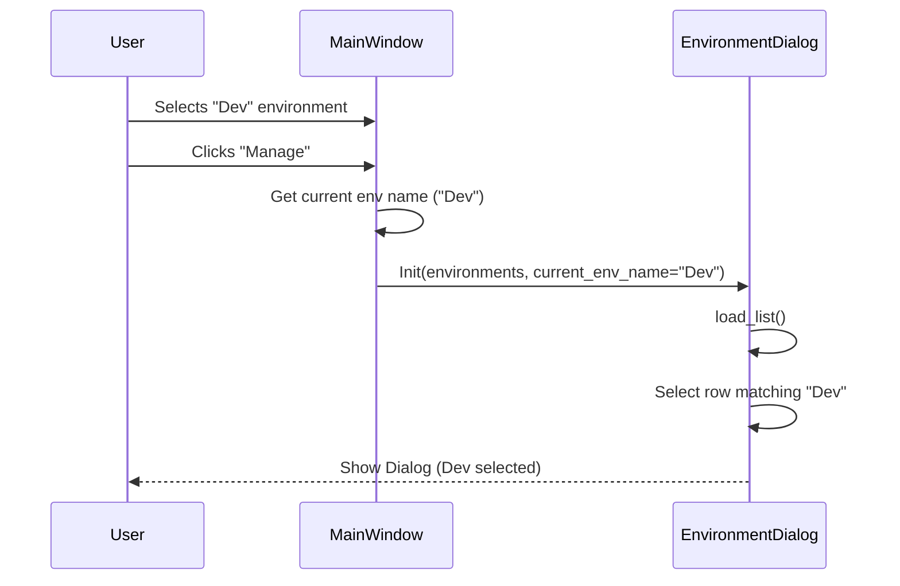

# Architecture: PYPOST-7 Open Current Environment in Editor

## 1. Modules

### `pypost/ui/main_window.py` - `MainWindow` Class
- **Responsibility**: Manages the main application state, including the currently selected environment.
- **Change**: 
  - Update `open_env_manager` method to:
    1. Retrieve the currently selected environment name from `self.env_selector`.
    2. Pass this name to the `EnvironmentDialog` constructor.

### `pypost/ui/dialogs/env_dialog.py` - `EnvironmentDialog` Class
- **Responsibility**: Displays and manages the list of environments.
- **Change**:
  - Update `__init__` to accept an optional `current_env_name: str` parameter.
  - Update `load_list` (or call a new method after `load_list`) to iterate through the loaded environments in the `QListWidget`.
  - Find the item matching `current_env_name` and set it as the current row using `setCurrentRow`.

## 2. Interaction Flow



## 3. Interfaces

### `EnvironmentDialog.__init__`
```python
def __init__(self, environments: List[Environment], parent=None, current_env_name: str = None)
```

## 4. Design Decisions
- **Parameter Passing**: Passing the current environment name via the constructor is the cleanest way to initialize the dialog state without creating tight coupling or requiring post-init configuration calls from the parent.
- **String vs Object**: Passing the environment name (string) is sufficient and safer than passing an object reference, as we just need to match it against the list names.

