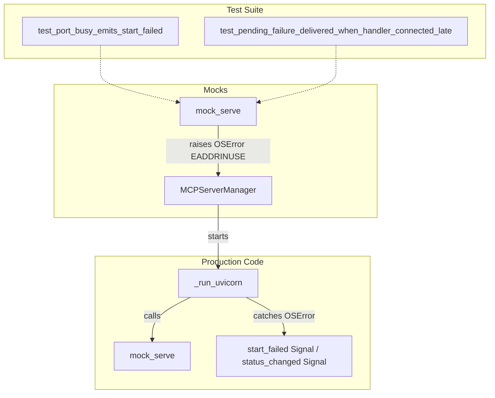

# PYPOST-716: Stabilize MCPServerManager port-busy test

## Research

### Background and Context
The test suite contains two specific unit test cases designed to verify port-busy error signaling:
1. `test_port_busy_emits_start_failed` in `tests/test_mcp_server_manager.py`
   (for `MCPServerManager`)
2. `test_port_busy_emits_start_failed` and
   `test_pending_failure_delivered_when_handler_connected_late` in
   `tests/test_metrics_server_startup.py` (for `MetricsManager`)

In these tests, a port is dynamically occupied using the `_occupy_port` socket helper. When
the server manager starts, uvicorn tries to bind to the port in a background
`threading.Thread`.

### The Native Crash (PYPOST-429)
When uvicorn's socket binding fails, uvicorn internally triggers `sys.exit(1)`.
The managers override `sys.exit` in their thread runner (`_run_uvicorn`) to raise
`OSError(errno.EADDRINUSE, ...)` so that the exception propagates out of
`loop.run_until_complete()` and gets caught locally.
However, on macOS under Python 3.11+, when uvicorn attempts to exit or when the background
daemon thread experiences an unhandled exception during event loop shutdown, PySide6's Qt
framework or the native thread runner crashes with a C++ segmentation fault (SIGSEGV). This
crashes the entire `pytest` process, preventing subsequent tests from running.

### Technical Analysis of Solutions
There are two primary ways to stabilize this scenario:
1. **Platform Skip**: Skip these tests on macOS (`sys.platform == "darwin"`) using
   `@pytest.mark.skipif`.
   - *Pros*: Extremely simple to implement.
   - *Cons*: Leaves macOS developers without test verification for port-busy scenarios.
2. **Mocking Uvicorn Bind**: Use `unittest.mock.patch` to mock `uvicorn.Server.serve` to raise
   `OSError(errno.EADDRINUSE, ...)` directly.
   - *Pros*: Completely avoids native socket binding and thread cleanup/exit paths, thereby
     preventing the macOS PySide6 segfault. It runs 100% of the manager's custom error
     handling, signal emission, and status transition logic. It maintains cross-platform
     consistency and keeps the tests enabled on macOS.
   - *Cons*: Does not run uvicorn's internal bind logic (but uvicorn's third-party code does
     not need to be unit-tested by PyPost).

The mocking approach is superior because it maintains test coverage on all platforms,
including macOS, without skipping any scenarios.

## Implementation Plan

1. **Update `tests/test_mcp_server_manager.py`**:
   - Use `@unittest.mock.patch("uvicorn.Server.serve", side_effect=OSError(errno.EADDRINUSE,
     "Address already in use"))` on `test_port_busy_emits_start_failed`.
   - Remove the `_occupy_port` and `blocker` socket logic from the test case since the mock
     will simulate the bind error directly.

2. **Update `tests/test_metrics_server_startup.py`**:
   - Apply the same `@unittest.mock.patch("uvicorn.Server.serve",
     side_effect=OSError(errno.EADDRINUSE, "Address already in use"))` to
     `test_port_busy_emits_start_failed` and
     `test_pending_failure_delivered_when_handler_connected_late`.
   - Remove the `_occupy_port` and `blocker` socket logic from these test cases.

3. **Verify suite stability**:
   - Run tests using `make test` to ensure they execute successfully without any crashes.

## Architecture

No production code changes are required. The production code already has the robust error
handling and `OSError` catching routines inside `MCPServerManager` and `MetricsManager`.
The test architecture changes are focused on isolating the third-party server (`uvicorn`)
binding layer from the manager's signaling logic.

### Module Diagram

### Key Interfaces and Flow
- **`uvicorn.Server.serve`**: Patched to throw `OSError` with `errno.EADDRINUSE`.
- **`MCPServerManager.start_failed`**: Qt Signal, emitted with the operator-facing error string.
- **`MCPServerManager.status_changed`**: Qt Signal, emitted with `False` after failure.
- **`MetricsManager` callback / `_pending_start_failure`**: Verified that it receives the
  simulated failure message correctly.

## Q&A

### Does mocking `uvicorn.Server.serve` miss any real-life error handling paths?
No. In `_run_uvicorn`, the exception raised by the mock is caught by `except OSError as exc`,
which is the exact same exception handling block that executes when the real `uvicorn` fails to
bind. The manager's signal-emission paths and status-updating flows are fully exercised.

### Why does this mock prevent the segfault?
The segfault occurs during uvicorn's complex socket cleanup, event loop shutdown, and thread
exit routines. By raising `OSError` directly from `serve()`, we prevent `uvicorn` from
initializing its loop/sockets in the background thread. The thread exits immediately and cleanly
via the manager's exception handler.
