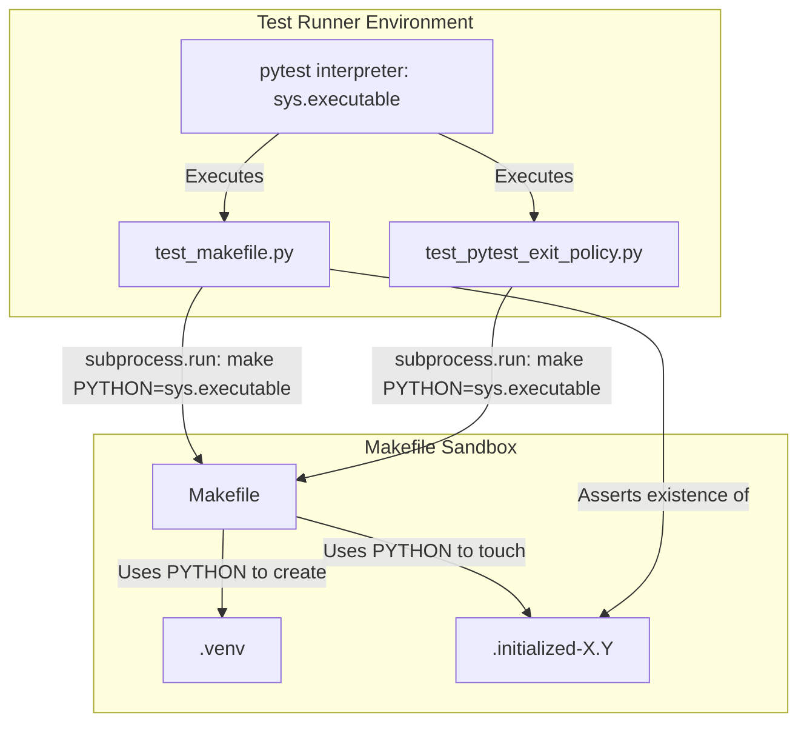

# PYPOST-718: Fix Makefile test Python version coupling

## Research

### Problem Analysis
The workspace uses a `Makefile` to manage virtual environments, dependencies, and testing.
By default, the `Makefile` defines the Python interpreter variable as:
```makefile
PYTHON := python3
```
And derives the version-specific initialization marker as:
```makefile
PYTHON_VERSION := $(shell $(PYTHON) -c 'import sys; print("%d.%d" % sys.version_info[:2])')
VENV_MARKER := $(VENV)/.initialized-$(PYTHON_VERSION)
```

When integration tests in `tests/test_makefile.py` and `tests/test_pytest_exit_policy.py` run,
they simulate Makefile target executions in temporary directories. The test suite determines
the expected Python version using the active `pytest` interpreter's runtime:
```python
PYTHON_VERSION = f"{sys.version_info.major}.{sys.version_info.minor}"
MARKER_NAME = f".initialized-{PYTHON_VERSION}"
```

If the Python interpreter running `pytest` differs from the default system `python3` command
on the PATH (for example, if running inside a specific virtual environment or with a specific
Python version manager like `pyenv` or `conda`), a version discrepancy occurs:
1. The test suite expects initialization markers based on the active `pytest` interpreter
   (e.g., `.initialized-3.11`).
2. The Makefile commands executed via `subprocess.run` use the default system `python3`
   (e.g., `.initialized-3.12`).
3. This mismatch leads to assertion failures in tests like `test_venv_creates_version_marker`
   because the expected marker file is not found.

### Research Findings
1. **Active Interpreter Resolution**: In Python, `sys.executable` is a platform-agnostic,
   standard attribute that returns the absolute path to the executable binary for the
   currently running Python interpreter.
2. **Makefile Variable Overriding**: GNU Make allows overriding variables defined in the
   `Makefile` by passing them as command-line arguments (e.g., `make PYTHON=/path/to/python`).
3. **Decoupling Best Practices**: To ensure that child processes spawned by a test runner
   execute within the exact same Python environment as the parent runner, the absolute path
   of `sys.executable` should be explicitly passed to the subprocess. This decouples the
   execution from the system's `PATH` and prevents environmental drift.

---

## Implementation Plan

1. **Update `tests/test_makefile.py` Helper Functions**:
   - Modify `_run_make` to inject `f"PYTHON={sys.executable}"` as an argument to the
     `make` command.
   - Modify `_prerequisites` to inject `f"PYTHON={sys.executable}"` as an argument to
     the `make` command.

2. **Update `tests/test_pytest_exit_policy.py` Subprocess Calls**:
   - Modify the `test_make_test_fails_with_exit_code_5_when_no_tests_collected` test to
     inject `f"PYTHON={sys.executable}"` into the `make install` and `make test`
     subprocess calls.

3. **Validation and Testing**:
   - Run the integration tests using the active interpreter to verify that the virtual
     environments and initialization markers are created with the correct Python version
     and that all assertions pass.

---

## Architecture

### Decoupling Pattern
Instead of relying on environmental defaults (which are prone to drift and version mismatch),
we explicitly inject the active runtime configuration (`sys.executable`) into the subprocess
environment. This establishes a deterministic contract where the Makefile's execution
environment is strictly bound to the test suite's execution environment.

### Module Interaction Diagram



---

## Q&A

**Q: Does this change affect how normal developers run `make` targets?**
A: No, normal developer usage of `make` targets remains unchanged. The changes only affect the
internal test environment setup during test execution.

**Q: Is `sys.executable` platform-agnostic?**
A: Yes, `sys.executable` is a standard Python attribute that returns the absolute path of the
executable binary for the Python interpreter on all supported platforms (macOS, Linux, Windows).

**Q: Why not modify the `Makefile` itself to detect the active interpreter?**
A: The `Makefile` is designed to be run directly by developers from their shell, where `python3`
is the standard default. Overriding it in the test suite is the correct separation of concerns,
as the test suite is what introduces the specific requirement of matching the active `pytest`
interpreter.
