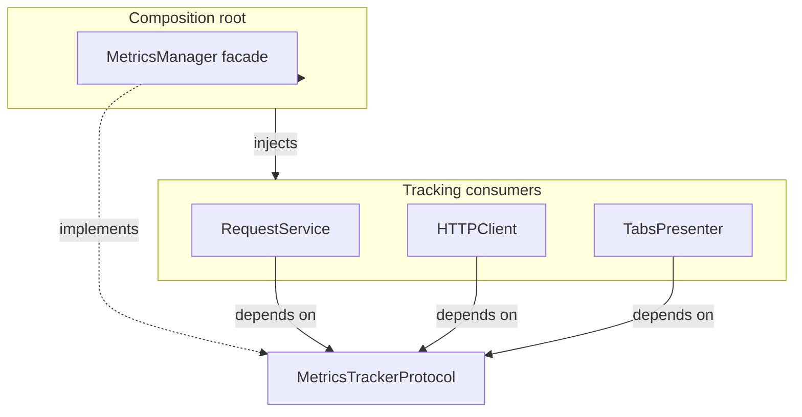

# PYPOST-73: MetricsTrackerProtocol architecture

## Research

- PYPOST-44 review TD-1: consumers typed as `MetricsManager | None` with no protocol.
- PYPOST-75 split counters into `MetricsRegistry`; facade delegates `track_*` unchanged.
- Consumers call only `track_*` and `set_mcp_server_up`; server APIs stay at composition root.

## Implementation Plan

1. Add `pypost/core/metrics_protocol.py` with `@runtime_checkable MetricsTrackerProtocol`.
2. Mirror all consumer-facing tracking methods from `MetricsRegistry` / `MetricsManager`.
3. Update injection sites (services, workers, presenters, widgets, adapters) to protocol type.
4. Keep `MetricsManager` in `main.py` and `MainWindow` (needs `start_server`, signals).
5. Add `tests/test_metrics_protocol.py` with `isinstance` check.

## Architecture

### Type boundaries

| Layer | Type | Rationale |
| --- | --- | --- |
| `main.py`, `MainWindow` | `MetricsManager` | Server lifecycle + Qt signals |
| Services, workers, UI | `MetricsTrackerProtocol \| None` | Tracking only |
| Tests | `MagicMock(spec=MetricsTrackerProtocol)` | Focused fake |

### Alternatives considered

| Option | Verdict |
| --- | --- |
| Protocol on tracking surface | **Selected** — minimal diff, enables future no-op |
| Rename injections to `MetricsRegistry` | Rejected — registry lacks MCP gauge helpers at facade |
| ABC base class | Rejected — structural typing fits duck-typed metrics |
