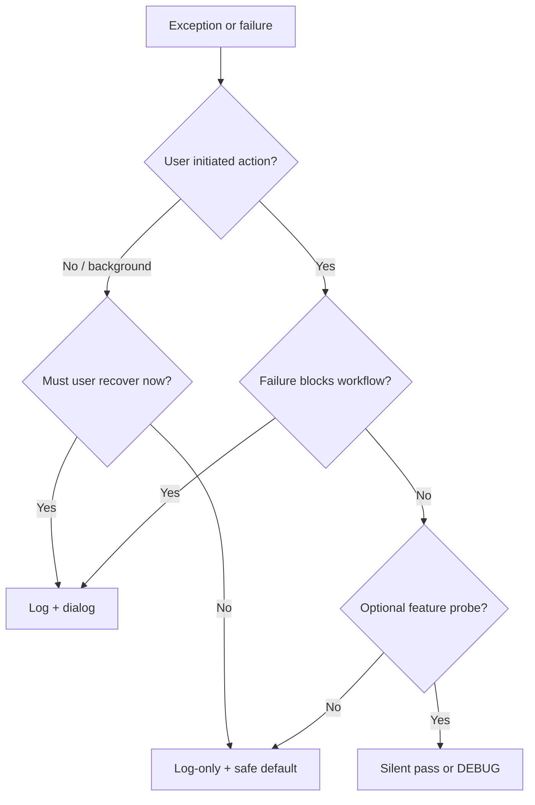

# PYPOST-739: Architecture

## Target Document

Expand **Error Handling** in [doc/dev/maintainability_audit.md](../../doc/dev/maintainability_audit.md).
That file is the PYPOST-687 audit hub; the section already lists counts and one-liners — this
task replaces the bullet list with a full convention reference.

`architecture.md` stays unchanged; it links to maintainability audit for quality topics.

## Layer Model

```text
models/     — raise typed errors; no logging
core/       — catch, log (never QMessageBox); may return defaults or propagate
core/qt/    — worker signals carry errors to UI thread; log on failure paths
ui/         — presenters decide log-only vs log+dialog; call collection_item_dialogs
```

## Three Patterns

| Pattern | User sees | Operator sees | Typical layer |
| --- | --- | --- | --- |
| **Log-only** | Nothing modal; optional status bar or degraded UI | `logger.error` / `logger.warning` | Core persistence, background load |
| **Log + dialog** | `QMessageBox` via `collection_item_dialogs` | Same log line before dialog | Presenters on user-initiated actions |
| **Silent pass** | Nothing | Usually nothing (DEBUG at most) | Optional probes, cleanup, parse fallbacks |

## Decision Flow



## Canonical Examples (from codebase)

| Pattern | Example |
| --- | --- |
| Log-only | `EnvPresenter._on_storage_load_failed` — log, empty env list |
| Log + dialog | `CollectionTreeActions.handle_rename_committed` — log + `show_rename_failure` |
| Log + dialog | `EnvPresenter._on_storage_save_failed` — log + `show_env_save_failed` |
| Log + dialog | `TabsPresenterWorker._on_request_error` — log + `show_request_error` |
| Log-only (soft) | `TabsPresenter._handle_copy_curl_request` — log + status bar, no modal |
| Silent pass | `RequestService._execute_mcp` — `json.JSONDecodeError: pass` for body shape probe |
| Silent pass | `AlertManager.close` — `OSError: pass` on handler teardown |

## Related Modules

- `pypost/ui/collection_item_dialogs.py` — single QMessageBox entry point for standard flows
- `pypost/core/environment_messages.py` — dialog title/body strings for env flows
- `pypost/models/errors.py` — `ExecutionError`, `ErrorCategory` for structured request failures

## References

- [logging.md](../../doc/dev/logging.md) — event naming and `logger.exception` preference
- [collection_tree_actions.md](../../doc/dev/collection_tree_actions.md) — dialog helper catalog
- [environment_encryption_at_rest.md](../../doc/dev/environment_encryption_at_rest.md) —
  file-level vs per-item persistence failures
