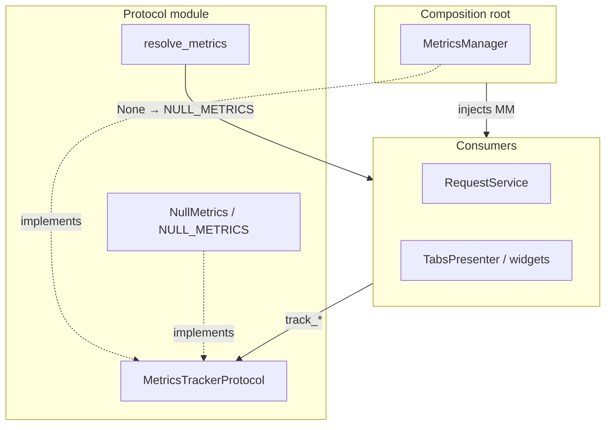

# PYPOST-74: NullMetrics architecture

## Research

- PYPOST-73 left `MetricsTrackerProtocol | None` and `if self._metrics:` at ~40 call sites.
- Collection tree actions already called metrics unconditionally when injected from MainWindow.
- Business guards (hidden key count, non-cancelled errors) must remain; only null checks go.

## Implementation Plan

1. Add `NullMetrics` with no-op `track_*` / `set_mcp_server_up` methods in `metrics_protocol.py`.
2. Export `NULL_METRICS` singleton and `resolve_metrics(metrics | None)`.
3. Update consumer `__init__` to `self._metrics = resolve_metrics(metrics)`.
4. Delete `if self._metrics:` wrappers; keep domain conditions (e.g. `hidden_key_count > 0`).
5. Extend protocol tests; update `doc/dev/testability.md`.

## Architecture

### Type boundaries

| Layer | Type | Default |
| --- | --- | --- |
| Composition root | `MetricsManager` | real facade |
| Consumers | `MetricsTrackerProtocol` (via resolve) | `NULL_METRICS` |
| Tests | `MagicMock(spec=...)` or real `MetricsManager` | explicit |
