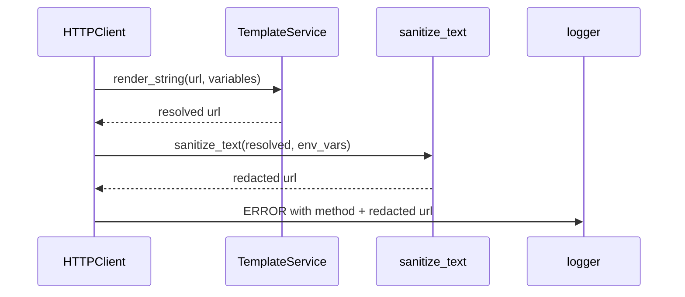

# PYPOST-741: Architecture — redact URLs in HTTP client ERROR logs

## Approach

Add a single helper on `HTTPClient` that produces log-safe URLs by reusing the existing
`sanitize_text` heuristics from `sensitive_text_sanitizer` (query-token and bearer patterns).

## Changes

| Component | Change |
| --- | --- |
| `HTTPClient._error_log_url` | Static helper: `sanitize_text(url, env_vars=variables)` |
| ERROR paths (4) | Log sanitized resolved URL instead of template URL |
| `TestHTTPClientErrorLogging` | Cover timeout, connection, request exception, YAML conversion |

## Data flow

## Non-goals

- WARNING/DEBUG URL logs unchanged.
- No `hidden_keys` threading into `HTTPClient` (follow-up if path-segment secrets need
  explicit masking).
